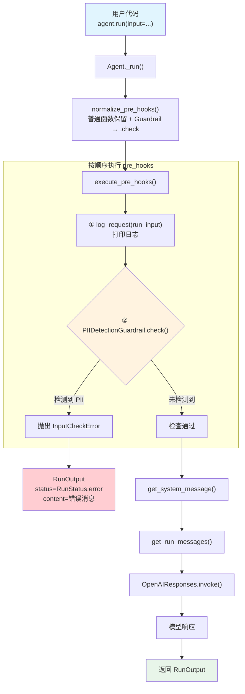

# mixed_hooks.py — 实现原理分析

> 源文件：`cookbook/02_agents/08_guardrails/mixed_hooks.py`

## 概述

本示例展示 Agno 的 **`pre_hooks` 混合使用**机制：在同一个 `pre_hooks` 列表中同时注册**普通函数 hook**（日志记录）和 **BaseGuardrail 实例**（PII 检测），两者按顺序执行。普通 hook 执行副作用（如打印日志），Guardrail 执行安全检查并可通过抛出 `InputCheckError` 拦截请求。示例还展示了通过 `RunStatus.error` 检查被拦截请求的响应状态。

**核心配置一览：**

| 配置项 | 值 | 说明 |
|--------|------|------|
| `name` | `"Privacy-Protected Agent"` | Agent 名称 |
| `model` | `OpenAIResponses(id="gpt-4o-mini")` | Responses API |
| `pre_hooks` | `[log_request, PIIDetectionGuardrail()]` | 混合 hook 列表：普通函数 + 护栏 |
| `post_hooks` | `None` | 未设置 |
| `instructions` | `"You are a helpful assistant that protects user privacy."` | 隐私保护指令 |
| `description` | `None` | 未设置 |
| `markdown` | `True`（默认） | 格式化输出 |

## 架构分层

```
用户代码层                          agno.agent 层
┌──────────────────────────────┐  ┌───────────────────────────────────────────┐
│ mixed_hooks.py               │  │ Agent._run()                              │
│                              │  │  ├ _run.py L1250-1256                     │
│ pre_hooks=[                  │  │  │  normalize_pre_hooks()                  │
│   log_request,          ─────│──│──│──→ 保留原函数                          │
│   PIIDetectionGuardrail()    │  │  │  → PIIDetectionGuardrail.check 绑定   │
│ ]                            │  │  │                                        │
│                              │  │  ├ _hooks.py L43                          │
│ agent.run(                   │  │  │  execute_pre_hooks()                   │
│   input="My SSN is..."      │  │  │    1. log_request(run_input)  → 打印   │
│ )                            │  │  │    2. .check(run_input)      → 检查   │
│                              │  │  │                                        │
│ response.status ==           │  │  ├ InputCheckError? → RunStatus.error    │
│   RunStatus.error?           │  │  │                                        │
└──────────────────────────────┘  └──┴────────────────────────────────────────┘
                                         │
                                         ▼ (仅检查通过时)
                                 ┌──────────────────┐
                                 │ OpenAIResponses   │
                                 │ gpt-4o-mini       │
                                 └──────────────────┘
```

## 核心组件解析

### 普通函数 Hook

`log_request` 是一个普通的 Python 函数，接受 `RunInput` 参数：

```python
def log_request(run_input: RunInput) -> None:
    """每个请求到来时打印输入内容前 60 个字符"""
    print(f"  [log_request] Input: {run_input.input_content[:60]}")
```

`filter_hook_args()`（`utils/hooks.py` L156）通过 `inspect.signature()` 检查函数签名，仅传递函数接受的参数。`log_request` 只声明了 `run_input`，因此只收到这一个参数。

### PIIDetectionGuardrail

`PIIDetectionGuardrail`（`guardrails/pii.py` L10）使用正则表达式检测个人敏感信息：

```python
class PIIDetectionGuardrail(BaseGuardrail):
    def __init__(self, mask_pii=False, ...):
        self.pii_patterns = {
            "SSN": re.compile(r"\b\d{3}-\d{2}-\d{4}\b"),       # 社会安全号
            "Credit Card": re.compile(r"\b\d{4}[\s-]?\d{4}..."), # 信用卡号
            "Email": re.compile(r"\b[A-Za-z0-9._%+-]+@..."),    # 邮箱
            "Phone": re.compile(r"\b\d{3}[\s.-]?\d{3}..."),     # 电话号码
        }

    def check(self, run_input):
        content = run_input.input_content_string()
        detected_pii = []
        for pii_type, pattern in self.pii_patterns.items():
            if pattern.search(content):
                detected_pii.append(pii_type)
        if detected_pii:
            raise InputCheckError(
                "Potential PII detected in input",
                additional_data={"detected_pii": detected_pii},
                check_trigger=CheckTrigger.PII_DETECTED,
            )
```

### 混合 Hook 的执行顺序

`normalize_pre_hooks()` 对列表中的每个元素分别处理：
1. **普通函数**（`log_request`）→ 直接保留
2. **BaseGuardrail 实例**（`PIIDetectionGuardrail()`）→ 转为 `.check` 绑定方法

`execute_pre_hooks()` 按列表顺序逐个执行，关键行为：

| 执行位置 | Hook | 行为 |
|---------|------|------|
| 第 1 个 | `log_request` | 打印日志，不抛异常 |
| 第 2 个 | `PIIDetectionGuardrail.check` | 检测 PII，有 PII 则抛出 `InputCheckError` |

> **重要**：普通函数 hook 的异常（非 `InputCheckError`/`OutputCheckError`）会被 `log_error()` 记录但**不中断执行**。只有 `InputCheckError`/`OutputCheckError` 会直接 `raise` 传播。

### RunStatus 检查

本示例使用 `agent.run()` 而非 `agent.print_response()`，通过检查返回值的 `status` 字段判断请求是否被拦截：

```python
response = agent.run(input="My SSN is 123-45-6789, can you help?")
if response.status == RunStatus.error:
    print(f"  [BLOCKED] Guardrail rejected: {response.content}")
```

当 `InputCheckError` 被捕获时（`_run.py` L628-646）：
- `run_response.status = RunStatus.error`
- `run_response.content = str(e)` → `"Potential PII detected in input"`

## System Prompt 组装

| 序号 | 组成部分 | 本文件中的值/来源 | 是否生效 |
|------|---------|-----------------|---------|
| 1 | `system_message`（自定义） | `None` | 否 |
| 3.1 | `instructions` | `"You are a helpful assistant that protects user privacy."` | 是 |
| 3.1.1 | 模型指令（`get_instructions_for_model`） | OpenAIResponses 默认 | 视模型而定 |
| 3.2.1 | `markdown` | `True`（默认） | 是 |
| 3.2.2 | `add_datetime_to_context` | `False`（默认） | 否 |
| 3.2.3 | `add_location_to_context` | `False`（默认） | 否 |
| 3.2.4 | `add_name_to_context` | `False`（默认） | 否 |
| 3.3.1 | `description` | `None` | 否 |
| 3.3.2 | `role` | `None` | 否 |
| 3.3.3 | instructions 拼接 | `"You are a helpful assistant..."` | 是 |
| 3.3.4 | additional_information | `["Use markdown to format your answers."]` | 是 |
| 3.3.5 | `_tool_instructions` | `None` | 否 |
| fmt | `resolve_in_context` 变量替换 | 默认 True，无模板变量 | 否 |
| 3.3.7 | `expected_output` | `None` | 否 |
| 3.3.8 | `additional_context` | `None` | 否 |
| 3.3.9 | `add_memories_to_context` | `False`（默认） | 否 |
| 3.3.10 | `add_culture_to_context` | `False`（默认） | 否 |
| 3.3.11 | `add_session_summary_to_context` | `False`（默认） | 否 |
| 3.3.12 | `add_learnings_to_context` | `True`（默认） | 否（无 learning） |
| 3.3.13 | `search_knowledge` instructions | 否（无 knowledge） | 否 |
| 3.3.14 | 模型 system message | 视模型而定 | 视模型而定 |
| 3.3.15 | JSON output prompt | 否（无 output_schema） | 否 |
| 3.3.16 | response model format prompt | 否 | 否 |
| 3.3.17 | `add_session_state_to_context` | `False`（默认） | 否 |

### 最终 System Prompt

```text
You are a helpful assistant that protects user privacy.

<additional_information>
- Use markdown to format your answers.
</additional_information>
```

## 完整 API 请求

**TEST 1 — 干净输入（检查通过）：**

```python
client.responses.create(
    model="gpt-4o-mini",
    input=[
        # 1. System Message（role_map: system → developer）
        {
            "role": "developer",
            "content": "You are a helpful assistant that protects user privacy.\n\n<additional_information>\n- Use markdown to format your answers.\n</additional_information>\n\n"
        },
        # 2. 用户输入（log_request 已执行打印，PIIDetectionGuardrail 检查通过）
        {
            "role": "user",
            "content": "What is the weather today?"
        }
    ],
    stream=True,
    stream_options={"include_usage": True}
)
```

**TEST 2 — 含 SSN（检查失败）：**

> 不会发出 API 请求。执行流程：
> 1. `log_request` 执行打印 → `[log_request] Input: My SSN is 123-45-6789, can you help?`
> 2. `PIIDetectionGuardrail.check()` 检测到 SSN → 抛出 `InputCheckError`
> 3. 返回 `RunOutput(status=RunStatus.error, content="Potential PII detected in input")`

## Mermaid 流程图



## 关键源码文件索引

| 文件 | 关键函数/类 | 作用 |
|------|------------|------|
| `agno/guardrails/pii.py` | `PIIDetectionGuardrail` L10 | PII 检测护栏，正则匹配 SSN/信用卡/邮箱/电话 |
| `agno/guardrails/base.py` | `BaseGuardrail` L8 | 护栏抽象基类 |
| `agno/exceptions.py` | `InputCheckError` L134 | 输入检查异常 |
| `agno/exceptions.py` | `CheckTrigger.PII_DETECTED` L131 | PII 检测触发类型 |
| `agno/utils/hooks.py` | `normalize_pre_hooks()` L70 | 规范化 hook 列表：普通函数保留，Guardrail → 绑定方法 |
| `agno/utils/hooks.py` | `filter_hook_args()` L156 | 根据函数签名过滤参数 |
| `agno/agent/_hooks.py` | `execute_pre_hooks()` L43 | 按顺序执行所有 pre_hooks |
| `agno/agent/_run.py` | 异常处理 L628-646 | 捕获 InputCheckError，设置 RunStatus.error |
| `agno/agent/agent.py` | `pre_hooks` L176 | Agent 属性：支持 Callable / BaseGuardrail / BaseEval |
| `agno/run/agent.py` | `RunInput` L29 | 输入容器，hook 的参数来源 |
| `agno/run/agent.py` | `RunOutput` L581 | 输出容器，含 status 字段 |
