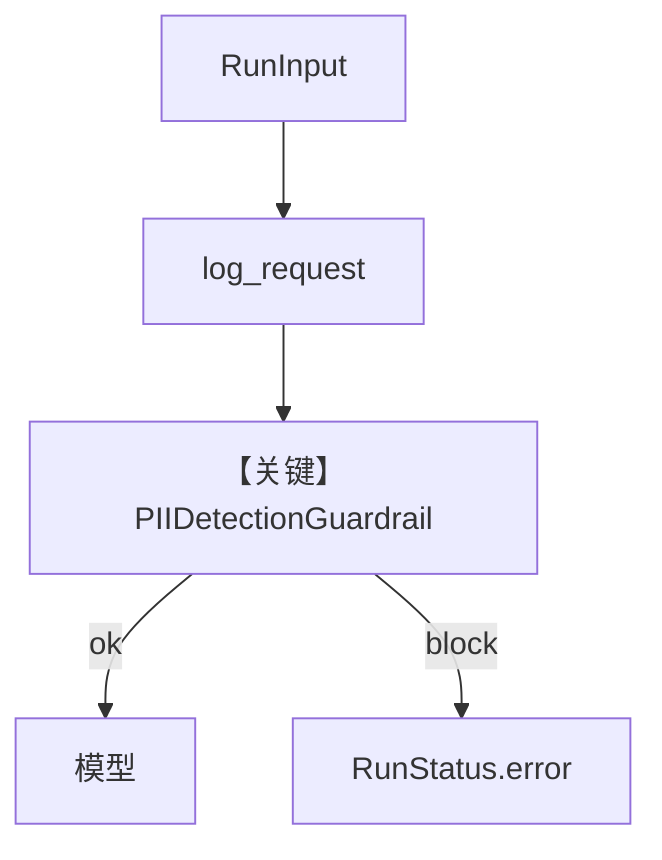

# mixed_hooks.py — 实现原理分析

> 源文件：`cookbook/02_agents/08_guardrails/mixed_hooks.py`

## 概述

本示例展示 **`pre_hooks` 中普通函数与 Guardrail 混排**：先 `log_request` 打印输入前缀，再 `PIIDetectionGuardrail()` 做敏感信息检测；失败则 `RunStatus.error`，模型不处理原始 PII。

**核心配置一览：**

| 配置项 | 值 | 说明 |
|--------|------|------|
| `name` | `"Privacy-Protected Agent"` | |
| `model` | `OpenAIResponses(id="gpt-4o-mini")` | Responses API |
| `pre_hooks` | `[log_request, PIIDetectionGuardrail()]` | 顺序执行 |
| `instructions` | `"You are a helpful assistant that protects user privacy."` | 字面量 |
| `markdown` | `False` | 未设置（默认） |

## 核心组件解析

### 顺序

`log_request` 先执行（副作用：print），再 PII 护栏；若 PII 命中，后续 run 中止。

### `agent.run` 与状态

脚本用 `response.status == RunStatus.error` 判断拦截，而非异常（依护栏实现可能两者兼有）。

### 运行机制与因果链

1. Clean input：日志 → 护栏通过 → 模型回复。
2. SSN/卡号：日志仍可能打印 → 护栏拦截 → `RunStatus.error`。

## System Prompt 组装

| 组成部分 | 值 |
|---------|-----|
| `instructions` | `You are a helpful assistant that protects user privacy.` |

无 `markdown=True`。

### 还原后的完整 System 文本（核心字面量）

```text
You are a helpful assistant that protects user privacy.
```

（若默认拼装为列表项或带 `<instructions>` 标签，以 `_messages.py` `# 3.3.3` 为准。）

## 完整 API 请求

护栏失败时不应到达 `responses.create`。

## Mermaid 流程图


```mermaid
flowchart TD
    A["RunInput"] --> L["log_request"]
    L --> P["【关键】PIIDetectionGuardrail"]
    P -->|ok| M["模型"]
    P -->|block| E["RunStatus.error"]
```

## 关键源码文件索引

| 文件 | 作用 |
|------|------|
| `agno/guardrails` | `PIIDetectionGuardrail` |
| `agno/agent/_hooks.py` | 顺序执行 pre_hooks |
