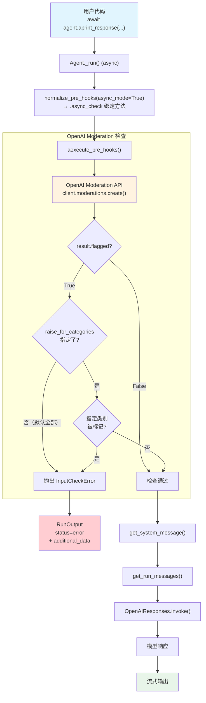

# openai_moderation.py — 实现原理分析

> 源文件：`cookbook/02_agents/08_guardrails/openai_moderation.py`

## 概述

本示例展示 Agno 内置的 **`OpenAIModerationGuardrail`** 机制：通过 OpenAI Moderation API 对输入内容（文本和图片）进行内容审核，检测暴力、仇恨言论、色情等违规类别。支持默认全类别检测和自定义类别过滤。示例使用异步模式（`asyncio.run` + `aprint_response`），并演示了文本和图片的审核场景。

**核心配置一览：**

| 配置项 | Agent 1（basic_agent） | Agent 2（custom_agent） | 说明 |
|--------|----------------------|----------------------|------|
| `name` | `"Basic Moderated Agent"` | `"Custom Moderated Agent"` | Agent 名称 |
| `model` | `OpenAIResponses(id="gpt-5-mini")` | `OpenAIResponses(id="gpt-5-mini")` | Responses API |
| `pre_hooks` | `[OpenAIModerationGuardrail()]` | `[OpenAIModerationGuardrail(raise_for_categories=[...])]` | 默认全类别 vs 自定义类别 |
| `description` | `"An agent with basic OpenAI content moderation."` | `"An agent that only moderates violence and hate speech."` | Agent 描述 |
| `instructions` | `"You are a helpful assistant..."` | `"You are a helpful assistant with selective content moderation."` | 指令 |
| `markdown` | `True`（默认） | `True`（默认） | 格式化输出 |

## 架构分层

```
用户代码层                           agno.agent 层
┌──────────────────────────────┐   ┌────────────────────────────────────────┐
│ openai_moderation.py         │   │ Agent._run() (async)                   │
│                              │   │  ├ normalize_pre_hooks(async_mode=True)│
│ pre_hooks=[                  │   │  │  → .async_check 绑定方法            │
│   OpenAIModerationGuardrail()│──>│  │                                     │
│ ]                            │   │  ├ aexecute_pre_hooks()                │
│                              │   │  │  → async_check(run_input)           │
│ aprint_response(             │   │  │    → OpenAI Moderation API 调用     │
│   input="...",               │   │  │    → InputCheckError? → 中断        │
│   images=[...]               │   │  │                                     │
│ )                            │   │  ├ get_system_message()                │
└──────────────────────────────┘   │  ├ get_run_messages()                  │
                                   └──┴──────────────────────────────────────┘
                                          │                    │
                                          ▼                    ▼
                                   ┌────────────┐     ┌──────────────────┐
                                   │ OpenAI      │     │ OpenAIResponses  │
                                   │ Moderation  │     │ gpt-5-mini       │
                                   │ API         │     └──────────────────┘
                                   └────────────┘
```

## 核心组件解析

### OpenAIModerationGuardrail

`OpenAIModerationGuardrail`（`guardrails/openai.py` L12）封装 OpenAI Moderation API：

```python
class OpenAIModerationGuardrail(BaseGuardrail):
    def __init__(
        self,
        moderation_model: str = "omni-moderation-latest",  # 审核模型
        raise_for_categories: Optional[List[Literal[...]]] = None,  # 指定检测类别
        api_key: Optional[str] = None,  # 默认用 OPENAI_API_KEY 环境变量
    ): ...
```

**支持的审核类别（13 个）：**

| 类别 | 说明 |
|------|------|
| `sexual` / `sexual/minors` | 色情/未成年色情 |
| `harassment` / `harassment/threatening` | 骚扰/威胁性骚扰 |
| `hate` / `hate/threatening` | 仇恨言论/威胁性仇恨 |
| `illicit` / `illicit/violent` | 违法/暴力违法 |
| `self-harm` / `self-harm/intent` / `self-harm/instructions` | 自残相关 |
| `violence` / `violence/graphic` | 暴力/血腥暴力 |

### 同步 vs 异步审核

```python
# 同步版（guardrails/openai.py L54）
def check(self, run_input):
    from openai import OpenAI as OpenAIClient
    client = OpenAIClient(api_key=self.api_key)
    response = client.moderations.create(model=self.moderation_model, input=model_input)

# 异步版（guardrails/openai.py L100）
async def async_check(self, run_input):
    from openai import AsyncOpenAI as OpenAIClient
    client = OpenAIClient(api_key=self.api_key)
    response = await client.moderations.create(model=self.moderation_model, input=model_input)
```

由于本示例使用 `aprint_response()`，`normalize_pre_hooks(async_mode=True)` 会绑定 `async_check` 方法。

### 图片审核支持

当 `run_input.images` 不为空时，审核请求会包含图片：

```python
# guardrails/openai.py L69-70
if images is not None:
    model_input = [{"type": "text", "text": content}, *images_to_message(images=images)]
```

`images_to_message()` 将 `Image` 对象转换为 OpenAI Moderation API 接受的格式。

### 类别过滤逻辑

```python
# guardrails/openai.py L77-98
if result.flagged:
    moderation_result = {
        "categories": result.categories.model_dump(),
        "category_scores": result.category_scores.model_dump(),
    }
    trigger_validation = False
    if self.raise_for_categories is not None:
        # 仅在指定类别被标记时触发
        for category in self.raise_for_categories:
            if moderation_result["categories"][category]:
                trigger_validation = True
    else:
        # 默认：任何类别被标记都触发
        trigger_validation = True
    if trigger_validation:
        raise InputCheckError(
            "OpenAI moderation violation detected.",
            additional_data=moderation_result,  # 携带详细审核结果
            check_trigger=CheckTrigger.INPUT_NOT_ALLOWED,
        )
```

| 模式 | `raise_for_categories` 值 | 行为 |
|------|--------------------------|------|
| 默认全类别 | `None` | 任何类别被标记都拦截 |
| 自定义类别 | `["violence", "violence/graphic", "hate", "hate/threatening"]` | 仅暴力和仇恨被标记时拦截 |

### 异常中的 additional_data

`InputCheckError` 的 `additional_data` 包含完整审核结果：
- `categories`：每个类别的布尔标记
- `category_scores`：每个类别的置信度分数

示例代码通过 `e.additional_data` 访问这些数据：

```python
except InputCheckError as e:
    print(f"[BLOCKED] Violence blocked: {e.message[:100]}...")
    print(f"   {json.dumps(e.additional_data, indent=2)}")
```

## System Prompt 组装

| 序号 | 组成部分 | 本文件中的值/来源 | 是否生效 |
|------|---------|-----------------|---------|
| 1 | `system_message`（自定义） | `None` | 否 |
| 3.1 | `instructions` | `"You are a helpful assistant that provides information and answers questions."` | 是 |
| 3.1.1 | 模型指令（`get_instructions_for_model`） | OpenAIResponses 默认 | 视模型而定 |
| 3.2.1 | `markdown` | `True`（默认） | 是 |
| 3.2.2 | `add_datetime_to_context` | `False`（默认） | 否 |
| 3.2.3 | `add_location_to_context` | `False`（默认） | 否 |
| 3.2.4 | `add_name_to_context` | `False`（默认） | 否 |
| 3.3.1 | `description` | `"An agent with basic OpenAI content moderation."` | 是 |
| 3.3.2 | `role` | `None` | 否 |
| 3.3.3 | instructions 拼接 | `"You are a helpful assistant..."` | 是 |
| 3.3.4 | additional_information | `["Use markdown to format your answers."]` | 是 |
| 3.3.5 | `_tool_instructions` | `None` | 否 |
| fmt | `resolve_in_context` 变量替换 | 默认 True，无模板变量 | 否 |
| 3.3.7 | `expected_output` | `None` | 否 |
| 3.3.8 | `additional_context` | `None` | 否 |
| 3.3.9 | `add_memories_to_context` | `False`（默认） | 否 |
| 3.3.10 | `add_culture_to_context` | `False`（默认） | 否 |
| 3.3.11 | `add_session_summary_to_context` | `False`（默认） | 否 |
| 3.3.12 | `add_learnings_to_context` | `True`（默认） | 否（无 learning） |
| 3.3.13 | `search_knowledge` instructions | 否（无 knowledge） | 否 |
| 3.3.14 | 模型 system message | 视模型而定 | 视模型而定 |
| 3.3.15 | JSON output prompt | 否（无 output_schema） | 否 |
| 3.3.16 | response model format prompt | 否 | 否 |
| 3.3.17 | `add_session_state_to_context` | `False`（默认） | 否 |

### 最终 System Prompt（basic_agent）

```text
An agent with basic OpenAI content moderation.
You are a helpful assistant that provides information and answers questions.

<additional_information>
- Use markdown to format your answers.
</additional_information>
```

## 完整 API 请求

**审核通过时（TEST 1）：**

先调用 Moderation API：

```python
# OpenAIModerationGuardrail.async_check() 内部
client = AsyncOpenAI(api_key=...)
response = await client.moderations.create(
    model="omni-moderation-latest",
    input="Can you help me understand machine learning concepts?"
)
# result.flagged == False → 检查通过
```

再调用主模型：

```python
client.responses.create(
    model="gpt-5-mini",
    input=[
        {
            "role": "developer",
            "content": "An agent with basic OpenAI content moderation.\nYou are a helpful assistant that provides information and answers questions.\n\n<additional_information>\n- Use markdown to format your answers.\n</additional_information>\n\n"
        },
        {
            "role": "user",
            "content": "Can you help me understand machine learning concepts?"
        }
    ],
    stream=True,
    stream_options={"include_usage": True}
)
```

**审核失败时（TEST 2 — 暴力内容）：**

```python
# Moderation API 返回 result.flagged == True
# raise_for_categories=None → 任何标记都触发
# 抛出 InputCheckError，不会调用主模型
```

**自定义类别 + 图片审核（TEST 4）：**

```python
# OpenAIModerationGuardrail.async_check() 内部
client = AsyncOpenAI(api_key=...)
response = await client.moderations.create(
    model="omni-moderation-latest",
    input=[
        {"type": "text", "text": "What do you see in this image?"},
        # images_to_message() 转换后的图片数据
        {"type": "image_url", "image_url": {"url": "https://agno-public.s3.amazonaws.com/images/ww2_violence.jpg"}}
    ]
)
# 仅检查 ["violence", "violence/graphic", "hate", "hate/threatening"]
```

## Mermaid 流程图



## 关键源码文件索引

| 文件 | 关键函数/类 | 作用 |
|------|------------|------|
| `agno/guardrails/openai.py` | `OpenAIModerationGuardrail` L12 | OpenAI Moderation API 护栏 |
| `agno/guardrails/openai.py` | `check()` L54 | 同步审核（调用 `OpenAI.moderations.create`） |
| `agno/guardrails/openai.py` | `async_check()` L100 | 异步审核（调用 `AsyncOpenAI.moderations.create`） |
| `agno/guardrails/base.py` | `BaseGuardrail` L8 | 护栏抽象基类 |
| `agno/exceptions.py` | `InputCheckError` L134 | 输入检查异常，携带 `additional_data` |
| `agno/exceptions.py` | `CheckTrigger.INPUT_NOT_ALLOWED` L126 | 审核违规触发类型 |
| `agno/utils/hooks.py` | `normalize_pre_hooks()` L70 | 异步模式下绑定 `async_check` |
| `agno/agent/_hooks.py` | `aexecute_pre_hooks()` L156 | 异步版 pre_hooks 执行 |
| `agno/agent/_run.py` | 异步异常处理 L1710 | 捕获 InputCheckError 设置 error 状态 |
| `agno/utils/openai.py` | `images_to_message()` | 将 Image 对象转换为 Moderation API 格式 |
| `agno/agent/agent.py` | `pre_hooks` L176 | Agent 属性定义 |
| `agno/run/agent.py` | `RunInput` L29 | 输入容器（含 images 字段） |
