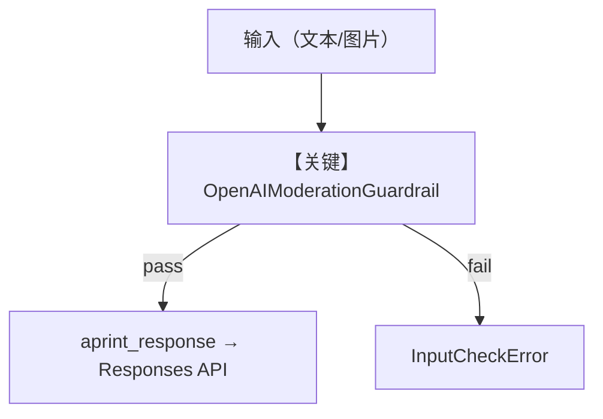

# openai_moderation.py — 实现原理分析

> 源文件：`cookbook/02_agents/08_guardrails/openai_moderation.py`

## 概述

本示例展示 **OpenAI Moderation API 护栏**：`OpenAIModerationGuardrail()` 在 `pre_hooks` 中审查文本（及可含图片）内容，违规抛 `InputCheckError`；第二个 Agent 演示 **`raise_for_categories`** 限定只关心暴力/仇恨等类别。

**核心配置一览：**

| 配置项 | 值 |
|--------|-----|
| `basic_agent` | `pre_hooks=[OpenAIModerationGuardrail()]`，`description` + `instructions` 字面量 |
| `custom_agent` | `OpenAIModerationGuardrail(raise_for_categories=[...])` |
| `model` | `OpenAIResponses(id="gpt-5-mini")` |

## 核心组件解析

护栏内部调用 OpenAI **Moderation** 端点（与 Chat/Responses 分离），根据返回类别决定是否拦截。

### 运行机制与因果链

1. 安全提问 → 通过 → `aprint_response` 正常。
2. 暴力/仇恨示例 → `InputCheckError`，打印 `e.check_trigger`。
3. 图片测试：`Image(url=...)` 与文本一并送入需审核的输入路径（依 guardrail 实现）。

## System Prompt 组装

`basic_agent` 字面量：

- `description`: `An agent with basic OpenAI content moderation.`
- `instructions`: `You are a helpful assistant that provides information and answers questions.`

`custom_agent`：

- `description`: `An agent that only moderates violence and hate speech.`
- `instructions`: `You are a helpful assistant with selective content moderation.`

## 完整 API 请求

通过护栏后：主对话为 `responses.create`；审核为 **额外** Moderation HTTP 调用。

## Mermaid 流程图

```mermaid
flowchart TD
    A["输入（文本/图片）"] --> M["【关键】OpenAIModerationGuardrail"]
    M -->|pass| R["aprint_response → Responses API"]
    M -->|fail| X["InputCheckError"]
```

## 关键源码文件索引

| 文件 | 作用 |
|------|------|
| `agno/guardrails`（OpenAI moderation 实现） | Moderation 调用与类别映射 |
