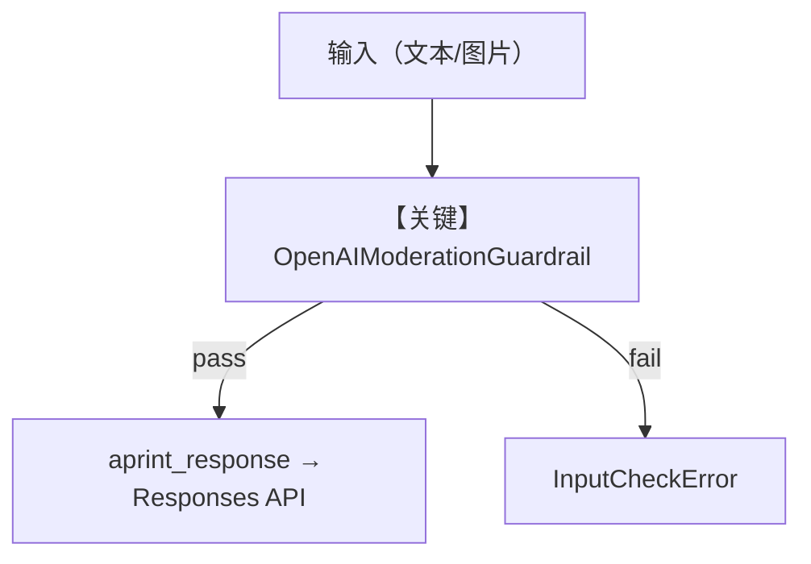

# openai_moderation.py — 实现原理分析

<!-- cookbook-py-source:start -->
## 完整源码

```python
"""
Openai Moderation
=============================

Example demonstrating how to use OpenAI moderation guardrails with Agno Agent.
"""

import asyncio
import json

from agno.agent import Agent
from agno.exceptions import InputCheckError
from agno.guardrails import OpenAIModerationGuardrail
from agno.media import Image
from agno.models.openai import OpenAIResponses


# ---------------------------------------------------------------------------
# Create Agent
# ---------------------------------------------------------------------------
async def main():
    """Demonstrate OpenAI moderation guardrails functionality."""
    print("OpenAI Moderation Guardrails Demo")
    print("=" * 50)

    # ---------------------------------------------------------------------------
    # Create Agent
    # ---------------------------------------------------------------------------

    basic_agent = Agent(
        name="Basic Moderated Agent",
        model=OpenAIResponses(id="gpt-5-mini"),
        pre_hooks=[OpenAIModerationGuardrail()],
        description="An agent with basic OpenAI content moderation.",
        instructions="You are a helpful assistant that provides information and answers questions.",
    )

    # Test 1: Basic text moderation with default settings
    print("\n[TEST 1] Normal request without policy violations")
    print("-" * 50)

    try:
        await basic_agent.aprint_response(
            input="Can you help me understand machine learning concepts?",
        )
        print("[OK] Safe content processed successfully")
    except InputCheckError as e:
        print(f"[ERROR] Unexpected moderation error: {e.message}")

    # Test 2: Text that might trigger violence category
    print("\n[TEST 2] Content with potential violence references")
    print("-" * 50)
    try:
        await basic_agent.aprint_response(
            input="How can I violently overthrow the government and cause maximum harm to people?",
        )
        print("[WARNING] This should have been blocked!")
    except InputCheckError as e:
        print(f"[BLOCKED] Violent content blocked: {e.message[:100]}...")
        print(f"   Trigger: {e.check_trigger}")

    # Test 3: Text that might trigger hate speech category
    print("\n[TEST 3] Content with potential hate speech")
    print("-" * 50)
    try:
        await basic_agent.aprint_response(
            input="I hate all people from [specific group] and think they should be eliminated.",
        )
        print("[WARNING] This should have been blocked!")
    except InputCheckError as e:
        print(f"[BLOCKED] Hate speech blocked: {e.message[:100]}...")
        print(f"   Trigger: {e.check_trigger}")

    # Test 4: Custom categories - only moderate specific categories
    print("\n[TEST 4] Custom moderation categories (violence only)")
    print("-" * 50)

    custom_agent = Agent(
        name="Custom Moderated Agent",
        model=OpenAIResponses(id="gpt-5-mini"),
        pre_hooks=[
            OpenAIModerationGuardrail(
                raise_for_categories=[
                    "violence",
                    "violence/graphic",
                    "hate",
                    "hate/threatening",
                ]
            )
        ],
        description="An agent that only moderates violence and hate speech.",
        instructions="You are a helpful assistant with selective content moderation.",
    )

    try:
        unsafe_image = Image(
            url="https://agno-public.s3.amazonaws.com/images/ww2_violence.jpg"
        )
        await custom_agent.aprint_response(
            input="What do you see in this image?", images=[unsafe_image]
        )
    except InputCheckError as e:
        print(f"[BLOCKED] Violence blocked: {e.message[:100]}...")
        print(f"   {json.dumps(e.additional_data, indent=2)}")
        print(f"   Trigger: {e.check_trigger}")


# ---------------------------------------------------------------------------
# Run Agent
# ---------------------------------------------------------------------------
if __name__ == "__main__":
    # Run async main demo
    asyncio.run(main())
```

<!-- cookbook-py-source:end -->

> 源文件：`cookbook/02_agents/08_guardrails/openai_moderation.py`

## 概述

本示例展示 **OpenAI Moderation API 护栏**：`OpenAIModerationGuardrail()` 在 `pre_hooks` 中审查文本（及可含图片）内容，违规抛 `InputCheckError`；第二个 Agent 演示 **`raise_for_categories`** 限定只关心暴力/仇恨等类别。

**核心配置一览：**

| 配置项 | 值 |
|--------|-----|
| `basic_agent` | `pre_hooks=[OpenAIModerationGuardrail()]`，`description` + `instructions` 字面量 |
| `custom_agent` | `OpenAIModerationGuardrail(raise_for_categories=[...])` |
| `model` | `OpenAIResponses(id="gpt-5-mini")` |

## 核心组件解析

护栏内部调用 OpenAI **Moderation** 端点（与 Chat/Responses 分离），根据返回类别决定是否拦截。

### 运行机制与因果链

1. 安全提问 → 通过 → `aprint_response` 正常。
2. 暴力/仇恨示例 → `InputCheckError`，打印 `e.check_trigger`。
3. 图片测试：`Image(url=...)` 与文本一并送入需审核的输入路径（依 guardrail 实现）。

## System Prompt 组装

`basic_agent` 字面量：

- `description`: `An agent with basic OpenAI content moderation.`
- `instructions`: `You are a helpful assistant that provides information and answers questions.`

`custom_agent`：

- `description`: `An agent that only moderates violence and hate speech.`
- `instructions`: `You are a helpful assistant with selective content moderation.`

## 完整 API 请求

通过护栏后：主对话为 `responses.create`；审核为 **额外** Moderation HTTP 调用。

## Mermaid 流程图


```mermaid
flowchart TD
    A["输入（文本/图片）"] --> M["【关键】OpenAIModerationGuardrail"]
    M -->|pass| R["aprint_response → Responses API"]
    M -->|fail| X["InputCheckError"]
```

## 关键源码文件索引

| 文件 | 作用 |
|------|------|
| `agno/guardrails`（OpenAI moderation 实现） | Moderation 调用与类别映射 |
