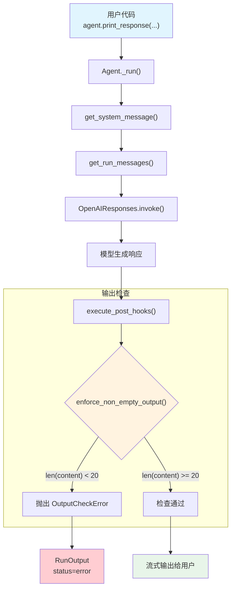

# output_guardrail.py — 实现原理分析

> 源文件：`cookbook/02_agents/08_guardrails/output_guardrail.py`

## 概述

本示例展示 Agno 的 **`post_hooks` 输出检查**机制：通过在 `post_hooks` 中注册普通函数，对 Agent 生成的输出进行后置验证。与 `pre_hooks`（输入检查）不同，`post_hooks` 在模型响应生成后、返回给用户前执行。检查失败时抛出 `OutputCheckError` 中断响应返回。

**核心配置一览：**

| 配置项 | 值 | 说明 |
|--------|------|------|
| `name` | `"Output-Checked Agent"` | Agent 名称 |
| `model` | `OpenAIResponses(id="gpt-5.2")` | Responses API |
| `pre_hooks` | `None` | 未设置 |
| `post_hooks` | `[enforce_non_empty_output]` | 输出检查函数 |
| `instructions` | `None` | 未设置 |
| `description` | `None` | 未设置 |
| `markdown` | `True`（默认） | 格式化输出 |

## 架构分层

```
用户代码层                          agno.agent 层
┌──────────────────────────────┐  ┌─────────────────────────────────────────┐
│ output_guardrail.py          │  │ Agent._run()                            │
│                              │  │  ├ _messages.py L106                    │
│ post_hooks=[                 │  │  │  get_system_message()                │
│   enforce_non_empty_output   │  │  ├ _messages.py L1146                   │
│ ]                            │  │  │  get_run_messages()                  │
│                              │  │  ├ Model.invoke()                       │
│ print_response(              │  │  │  → 模型生成响应                      │
│   "Summarize the key...",    │  │  │                                      │
│   stream=True                │  │  ├ _run.py L559-572  ← 步骤 10        │
│ )                            │──│──│  execute_post_hooks()                │
│                              │  │  │    → enforce_non_empty_output(       │
│                              │  │  │        run_output=RunOutput)          │
│                              │  │  │    → OutputCheckError? → 中断        │
└──────────────────────────────┘  └──┴─────────────────────────────────────┘
                                         │
                                         ▼
                                 ┌──────────────────┐
                                 │ OpenAIResponses   │
                                 │ gpt-5.2           │
                                 └──────────────────┘
```

## 核心组件解析

### 输出检查函数

`enforce_non_empty_output` 是一个接受 `RunOutput` 参数的普通函数：

```python
def enforce_non_empty_output(run_output: RunOutput) -> None:
    """拒绝空或过短的响应"""
    content = (run_output.content or "").strip()
    if len(content) < 20:
        raise OutputCheckError(
            "Output is too short to be useful.",
            check_trigger=CheckTrigger.OUTPUT_NOT_ALLOWED,
        )
```

关键点：
- 参数类型为 `RunOutput`（`run/agent.py` L581），而非 pre_hooks 的 `RunInput`
- 通过 `run_output.content` 获取模型生成的文本内容
- 抛出 `OutputCheckError`（而非 `InputCheckError`）

### pre_hooks vs post_hooks 对比

| 特性 | pre_hooks | post_hooks |
|------|-----------|------------|
| 执行时机 | 模型调用前（步骤 4） | 模型调用后（步骤 10） |
| 参数类型 | `RunInput`（用户输入） | `RunOutput`（模型输出） |
| 异常类型 | `InputCheckError` | `OutputCheckError` |
| 执行位置 | `_run.py` L410-425 | `_run.py` L559-572 |
| 常见用途 | 输入过滤、安全检查 | 输出质量验证、格式检查 |

### post_hooks 的规范化

`normalize_post_hooks()`（`utils/hooks.py` L113）与 `normalize_pre_hooks()` 逻辑相同：
- 普通函数 → 直接保留
- `BaseGuardrail` 实例 → 转为 `.check` 绑定方法
- `BaseEval` 实例 → 提取 `.post_check` 方法

### post_hooks 执行

`execute_post_hooks()`（`_hooks.py` L266）参数注入映射：

| 参数名 | 注入内容 | 说明 |
|--------|---------|------|
| `run_output` | `RunOutput` 实例 | 包含模型响应内容 |
| `agent` | `Agent` 实例 | Agent 引用 |
| `session` | `AgentSession` | 会话对象 |
| `run_context` | `RunContext` | 运行上下文 |
| `user_id` | 用户 ID | 可选 |

`filter_hook_args()` 检查 `enforce_non_empty_output` 的签名只有 `run_output`，因此只传递这一个参数。

### OutputCheckError 处理

与 `InputCheckError` 使用相同的异常处理逻辑（`_run.py` L628-646）：

```python
except (InputCheckError, OutputCheckError) as e:
    run_response.status = RunStatus.error
    if run_response.content is None:
        run_response.content = str(e)
    cleanup_and_store(...)
    return run_response
```

> 注意：post_hooks 是在模型已经生成响应之后执行的，因此 `run_response.content` 通常已有值。此时 `OutputCheckError` 不会覆盖 content（因为 `if run_response.content is None` 条件不满足），但 status 仍会被设置为 error。

## System Prompt 组装

| 序号 | 组成部分 | 本文件中的值/来源 | 是否生效 |
|------|---------|-----------------|---------|
| 1 | `system_message`（自定义） | `None` | 否 |
| 3.1 | `instructions` | `None` | 否 |
| 3.1.1 | 模型指令（`get_instructions_for_model`） | OpenAIResponses 默认 | 视模型而定 |
| 3.2.1 | `markdown` | `True`（默认） | 是 |
| 3.2.2 | `add_datetime_to_context` | `False`（默认） | 否 |
| 3.2.3 | `add_location_to_context` | `False`（默认） | 否 |
| 3.2.4 | `add_name_to_context` | `False`（默认） | 否 |
| 3.3.1 | `description` | `None` | 否 |
| 3.3.2 | `role` | `None` | 否 |
| 3.3.3 | instructions 拼接 | 无 | 否 |
| 3.3.4 | additional_information | `["Use markdown to format your answers."]` | 是 |
| 3.3.5 | `_tool_instructions` | `None` | 否 |
| fmt | `resolve_in_context` 变量替换 | 默认 True，无模板变量 | 否 |
| 3.3.7 | `expected_output` | `None` | 否 |
| 3.3.8 | `additional_context` | `None` | 否 |
| 3.3.9 | `add_memories_to_context` | `False`（默认） | 否 |
| 3.3.10 | `add_culture_to_context` | `False`（默认） | 否 |
| 3.3.11 | `add_session_summary_to_context` | `False`（默认） | 否 |
| 3.3.12 | `add_learnings_to_context` | `True`（默认） | 否（无 learning） |
| 3.3.13 | `search_knowledge` instructions | 否（无 knowledge） | 否 |
| 3.3.14 | 模型 system message | 视模型而定 | 视模型而定 |
| 3.3.15 | JSON output prompt | 否（无 output_schema） | 否 |
| 3.3.16 | response model format prompt | 否 | 否 |
| 3.3.17 | `add_session_state_to_context` | `False`（默认） | 否 |

### 最终 System Prompt

```text
<additional_information>
- Use markdown to format your answers.
</additional_information>
```

## 完整 API 请求

```python
client.responses.create(
    model="gpt-5.2",
    input=[
        # 1. System Message（role_map: system → developer）
        {
            "role": "developer",
            "content": "<additional_information>\n- Use markdown to format your answers.\n</additional_information>\n\n"
        },
        # 2. 当前用户输入
        {
            "role": "user",
            "content": "Summarize the key ideas in clean architecture."
        }
    ],
    stream=True,
    stream_options={"include_usage": True}
)
```

> 模型响应生成后，`execute_post_hooks()` 执行 `enforce_non_empty_output(run_output)`。如果响应内容长度 >= 20 字符，检查通过，正常返回；如果 < 20 字符，抛出 `OutputCheckError`，`run_response.status` 设为 `RunStatus.error`。

## Mermaid 流程图



## 关键源码文件索引

| 文件 | 关键函数/类 | 作用 |
|------|------------|------|
| `agno/agent/agent.py` | `post_hooks` L178 | Agent 属性：后置 hook 列表 |
| `agno/exceptions.py` | `OutputCheckError` L155 | 输出检查异常 |
| `agno/exceptions.py` | `CheckTrigger.OUTPUT_NOT_ALLOWED` L127 | 输出不允许触发类型 |
| `agno/utils/hooks.py` | `normalize_post_hooks()` L113 | 规范化 post_hooks 列表 |
| `agno/utils/hooks.py` | `filter_hook_args()` L156 | 根据函数签名过滤参数 |
| `agno/agent/_hooks.py` | `execute_post_hooks()` L266 | 按顺序执行所有 post_hooks |
| `agno/agent/_run.py` | post_hooks 执行 L559-572 | 步骤 10：模型响应后执行 |
| `agno/agent/_run.py` | 异常处理 L628-646 | 捕获 OutputCheckError 设置 error 状态 |
| `agno/run/agent.py` | `RunOutput` L581 | 输出容器，post_hook 的参数来源 |
