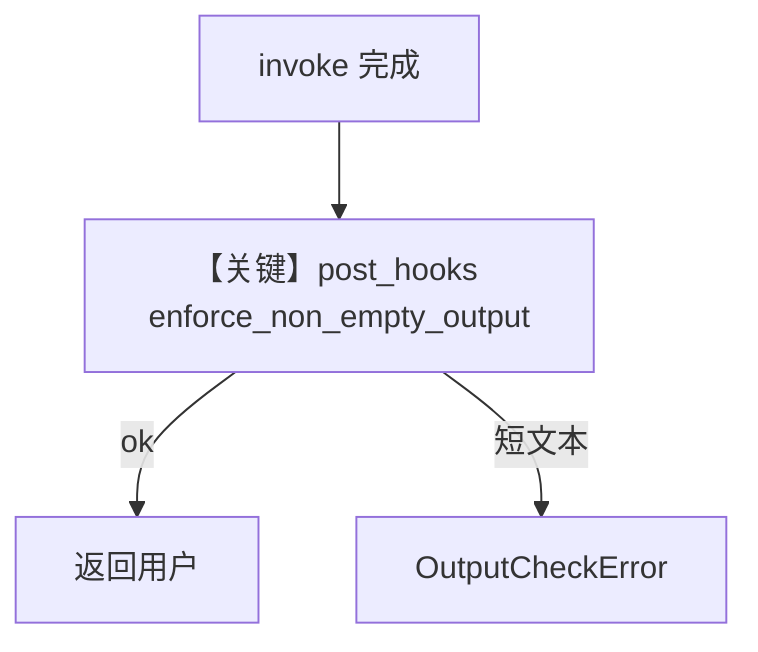

# output_guardrail.py — 实现原理分析

<!-- cookbook-py-source:start -->
## 完整源码

```python
"""
Output Guardrail
=============================

Output Guardrail.
"""

from agno.agent import Agent
from agno.exceptions import CheckTrigger, OutputCheckError
from agno.models.openai import OpenAIResponses
from agno.run.agent import RunOutput


def enforce_non_empty_output(run_output: RunOutput) -> None:
    """Reject empty or very short responses."""
    content = (run_output.content or "").strip()
    if len(content) < 20:
        raise OutputCheckError(
            "Output is too short to be useful.",
            check_trigger=CheckTrigger.OUTPUT_NOT_ALLOWED,
        )


# ---------------------------------------------------------------------------
# Create Agent
# ---------------------------------------------------------------------------
agent = Agent(
    name="Output-Checked Agent",
    model=OpenAIResponses(id="gpt-5.2"),
    post_hooks=[enforce_non_empty_output],
)

# ---------------------------------------------------------------------------
# Run Agent
# ---------------------------------------------------------------------------
if __name__ == "__main__":
    agent.print_response("Summarize the key ideas in clean architecture.", stream=True)
```

<!-- cookbook-py-source:end -->

> 源文件：`cookbook/02_agents/08_guardrails/output_guardrail.py`

## 概述

本示例展示 **输出侧校验**：通过 `post_hooks` 注册 `enforce_non_empty_output`，在模型返回后检查 `RunOutput.content` 长度，过短则 `OutputCheckError`（`CheckTrigger.OUTPUT_NOT_ALLOWED`）。

**核心配置一览：**

| 配置项 | 值 |
|--------|-----|
| `name` | `"Output-Checked Agent"` |
| `model` | `OpenAIResponses(id="gpt-5.2")` |
| `post_hooks` | `[enforce_non_empty_output]` |

## 核心组件解析

### Post hooks

`execute_post_hooks` 在得到 `RunOutput` 后运行（见 `agno/agent/_hooks.py` 与 `_run.py` 中 `execute_post_hooks` 引用）。

### 运行机制与因果链

流式 `print_response` 结束后仍应得到完整 `content` 再校验；若模型返回少于 20 字符则失败。

## System Prompt 组装

无显式 `instructions`；system 可能为默认空或模型默认。

参照用户句：`Summarize the key ideas in clean architecture.`

## 完整 API 请求

先 `responses.create`（或流式），再 **post_hook** 检查输出。

## Mermaid 流程图


```mermaid
flowchart TD
    A["invoke 完成"] --> B["【关键】post_hooks enforce_non_empty_output"]
    B -->|ok| C["返回用户"]
    B -->|短文本| D["OutputCheckError"]
```

## 关键源码文件索引

| 文件 | 作用 |
|------|------|
| `agno/agent/_hooks.py` | `execute_post_hooks` |
| `agno/exceptions` | `OutputCheckError` |
