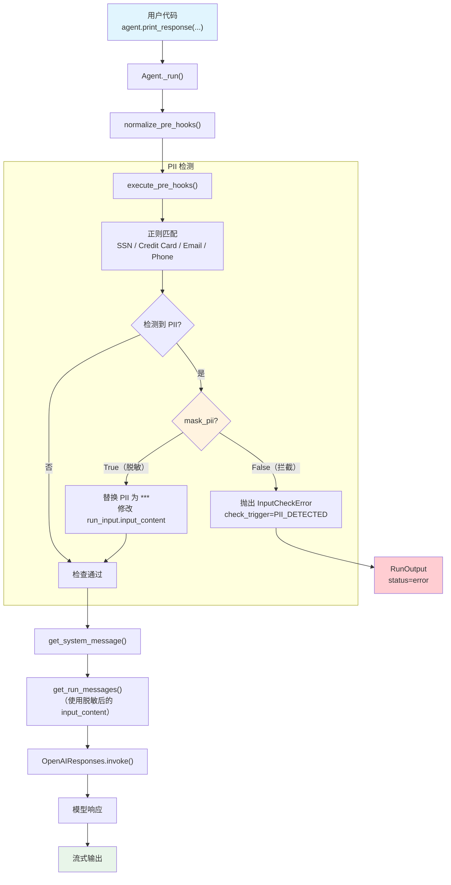

# pii_detection.py — 实现原理分析

> 源文件：`cookbook/02_agents/08_guardrails/pii_detection.py`

## 概述

本示例展示 Agno 内置的 **`PIIDetectionGuardrail`** 机制：通过正则表达式检测用户输入中的个人敏感信息（PII），支持 SSN、信用卡、邮箱、电话四种默认模式。提供两种处理策略：**拦截模式**（默认，抛出 `InputCheckError`）和 **脱敏模式**（`mask_pii=True`，将 PII 替换为 `*` 后继续执行）。示例使用异步模式。

**核心配置一览：**

| 配置项 | Agent 1（拦截模式） | Agent 2（脱敏模式） | 说明 |
|--------|-------------------|-------------------|------|
| `name` | `"Privacy-Protected Agent"` | `"Privacy-Protected Agent (Masked)"` | Agent 名称 |
| `model` | `OpenAIResponses(id="gpt-5-mini")` | `OpenAIResponses(id="gpt-5-mini")` | Responses API |
| `pre_hooks` | `[PIIDetectionGuardrail()]` | `[PIIDetectionGuardrail(mask_pii=True)]` | 拦截 vs 脱敏 |
| `description` | `"An agent that helps with customer service while protecting privacy."` | 同左 | Agent 描述 |
| `instructions` | `"You are a helpful customer service assistant..."` | 同左 | 指令 |
| `markdown` | `True`（默认） | `True`（默认） | 格式化输出 |

## 架构分层

```
用户代码层                           agno.agent 层
┌──────────────────────────────┐   ┌────────────────────────────────────────┐
│ pii_detection.py             │   │ Agent._run()                           │
│                              │   │  ├ normalize_pre_hooks()                │
│ pre_hooks=[                  │   │  │  → PIIDetectionGuardrail.check      │
│   PIIDetectionGuardrail()    │──>│  │                                     │
│ ]                            │   │  ├ execute_pre_hooks()                  │
│                              │   │  │  → check(run_input)                  │
│ print_response(              │   │  │    ├ 正则匹配 SSN/CC/Email/Phone    │
│   input="My SSN is..."      │   │  │    ├ 拦截模式 → InputCheckError     │
│ )                            │   │  │    └ 脱敏模式 → 修改 input_content  │
│                              │   │  │                                     │
│ PIIDetectionGuardrail(       │   │  ├ get_system_message()                │
│   mask_pii=True              │   │  ├ get_run_messages()                  │
│ )                            │   │  │  (脱敏后的内容进入消息)              │
└──────────────────────────────┘   └──┴──────────────────────────────────────┘
                                          │
                                          ▼
                                  ┌──────────────────┐
                                  │ OpenAIResponses   │
                                  │ gpt-5-mini        │
                                  └──────────────────┘
```

## 核心组件解析

### PIIDetectionGuardrail 构造

`PIIDetectionGuardrail`（`guardrails/pii.py` L10）支持可选启用的检测类别和自定义模式：

```python
class PIIDetectionGuardrail(BaseGuardrail):
    def __init__(
        self,
        mask_pii: bool = False,              # 脱敏模式开关
        enable_ssn_check: bool = True,        # SSN 检测
        enable_credit_card_check: bool = True, # 信用卡检测
        enable_email_check: bool = True,       # 邮箱检测
        enable_phone_check: bool = True,       # 电话检测
        custom_patterns: Optional[Dict[str, Pattern[str]]] = None,  # 自定义正则
    ):
        self.pii_patterns = {}
        if enable_ssn_check:
            self.pii_patterns["SSN"] = re.compile(r"\b\d{3}-\d{2}-\d{4}\b")
        if enable_credit_card_check:
            self.pii_patterns["Credit Card"] = re.compile(r"\b\d{4}[\s-]?\d{4}[\s-]?\d{4}[\s-]?\d{4}\b")
        if enable_email_check:
            self.pii_patterns["Email"] = re.compile(r"\b[A-Za-z0-9._%+-]+@[A-Za-z0-9.-]+\.[A-Za-z]{2,}\b")
        if enable_phone_check:
            self.pii_patterns["Phone"] = re.compile(r"\b\d{3}[\s.-]?\d{3}[\s.-]?\d{4}\b")
```

### 拦截模式 vs 脱敏模式

```python
# guardrails/pii.py L48-70
def check(self, run_input):
    content = run_input.input_content_string()
    detected_pii = []
    for pii_type, pattern in self.pii_patterns.items():
        if pattern.search(content):
            detected_pii.append(pii_type)
    if detected_pii:
        if self.mask_pii:
            # 脱敏模式：替换 PII 为等长 '*'
            for pii_type in detected_pii:
                def mask_match(match):
                    return "*" * len(match.group(0))
                content = self.pii_patterns[pii_type].sub(mask_match, content)
            run_input.input_content = content  # 修改原始输入
            return  # 继续执行
        else:
            # 拦截模式：直接拒绝
            raise InputCheckError(
                "Potential PII detected in input",
                additional_data={"detected_pii": detected_pii},
                check_trigger=CheckTrigger.PII_DETECTED,
            )
```

| 模式 | `mask_pii` | 行为 | 结果 |
|------|-----------|------|------|
| 拦截 | `False`（默认） | 抛出 `InputCheckError` | 请求被拒绝，不调用模型 |
| 脱敏 | `True` | 修改 `run_input.input_content` 替换 PII | 请求继续，脱敏后的内容发送给模型 |

### 脱敏模式的数据流

脱敏模式的关键在于直接修改 `run_input.input_content`：

1. `run_input` 是 `RunInput` 的可变实例，在 `execute_pre_hooks()` 中通过引用传递
2. `PIIDetectionGuardrail.check()` 将 `"123-45-6789"` 替换为 `"***-**-****"`
3. 修改后的 `run_input.input_content` 在后续的 `get_run_messages()` 中被读取
4. 模型收到的是脱敏后的内容

`execute_pre_hooks()` 末尾更新 `run_response.input`（`_hooks.py` L152-153）：

```python
# 更新 run_response 上的输入（含脱敏修改）
run_response.input = run_input
```

### 默认正则模式详解

| PII 类型 | 正则表达式 | 匹配示例 |
|---------|-----------|---------|
| SSN | `\b\d{3}-\d{2}-\d{4}\b` | `123-45-6789` |
| Credit Card | `\b\d{4}[\s-]?\d{4}[\s-]?\d{4}[\s-]?\d{4}\b` | `4532 1234 5678 9012` / `4532123456789012` |
| Email | `\b[A-Za-z0-9._%+-]+@[A-Za-z0-9.-]+\.[A-Za-z]{2,}\b` | `john.doe@example.com` |
| Phone | `\b\d{3}[\s.-]?\d{3}[\s.-]?\d{4}\b` | `555-123-4567` / `555.987.6543` |

## System Prompt 组装

| 序号 | 组成部分 | 本文件中的值/来源 | 是否生效 |
|------|---------|-----------------|---------|
| 1 | `system_message`（自定义） | `None` | 否 |
| 3.1 | `instructions` | `"You are a helpful customer service assistant..."` | 是 |
| 3.1.1 | 模型指令（`get_instructions_for_model`） | OpenAIResponses 默认 | 视模型而定 |
| 3.2.1 | `markdown` | `True`（默认） | 是 |
| 3.2.2 | `add_datetime_to_context` | `False`（默认） | 否 |
| 3.2.3 | `add_location_to_context` | `False`（默认） | 否 |
| 3.2.4 | `add_name_to_context` | `False`（默认） | 否 |
| 3.3.1 | `description` | `"An agent that helps with customer service while protecting privacy."` | 是 |
| 3.3.2 | `role` | `None` | 否 |
| 3.3.3 | instructions 拼接 | `"You are a helpful customer service assistant..."` | 是 |
| 3.3.4 | additional_information | `["Use markdown to format your answers."]` | 是 |
| 3.3.5 | `_tool_instructions` | `None` | 否 |
| fmt | `resolve_in_context` 变量替换 | 默认 True，无模板变量 | 否 |
| 3.3.7 | `expected_output` | `None` | 否 |
| 3.3.8 | `additional_context` | `None` | 否 |
| 3.3.9 | `add_memories_to_context` | `False`（默认） | 否 |
| 3.3.10 | `add_culture_to_context` | `False`（默认） | 否 |
| 3.3.11 | `add_session_summary_to_context` | `False`（默认） | 否 |
| 3.3.12 | `add_learnings_to_context` | `True`（默认） | 否（无 learning） |
| 3.3.13 | `search_knowledge` instructions | 否（无 knowledge） | 否 |
| 3.3.14 | 模型 system message | 视模型而定 | 视模型而定 |
| 3.3.15 | JSON output prompt | 否（无 output_schema） | 否 |
| 3.3.16 | response model format prompt | 否 | 否 |
| 3.3.17 | `add_session_state_to_context` | `False`（默认） | 否 |

### 最终 System Prompt

```text
An agent that helps with customer service while protecting privacy.
You are a helpful customer service assistant. Always protect user privacy and handle sensitive information appropriately.

<additional_information>
- Use markdown to format your answers.
</additional_information>
```

## 完整 API 请求

**TEST 1 — 无 PII（检查通过）：**

```python
client.responses.create(
    model="gpt-5-mini",
    input=[
        {
            "role": "developer",
            "content": "An agent that helps with customer service while protecting privacy.\nYou are a helpful customer service assistant. Always protect user privacy and handle sensitive information appropriately.\n\n<additional_information>\n- Use markdown to format your answers.\n</additional_information>\n\n"
        },
        {
            "role": "user",
            "content": "Can you help me understand your return policy?"
        }
    ],
    stream=True,
    stream_options={"include_usage": True}
)
```

**TEST 2 — 含 SSN（拦截模式，检查失败）：**

> 不会发出 API 请求。`PIIDetectionGuardrail.check()` 检测到 SSN → 抛出 `InputCheckError(check_trigger=CheckTrigger.PII_DETECTED, additional_data={"detected_pii": ["SSN"]})`。

**TEST 8 — 含 SSN（脱敏模式，替换后继续）：**

```python
client.responses.create(
    model="gpt-5-mini",
    input=[
        {
            "role": "developer",
            "content": "An agent that helps with customer service while protecting privacy.\nYou are a helpful customer service assistant. Always protect user privacy and handle sensitive information appropriately.\n\n<additional_information>\n- Use markdown to format your answers.\n</additional_information>\n\n"
        },
        {
            "role": "user",
            # SSN "123-45-6789" 已被替换为 "***********"
            "content": "Hi, my Social Security Number is ***********. Can you help me with my account?"
        }
    ],
    stream=True,
    stream_options={"include_usage": True}
)
```

## Mermaid 流程图



## 关键源码文件索引

| 文件 | 关键函数/类 | 作用 |
|------|------------|------|
| `agno/guardrails/pii.py` | `PIIDetectionGuardrail` L10 | PII 检测护栏（正则匹配 + 拦截/脱敏） |
| `agno/guardrails/pii.py` | `check()` L48 | 同步检查：遍历正则模式匹配 PII |
| `agno/guardrails/pii.py` | `async_check()` L72 | 异步检查（逻辑与同步相同） |
| `agno/guardrails/base.py` | `BaseGuardrail` L8 | 护栏抽象基类 |
| `agno/exceptions.py` | `InputCheckError` L134 | 输入检查异常 |
| `agno/exceptions.py` | `CheckTrigger.PII_DETECTED` L131 | PII 检测触发类型 |
| `agno/utils/hooks.py` | `normalize_pre_hooks()` L70 | 将 Guardrail 实例转为绑定方法 |
| `agno/agent/_hooks.py` | `execute_pre_hooks()` L43 | 执行 pre_hooks，传播 InputCheckError |
| `agno/agent/_hooks.py` | L152-153 | 执行完毕后更新 `run_response.input`（含脱敏修改） |
| `agno/agent/_run.py` | 异常处理 L628-646 | 捕获 InputCheckError 设置 error 状态 |
| `agno/run/agent.py` | `RunInput` L29 | 输入容器（`input_content` 可被脱敏修改） |
| `agno/run/agent.py` | `RunInput.input_content_string()` L49 | 将各种输入类型转为字符串 |
