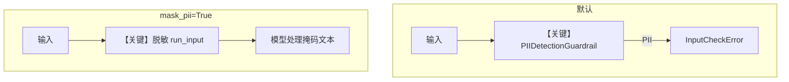

# pii_detection.py — 实现原理分析

> 源文件：`cookbook/02_agents/08_guardrails/pii_detection.py`

## 概述

本示例展示 **PII 检测护栏** 的多种输入与 **`mask_pii=True`** 模式：`PIIDetectionGuardrail()` 默认拦截；后半段重建 Agent 使用 **`PIIDetectionGuardrail(mask_pii=True)`**，在允许对话继续的同时脱敏输入。

**核心配置一览：**

| 阶段 | `pre_hooks` | 说明 |
|------|-------------|------|
| 测试 1–7 | `[PIIDetectionGuardrail()]` | 拦截 SSN/卡号/邮箱/电话等 |
| 测试 8 | `[PIIDetectionGuardrail(mask_pii=True)]` | 掩码后继续 run |

共用：`OpenAIResponses(id="gpt-5-mini")`，`description` 与 `instructions` 客户服务场景字面量。

## 核心组件解析

### 拦截 vs 掩码

- 拦截：`InputCheckError`，模型不见明文。
- 掩码：改写 `run_input` 后再进入模型（具体字段依 `PIIDetectionGuardrail` 实现）。

### 运行机制与因果链

异步 `main()` 中多次 `print_response` 覆盖 **七类** PII 场景与 **掩码** 场景。

## System Prompt 组装

字面量 `instructions`：

```text
You are a helpful customer service assistant. Always protect user privacy and handle sensitive information appropriately.
```

`description`：

```text
An agent that helps with customer service while protecting privacy.
```

（第二段 Agent 描述相同，第二 name 为 `Privacy-Protected Agent (Masked)`。）

## 完整 API 请求

通过或脱敏后：`responses.create`。

## Mermaid 流程图


```mermaid
flowchart TD
    subgraph Block["默认"]
        A["输入"] --> G["【关键】PIIDetectionGuardrail"]
        G -->|PII| E["InputCheckError"]
    end
    subgraph Mask["mask_pii=True"]
        B["输入"] --> H["【关键】脱敏 run_input"]
        H --> M["模型处理掩码文本"]
    end
```

## 关键源码文件索引

| 文件 | 作用 |
|------|------|
| `agno/guardrails` | `PIIDetectionGuardrail` |
