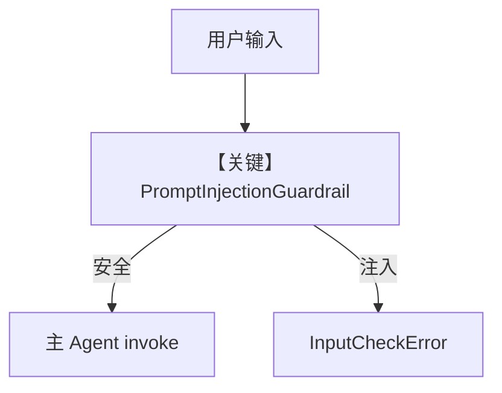

# prompt_injection.py — 实现原理分析

> 源文件：`cookbook/02_agents/08_guardrails/prompt_injection.py`

## 概述

本示例展示 **`PromptInjectionGuardrail`**：在 `pre_hooks` 中检测越狱/忽略指令/角色覆盖等提示注入模式，命中则 `InputCheckError`，保护下游模型不被用户改写系统行为。

**核心配置一览：**

| 配置项 | 值 |
|--------|-----|
| `name` | `"Guardrails Demo Agent"` |
| `model` | `OpenAIResponses(id="gpt-5-mini")` |
| `pre_hooks` | `[PromptInjectionGuardrail()]` |
| `description` | `An agent that tells jokes and provides helpful information.` |
| `instructions` | 长字面量（笑话助手，积极语气） |

## 核心组件解析

多组 `print_response` 覆盖正常请求与四类攻击模板；异常路径打印 `e.check_trigger`。

### 运行机制与因果链

护栏在 **主模型前** 执行；通过后才进入 `get_run_messages` → `invoke`。

## System Prompt 组装

`description` 与 `instructions` 均为 `.py` 字面量，按 `# 3.3.1`–`# 3.3.3` 进入 system。

### 还原后的完整 System 文本（用户给定）

```text
An agent that tells jokes and provides helpful information.

You are a friendly assistant that tells jokes and provides helpful information. Always maintain a positive and helpful tone.
```

（若使用 instruction 标签，以 `use_instruction_tags` 为准。）

参照用户句（正常）：`Hello! Can you tell me a short joke about programming?`

## 完整 API 请求

主对话：`responses.create`；护栏可能额外调用分类/模型（依 `PromptInjectionGuardrail` 实现）。

## Mermaid 流程图


```mermaid
flowchart TD
    U["用户输入"] --> P["【关键】PromptInjectionGuardrail"]
    P -->|安全| M["主 Agent invoke"]
    P -->|注入| E["InputCheckError"]
```

## 关键源码文件索引

| 文件 | 作用 |
|------|------|
| `agno/guardrails` | `PromptInjectionGuardrail` |
