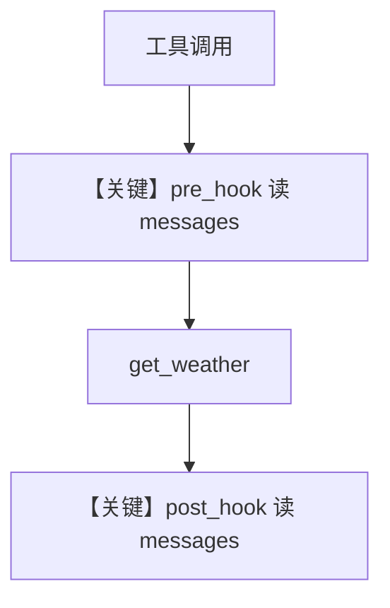

# message_history_hooks.py — 实现原理分析

> 源文件：`cookbook/02_agents/09_hooks/message_history_hooks.py`

## 概述

本示例展示 **工具级 pre/post hook** 访问 **`run_context.messages`**：在 `@tool(pre_hook=..., post_hook=...)` 中打印当前 run 内消息条数，用于调试工具调用前后对话长度。

**核心配置一览：**

| 配置项 | 值 |
|--------|-----|
| `model` | `OpenAIChat(id="gpt-4o-mini")` | **Chat Completions API**（非 Responses） |
| `tools` | `[get_weather]` | 带 hook 的 `@tool` |
| `instructions` | `["Use the tools to help the user."]` |

## 核心组件解析

### `RunContext.messages`

在工具执行前后，hook 读取同一 run 内已组装的 message 列表长度，验证 agentic 循环中历史增长。

### 运行机制与因果链

用户问天气 → 模型调 `get_weather` → pre_hook 打印 → 执行函数 → post_hook 打印含 `fc.result`。

## System Prompt 组装

```text
Use the tools to help the user.
```

（默认 `markdown=False`，无附加段除非模型自带。）

## 完整 API 请求

```python
# OpenAIChat → chat.completions.create（与 OpenAIResponses 不同）
client.chat.completions.create(
    model="gpt-4o-mini",
    messages=[...],  # system/user/assistant/tool
)
```

## Mermaid 流程图



## 关键源码文件索引

| 文件 | 作用 |
|------|------|
| `agno/tools/__init__.py` / `tool` 装饰器 | pre_hook/post_hook 绑定 |
| `agno/models/openai/chat.py` | `OpenAIChat.invoke` |
