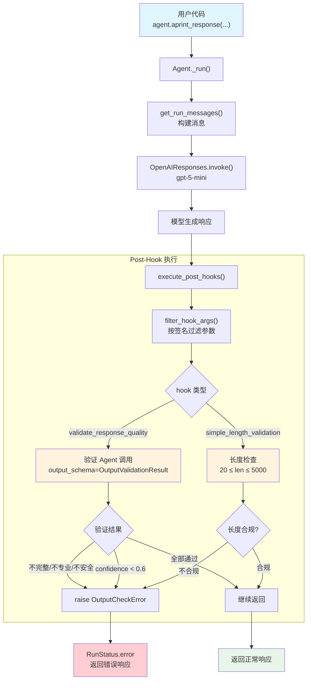

# post_hook_output.py — 实现原理分析

> 源文件：`cookbook/02_agents/09_hooks/post_hook_output.py`

## 概述

本示例展示 Agno 的 **`post_hooks`** 机制：在模型生成响应**之后**、返回给用户**之前**对输出进行质量验证。示例演示了两种后置 hook——AI 驱动的综合验证（完整性/专业性/安全性）和简单的长度检查，验证失败时通过 `OutputCheckError` 中断返回。

**核心配置一览：**

| 配置项 | Agent 1（Customer Support） | Agent 2（Simple） | Agent 3（Brief） |
|--------|----------------------------|-------------------|------------------|
| `name` | `"Customer Support Agent"` | `"Simple Agent"` | `"Brief Agent"` |
| `model` | `OpenAIResponses(id="gpt-5-mini")` | 同左 | 同左 |
| `post_hooks` | `[validate_response_quality]` | `[simple_length_validation]` | `[simple_length_validation]` |
| `instructions` | 3 条客服指令 | 1 条简短指令 | `"Answer in 1-2 words only."` |
| `pre_hooks` | `None` | `None` | `None` |
| `tools` | `None` | `None` | `None` |

> 本示例使用异步模式（`aprint_response` + `asyncio.run`）。

## 架构分层

```
用户代码层                          agno.agent 层
┌──────────────────────────┐    ┌──────────────────────────────────────┐
│ post_hook_output.py      │    │ Agent._run()                         │
│                          │    │  ├ _run.py L1254-1256                │
│ post_hooks=[             │    │  │  normalize_post_hooks()            │
│   validate_response_     │───>│  │    → 普通函数直接保留              │
│   quality                │    │  │                                    │
│ ]                        │    │  ├ 步骤 7: Model.response()           │
│                          │    │  │    → 模型生成响应                  │
│ 或                       │    │  │                                    │
│ post_hooks=[             │    │  ├ _run.py L559-572                  │
│   simple_length_         │    │  │  execute_post_hooks()              │
│   validation             │    │  │    → filter_hook_args()            │
│ ]                        │    │  │    → hook(run_output=...)          │
│                          │    │  │    → OutputCheckError? 设置 error  │
└──────────────────────────┘    └──────────────────────────────────────┘
                                        │
                                        ▼
                                ┌──────────────────┐
                                │ OpenAIResponses   │
                                │ gpt-5-mini        │
                                └──────────────────┘
```

## 核心组件解析

### post_hooks 规范化

与 pre_hooks 相同，`post_hooks` 在首次运行时通过 `normalize_post_hooks()`（`utils/hooks.py:113`）进行规范化。本例中 hook 为普通函数，直接保留。

### execute_post_hooks 执行时机

`execute_post_hooks()`（`_hooks.py:266`）在 `_run.py` 步骤 10 执行——位于模型响应**之后**、返回给用户**之前**：

```python
# _run.py L559-572
# 9. 转换结构化格式
convert_response_to_structured_format(agent, run_response, run_context=run_context)

# 10. 执行 post-hooks
if agent.post_hooks is not None:
    post_hook_iterator = execute_post_hooks(
        agent,
        hooks=agent.post_hooks,
        run_output=run_response,  # 注意：传递的是 run_output 而非 run_input
        run_context=run_context,
        session=agent_session,
        user_id=user_id,
        ...
    )
    deque(post_hook_iterator, maxlen=0)
```

### post_hooks 参数注入

`execute_post_hooks` 构建的参数字典与 `execute_pre_hooks` 不同——使用 `run_output` 替代 `run_input`：

```python
# _hooks.py L284-293
all_args = {
    "run_output": run_output,      # RunOutput 实例（包含模型响应）
    "agent": agent,                # Agent 实例
    "session": session,            # AgentSession
    "user_id": user_id,            # 用户 ID
    "run_context": run_context,    # RunContext 实例
    "debug_mode": debug_mode,      # 调试模式
    "metadata": run_context.metadata,  # 元数据
}
```

| 参数对比 | pre_hooks | post_hooks |
|---------|-----------|------------|
| 输入/输出 | `run_input: RunInput` | `run_output: RunOutput` |
| 其他参数 | `agent`, `session`, `run_context`, `user_id`, `debug_mode`, `metadata` | 相同 |

### RunOutput 容器

`RunOutput`（`run/agent.py:581`）是模型输出的容器，post_hook 可访问其 `content`（响应文本）、`status`（运行状态）、`session_state`（会话状态）等字段：

```python
# run/agent.py L581-628
class RunOutput:
    content: Optional[Any] = None           # 模型响应内容
    status: RunStatus = RunStatus.running   # 运行状态
    session_state: Optional[Dict[str, Any]] = None
    metrics: Optional[RunMetrics] = None
    # ... 更多字段
```

### OutputCheckError 异常传播

`OutputCheckError`（`exceptions.py:155`）的传播路径与 `InputCheckError` 完全一致：

```python
# _hooks.py L359-363
except (InputCheckError, OutputCheckError) as e:
    raise e  # 直接传播
except Exception as e:
    log_error(f"Post-hook #{i + 1} execution failed: {str(e)}")
    log_exception(e)  # 其他异常仅记录
```

最终在 `_run.py` L628-646 被捕获，设置 `RunStatus.error`。

### 两种验证策略对比

| 策略 | `validate_response_quality` | `simple_length_validation` |
|------|---------------------------|---------------------------|
| 验证方式 | AI Agent（结构化输出） | 简单字符串长度检查 |
| 额外 API 调用 | 是（验证 Agent 独立调用 gpt-5-mini） | 否 |
| 检查维度 | 完整性、专业性、安全性、置信度 | 长度下限（20）、上限（5000） |
| 性能开销 | 高（需额外模型调用） | 低（纯逻辑判断） |
| 适用场景 | 高安全要求的生产环境 | 简单的长度约束 |

## System Prompt 组装

以 `agent_with_validation`（Customer Support Agent）为例：

| 序号 | 组成部分 | 本文件中的值/来源 | 是否生效 |
|------|---------|-----------------|---------|
| 1 | `system_message`（自定义） | `None` | 否 |
| 3.1 | `instructions` | 3 条客服指令 | 是 |
| 3.1.1 | 模型指令（`get_instructions_for_model`） | 模型默认 | 是 |
| 3.2.1 | `markdown` | `False` | 否 |
| 3.2.2 | `add_datetime_to_context` | `False` | 否 |
| 3.2.3 | `add_location_to_context` | `False` | 否 |
| 3.2.4 | `add_name_to_context` | `False` | 否 |
| 3.3.1 | `description` | `None` | 否 |
| 3.3.2 | `role` | `None` | 否 |
| 3.3.3 | instructions 拼接 | 3 条指令拼接 | 是 |
| 3.3.4 | additional_information | 无 | 否 |
| 3.3.5 | `_tool_instructions` | `None` | 否 |
| fmt | `resolve_in_context` 变量替换 | 无模板变量 | 否 |
| 3.3.7 | `expected_output` | `None` | 否 |
| 3.3.8 | `additional_context` | `None` | 否 |
| 3.3.9 | `add_memories_to_context` | `None` | 否 |
| 3.3.10 | `add_culture_to_context` | `None` | 否 |
| 3.3.11 | `add_session_summary_to_context` | `None` | 否 |
| 3.3.12 | `add_learnings_to_context` | `True`（默认），但无 learning | 否 |
| 3.3.13 | `search_knowledge` instructions | 无 knowledge | 否 |
| 3.3.14 | 模型 system message | 模型默认 | 否 |
| 3.3.15 | JSON output prompt | 无 output_schema | 否 |
| 3.3.16 | response model format prompt | 无 parser_model | 否 |
| 3.3.17 | `add_session_state_to_context` | `False` | 否 |

### 最终 System Prompt

```text
- You are a helpful customer support agent.
- Provide clear, professional responses to customer inquiries.
- Be concise but thorough in your explanations.
```

## 完整 API 请求

### 场景 1：验证通过（Test 1）

主 Agent 请求：

```python
client.responses.create(
    model="gpt-5-mini",
    input=[
        # System Message
        {"role": "developer", "content": "- You are a helpful customer support agent.\n- Provide clear, professional responses...\n- Be concise but thorough..."},
        # 用户输入
        {"role": "user", "content": "How do I reset my password on my Microsoft account?"}
    ],
    stream=True,
    stream_options={"include_usage": True}
)
```

模型响应后，post_hook 中的验证 Agent 请求（内部）：

```python
client.responses.create(
    model="gpt-5-mini",
    input=[
        {"role": "developer", "content": "You are an output quality validator..."},
        {"role": "user", "content": "Validate this response: '<主 Agent 的响应内容>'"}
    ],
    text={"format": {"type": "json_schema", "name": "OutputValidationResult", "schema": {...}}},
    stream=True,
    stream_options={"include_usage": True}
)
```

### 场景 2：验证失败（Test 2 - 长度检查）

主 Agent 请求同上，但 Brief Agent 指令为 `"Answer in 1-2 words only."`。

模型响应后，`simple_length_validation` 检查 `len(content) < 20`：

```python
# 不会发出验证 Agent API 请求（纯逻辑检查）
# OutputCheckError 在 execute_post_hooks() 中直接向上传播
# _run.py L628 捕获 → RunStatus.error
```

> 与 pre_hook 不同，post_hook 失败时主 Agent 已消耗 token，但响应不会返回给用户。

## Mermaid 流程图



## 关键源码文件索引

| 文件 | 关键函数/类 | 作用 |
|------|------------|------|
| `agno/agent/agent.py` | `post_hooks` L178 | post_hooks 属性定义 |
| `agno/agent/_run.py` | `_run()` L1254-1256 | 首次运行时规范化 hooks |
| `agno/agent/_run.py` | `_run()` L559-572 | 步骤 10：执行 post_hooks |
| `agno/agent/_run.py` | `_run()` L628-646 | 捕获 OutputCheckError → RunStatus.error |
| `agno/agent/_hooks.py` | `execute_post_hooks()` L266 | 同步版 post_hooks 执行入口 |
| `agno/agent/_hooks.py` | `aexecute_post_hooks()` L369 | 异步版 post_hooks 执行入口 |
| `agno/agent/_hooks.py` | L284-293 | 构建 all_args 参数字典（含 run_output） |
| `agno/utils/hooks.py` | `normalize_post_hooks()` L113 | 规范化 hook 列表 |
| `agno/utils/hooks.py` | `filter_hook_args()` L156 | 按函数签名过滤参数 |
| `agno/exceptions.py` | `OutputCheckError` L155 | 输出检查异常 |
| `agno/exceptions.py` | `CheckTrigger` L122 | 检查触发类型枚举 |
| `agno/run/agent.py` | `RunOutput` L581 | 模型输出容器 |
