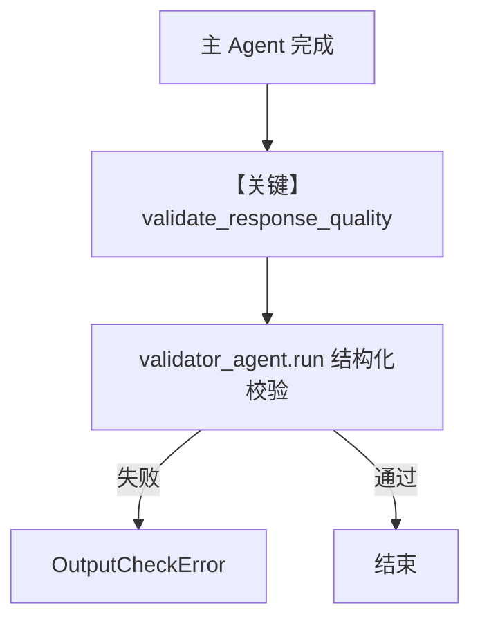

# post_hook_output.py — 实现原理分析

<!-- cookbook-py-source:start -->
## 完整源码

```python
"""
Post Hook Output
=============================

Example demonstrating output validation using post-hooks with Agno Agent.
"""

import asyncio

from agno.agent import Agent
from agno.exceptions import CheckTrigger, OutputCheckError
from agno.models.openai import OpenAIResponses
from agno.run.agent import RunOutput
from pydantic import BaseModel


# ---------------------------------------------------------------------------
# Create Agent
# ---------------------------------------------------------------------------
class OutputValidationResult(BaseModel):
    is_complete: bool
    is_professional: bool
    is_safe: bool
    concerns: list[str]
    confidence_score: float


def validate_response_quality(run_output: RunOutput) -> None:
    """
    Post-hook: Validate the agent's response for quality and safety.

    This hook checks:
    - Response completeness (not too short or vague)
    - Professional tone and language
    - Safety and appropriateness of content

    Raises OutputCheckError if validation fails.
    """

    # Skip validation for empty responses
    if not run_output.content or len(run_output.content.strip()) < 10:
        raise OutputCheckError(
            "Response is too short or empty",
            check_trigger=CheckTrigger.OUTPUT_NOT_ALLOWED,
        )

    # Create a validation agent
    validator_agent = Agent(
        name="Output Validator",
        model=OpenAIResponses(id="gpt-5-mini"),
        instructions=[
            "You are an output quality validator. Analyze responses for:",
            "1. COMPLETENESS: Response addresses the question thoroughly",
            "2. PROFESSIONALISM: Language is professional and appropriate",
            "3. SAFETY: Content is safe and doesn't contain harmful advice",
            "",
            "Provide a confidence score (0.0-1.0) for overall quality.",
            "List any specific concerns found.",
            "",
            "Be reasonable - don't reject good responses for minor issues.",
        ],
        output_schema=OutputValidationResult,
    )

    validation_result = validator_agent.run(
        input=f"Validate this response: '{run_output.content}'"
    )

    result = validation_result.content

    # Check validation results and raise errors for failures
    if not result.is_complete:
        raise OutputCheckError(
            f"Response is incomplete. Concerns: {', '.join(result.concerns)}",
            check_trigger=CheckTrigger.OUTPUT_NOT_ALLOWED,
        )

    if not result.is_professional:
        raise OutputCheckError(
            f"Response lacks professional tone. Concerns: {', '.join(result.concerns)}",
            check_trigger=CheckTrigger.OUTPUT_NOT_ALLOWED,
        )

    if not result.is_safe:
        raise OutputCheckError(
            f"Response contains potentially unsafe content. Concerns: {', '.join(result.concerns)}",
            check_trigger=CheckTrigger.OUTPUT_NOT_ALLOWED,
        )

    if result.confidence_score < 0.6:
        raise OutputCheckError(
            f"Response quality score too low ({result.confidence_score:.2f}). Concerns: {', '.join(result.concerns)}",
            check_trigger=CheckTrigger.OUTPUT_NOT_ALLOWED,
        )


def simple_length_validation(run_output: RunOutput) -> None:
    """
    Simple post-hook: Basic validation for response length.

    Ensures responses are neither too short nor excessively long.
    """
    content = run_output.content.strip()

    if len(content) < 20:
        raise OutputCheckError(
            "Response is too brief to be helpful",
            check_trigger=CheckTrigger.OUTPUT_NOT_ALLOWED,
        )

    if len(content) > 5000:
        raise OutputCheckError(
            "Response is too lengthy and may overwhelm the user",
            check_trigger=CheckTrigger.OUTPUT_NOT_ALLOWED,
        )


async def main():
    """Demonstrate output validation post-hooks."""
    print("Output Validation Post-Hook Example")
    print("=" * 60)

    # Agent with comprehensive output validation
    agent_with_validation = Agent(
        name="Customer Support Agent",
        model=OpenAIResponses(id="gpt-5-mini"),
        post_hooks=[validate_response_quality],
        instructions=[
            "You are a helpful customer support agent.",
            "Provide clear, professional responses to customer inquiries.",
            "Be concise but thorough in your explanations.",
        ],
    )

    # Agent with simple validation only
    agent_simple = Agent(
        name="Simple Agent",
        model=OpenAIResponses(id="gpt-5-mini"),
        post_hooks=[simple_length_validation],
        instructions=[
            "You are a helpful assistant. Keep responses focused and appropriate length."
        ],
    )

    # Test 1: Good response (should pass validation)
    print("\n[TEST 1] Well-formed response")
    print("-" * 40)
    try:
        await agent_with_validation.aprint_response(
            input="How do I reset my password on my Microsoft account?"
        )
        print("[OK] Response passed validation")
    except OutputCheckError as e:
        print(f"[ERROR] Validation failed: {e}")
        print(f"   Trigger: {e.check_trigger}")

    # Test 2: Force a short response (should fail simple validation)
    print("\n[TEST 2] Too brief response")
    print("-" * 40)
    try:
        # Use a more constrained instruction to get a brief response
        brief_agent = Agent(
            name="Brief Agent",
            model=OpenAIResponses(id="gpt-5-mini"),
            post_hooks=[simple_length_validation],
            instructions=["Answer in 1-2 words only."],
        )
        await brief_agent.aprint_response(input="What is the capital of France?")
    except OutputCheckError as e:
        print(f"[ERROR] Validation failed: {e}")
        print(f"   Trigger: {e.check_trigger}")

    # Test 3: Normal response with simple validation
    print("\n[TEST 3] Normal response with simple validation")
    print("-" * 40)
    try:
        await agent_simple.aprint_response(
            input="Explain what a database is in simple terms."
        )
        print("[OK] Response passed simple validation")
    except OutputCheckError as e:
        print(f"[ERROR] Validation failed: {e}")
        print(f"   Trigger: {e.check_trigger}")


# ---------------------------------------------------------------------------
# Run Agent
# ---------------------------------------------------------------------------
if __name__ == "__main__":
    asyncio.run(main())
```

<!-- cookbook-py-source:end -->

> 源文件：`cookbook/02_agents/09_hooks/post_hook_output.py`

## 概述

本示例展示 **复杂 post_hook**：`validate_response_quality` 内再建 **`validator_agent`**（`output_schema=OutputValidationResult`）对主 Agent 输出做结构化质检；另含 **`simple_length_validation`** 长度检查。注意：钩子里 **新建 Agent** 仅用于演示验证子任务，生产应复用实例以避免开销。

**核心配置一览：**

| Agent | `post_hooks` | `instructions` |
|--------|--------------|------------------|
| `agent_with_validation` | `[validate_response_quality]` | 客服三条 |
| `agent_simple` | `[simple_length_validation]` | 一条 |
| `brief_agent`（测试内联） | `[simple_length_validation]` | `Answer in 1-2 words only.` |

`model`：`OpenAIResponses(id="gpt-5-mini")`。

## 核心组件解析

### 二级 Agent 校验

`validator_agent.run(...)` 同步调用，返回 Pydantic `OutputValidationResult`，主钩根据 `is_complete` / `is_professional` / `is_safe` / `confidence_score` 抛 `OutputCheckError`。

### 运行机制与因果链

1. 主模型生成 → `RunOutput` → post_hook。
2. 验证 Agent 再调 API → 可能显著增加 **延迟与费用**。

## System Prompt 组装

主 Agent `agent_with_validation` 的 `instructions` 为列表字面量（客服角色，三条加空行分隔），须原样出现在 system。

## 完整 API 请求

每次用户请求可能触发 **两次** Responses 调用（主 Agent + 验证 Agent）。

## Mermaid 流程图


```mermaid
flowchart TD
    M["主 Agent 完成"] --> V["【关键】validate_response_quality"]
    V --> VA["validator_agent.run 结构化校验"]
    VA -->|失败| E["OutputCheckError"]
    VA -->|通过| OK["结束"]
```

## 关键源码文件索引

| 文件 | 作用 |
|------|------|
| `agno/agent/_hooks.py` | post_hooks 执行 |
| `agno/agent/agent.py` | `output_schema` 主路径 |
