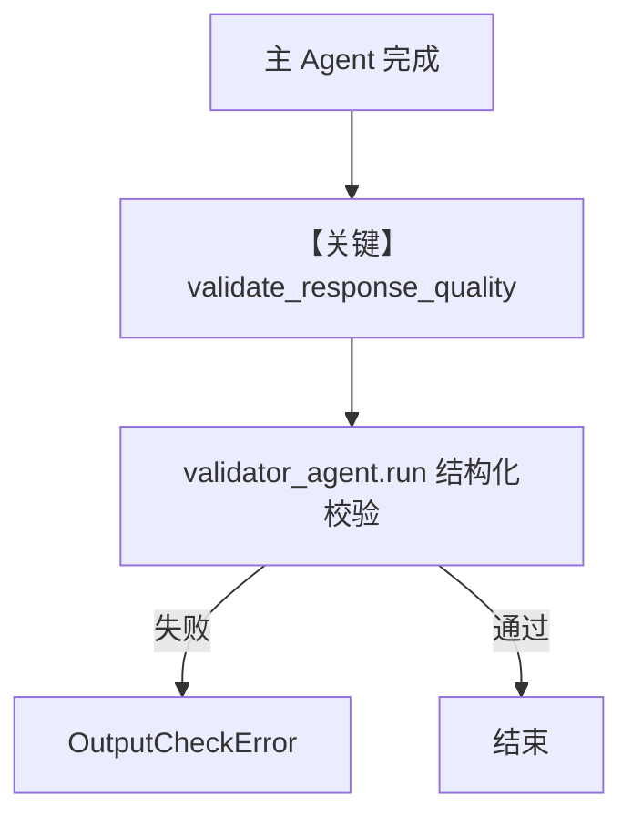

# post_hook_output.py — 实现原理分析

> 源文件：`cookbook/02_agents/09_hooks/post_hook_output.py`

## 概述

本示例展示 **复杂 post_hook**：`validate_response_quality` 内再建 **`validator_agent`**（`output_schema=OutputValidationResult`）对主 Agent 输出做结构化质检；另含 **`simple_length_validation`** 长度检查。注意：钩子里 **新建 Agent** 仅用于演示验证子任务，生产应复用实例以避免开销。

**核心配置一览：**

| Agent | `post_hooks` | `instructions` |
|--------|--------------|------------------|
| `agent_with_validation` | `[validate_response_quality]` | 客服三条 |
| `agent_simple` | `[simple_length_validation]` | 一条 |
| `brief_agent`（测试内联） | `[simple_length_validation]` | `Answer in 1-2 words only.` |

`model`：`OpenAIResponses(id="gpt-5-mini")`。

## 核心组件解析

### 二级 Agent 校验

`validator_agent.run(...)` 同步调用，返回 Pydantic `OutputValidationResult`，主钩根据 `is_complete` / `is_professional` / `is_safe` / `confidence_score` 抛 `OutputCheckError`。

### 运行机制与因果链

1. 主模型生成 → `RunOutput` → post_hook。
2. 验证 Agent 再调 API → 可能显著增加 **延迟与费用**。

## System Prompt 组装

主 Agent `agent_with_validation` 的 `instructions` 为列表字面量（客服角色，三条加空行分隔），须原样出现在 system。

## 完整 API 请求

每次用户请求可能触发 **两次** Responses 调用（主 Agent + 验证 Agent）。

## Mermaid 流程图

```mermaid
flowchart TD
    M["主 Agent 完成"] --> V["【关键】validate_response_quality"]
    V --> VA["validator_agent.run 结构化校验"]
    VA -->|失败| E["OutputCheckError"]
    VA -->|通过| OK["结束"]
```

## 关键源码文件索引

| 文件 | 作用 |
|------|------|
| `agno/agent/_hooks.py` | post_hooks 执行 |
| `agno/agent/agent.py` | `output_schema` 主路径 |
