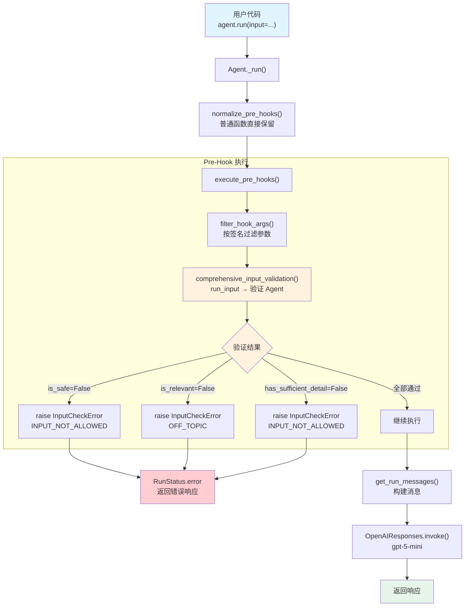

# pre_hook_input.py — 实现原理分析

> 源文件：`cookbook/02_agents/09_hooks/pre_hook_input.py`

## 概述

本示例展示 Agno 的 **`pre_hooks`** 机制：在模型调用前对用户输入进行全面验证（相关性、充分性、安全性），验证失败时通过 `InputCheckError` 中断运行，阻止不合规请求到达主模型。

**核心配置一览：**

| 配置项 | 值 | 说明 |
|--------|------|------|
| `name` | `"Financial Advisor"` | Agent 名称 |
| `model` | `OpenAIResponses(id="gpt-5-mini")` | Responses API |
| `pre_hooks` | `[comprehensive_input_validation]` | 前置 hook（输入验证函数） |
| `post_hooks` | `None` | 未设置 |
| `description` | `"A professional financial advisor..."` | Agent 描述 |
| `instructions` | 4 条投资顾问指令 | 专业领域指令 |
| `output_schema` | `None` | 未设置（主 Agent） |
| `tools` | `None` | 未设置 |
| `markdown` | `False` | 默认值 |

> 注意：hook 函数内部创建了独立的验证 Agent（`Input Validator`），使用 `output_schema=InputValidationResult` 获取结构化验证结果。

## 架构分层

```
用户代码层                          agno.agent 层
┌──────────────────────────┐    ┌──────────────────────────────────────┐
│ pre_hook_input.py        │    │ Agent._run()                         │
│                          │    │  ├ _run.py L1250-1256                │
│ pre_hooks=[              │    │  │  normalize_pre_hooks()             │
│   comprehensive_input_   │───>│  │    → 普通函数直接保留              │
│   validation             │    │  │                                    │
│ ]                        │    │  ├ _run.py L410-425                  │
│                          │    │  │  execute_pre_hooks()               │
│ 验证 Agent（内部）：     │    │  │    → filter_hook_args()            │
│   output_schema=         │    │  │    → hook(run_input=...)           │
│   InputValidationResult  │    │  │    → InputCheckError? 中断        │
│                          │    │  │                                    │
│                          │    │  ├ get_run_messages()                 │
│                          │    │  └ Model.response()                   │
└──────────────────────────┘    └──────────────────────────────────────┘
                                        │
                                        ▼
                                ┌──────────────────┐
                                │ OpenAIResponses   │
                                │ gpt-5-mini        │
                                └──────────────────┘
```

## 核心组件解析

### pre_hooks 规范化

`pre_hooks` 在首次运行时通过 `normalize_pre_hooks()`（`utils/hooks.py:70`）进行规范化：

```python
# _run.py L1250-1256
if not agent._hooks_normalised:
    if agent.pre_hooks:
        agent.pre_hooks = normalize_pre_hooks(agent.pre_hooks)
    if agent.post_hooks:
        agent.post_hooks = normalize_post_hooks(agent.post_hooks)
    agent._hooks_normalised = True
```

规范化规则：
- `BaseGuardrail` 实例 → 转为 `.check` / `.async_check` 绑定方法
- `BaseEval` 实例 → 转为 `.pre_check` 方法
- **普通函数**（本例）→ 直接保留

### execute_pre_hooks 参数注入

`execute_pre_hooks()`（`_hooks.py:43`）构建所有可用参数字典，然后通过 `filter_hook_args()` 按函数签名过滤：

```python
# _hooks.py L62-70
all_args = {
    "run_input": run_input,        # RunInput 实例
    "run_context": run_context,    # RunContext 实例
    "agent": agent,                # Agent 实例
    "session": session,            # AgentSession
    "user_id": user_id,            # 用户 ID
    "debug_mode": debug_mode,      # 调试模式
    "metadata": run_context.metadata,  # 元数据
}
```

`filter_hook_args()`（`utils/hooks.py:156`）使用 `inspect.signature()` 检查 hook 函数接受的参数，仅传递匹配的参数：

```python
# utils/hooks.py L156-173
def filter_hook_args(hook, all_args):
    sig = inspect.signature(hook)
    accepted_params = set(sig.parameters.keys())
    # 如果有 **kwargs，传递所有参数
    if has_var_keyword:
        return all_args
    # 否则只传递签名中声明的参数
    return {key: value for key, value in all_args.items() if key in accepted_params}
```

本例中 `comprehensive_input_validation(run_input: RunInput)` 只声明了 `run_input`，因此只会收到 `run_input` 参数。

### InputCheckError 异常传播

验证失败时抛出 `InputCheckError`（`exceptions.py:134`），该异常在 `execute_pre_hooks` 中被特殊处理——直接向上传播而非被吞掉：

```python
# _hooks.py L143-147
except (InputCheckError, OutputCheckError) as e:
    raise e  # 直接传播，中断运行
except Exception as e:
    log_error(f"Pre-hook #{i + 1} execution failed: {str(e)}")
    log_exception(e)  # 其他异常仅记录日志，不中断
```

在 `_run.py` 的最外层 try-except 中，`InputCheckError` 被捕获并设置错误状态：

```python
# _run.py L628-646
except (InputCheckError, OutputCheckError) as e:
    run_response.status = RunStatus.error
    if run_response.content is None:
        run_response.content = str(e)
    log_error(f"Validation failed: {str(e)} | Check trigger: {e.check_trigger}")
    # 清理并存储
    cleanup_and_store(agent, run_response=run_response, ...)
    return run_response
```

### CheckTrigger 枚举

`CheckTrigger`（`exceptions.py:122`）定义了检查触发类型：

| 枚举值 | 说明 | 本例使用场景 |
|--------|------|-------------|
| `OFF_TOPIC` | 离题 | 非金融话题（Test 3） |
| `INPUT_NOT_ALLOWED` | 输入不允许 | 细节不足（Test 2）、不安全（Test 4） |
| `OUTPUT_NOT_ALLOWED` | 输出不允许 | 本例未使用 |
| `VALIDATION_FAILED` | 验证失败 | 本例未使用 |
| `PROMPT_INJECTION` | 提示注入 | 本例未使用 |
| `PII_DETECTED` | PII 检测 | 本例未使用 |

### RunInput 容器

`RunInput`（`run/agent.py:29`）是用户输入的容器，封装原始输入内容和媒体文件：

```python
# run/agent.py L29-47
class RunInput:
    input_content: Union[str, List, Dict, Message, BaseModel, List[Message]]
    images: Optional[Sequence[Image]] = None
    videos: Optional[Sequence[Video]] = None
    audios: Optional[Sequence[Audio]] = None
    files: Optional[Sequence[File]] = None
```

hook 函数通过 `run_input.input_content` 访问用户输入文本。

## System Prompt 组装

| 序号 | 组成部分 | 本文件中的值/来源 | 是否生效 |
|------|---------|-----------------|---------|
| 1 | `system_message`（自定义） | `None` | 否 |
| 3.1 | `instructions` | 4 条投资顾问指令 | 是 |
| 3.1.1 | 模型指令（`get_instructions_for_model`） | 模型默认 | 是 |
| 3.2.1 | `markdown` | `False` | 否 |
| 3.2.2 | `add_datetime_to_context` | `False` | 否 |
| 3.2.3 | `add_location_to_context` | `False` | 否 |
| 3.2.4 | `add_name_to_context` | `False` | 否 |
| 3.3.1 | `description` | `"A professional financial advisor..."` | 是 |
| 3.3.2 | `role` | `None` | 否 |
| 3.3.3 | instructions 拼接 | 4 条指令拼接 | 是 |
| 3.3.4 | additional_information | 无 | 否 |
| 3.3.5 | `_tool_instructions` | `None` | 否 |
| fmt | `resolve_in_context` 变量替换 | 默认 `True`，但无模板变量 | 否 |
| 3.3.7 | `expected_output` | `None` | 否 |
| 3.3.8 | `additional_context` | `None` | 否 |
| 3.3.9 | `add_memories_to_context` | `None` | 否 |
| 3.3.10 | `add_culture_to_context` | `None` | 否 |
| 3.3.11 | `add_session_summary_to_context` | `None` | 否 |
| 3.3.12 | `add_learnings_to_context` | `True`（默认），但无 learning | 否 |
| 3.3.13 | `search_knowledge` instructions | 无 knowledge | 否 |
| 3.3.14 | 模型 system message | 模型默认 | 否 |
| 3.3.15 | JSON output prompt | 无 output_schema | 否 |
| 3.3.16 | response model format prompt | 无 parser_model | 否 |
| 3.3.17 | `add_session_state_to_context` | `False` | 否 |

### 最终 System Prompt

```text
A professional financial advisor providing investment guidance and financial planning advice.
- You are a knowledgeable financial advisor with expertise in:
- • Investment strategies and portfolio management
- • Retirement planning and savings strategies
- • Risk assessment and diversification
- • Tax-efficient investing
-
- Provide clear, actionable advice while being mindful of individual circumstances.
- Always remind users to consult with a licensed financial advisor for personalized advice.
```

## 完整 API 请求

### 场景 1：验证通过（Test 1）

pre_hook 中的验证 Agent 请求（内部）：

```python
client.responses.create(
    model="gpt-5-mini",
    input=[
        # System Message（验证 Agent 的 instructions）
        {"role": "developer", "content": "You are an input validation specialist..."},
        # 用户输入（包含待验证内容）
        {"role": "user", "content": "Validate this user request: 'I'm 35 years old and want to start investing...'"}
    ],
    text={"format": {"type": "json_schema", "name": "InputValidationResult", "schema": {...}}},
    stream=True,
    stream_options={"include_usage": True}
)
```

验证通过后，主 Agent 请求：

```python
client.responses.create(
    model="gpt-5-mini",
    input=[
        # System Message
        {"role": "developer", "content": "A professional financial advisor..."},
        # 用户输入
        {"role": "user", "content": "I'm 35 years old and want to start investing..."}
    ],
    stream=True,
    stream_options={"include_usage": True}
)
```

### 场景 2：验证失败（Test 2/3/4）

验证 Agent 返回 `is_relevant=False` 或 `has_sufficient_detail=False` 或 `is_safe=False`：

```python
# 不会发出主 Agent API 请求
# InputCheckError 在 execute_pre_hooks() 中直接向上传播
# _run.py L628 捕获 → RunStatus.error
```

> pre_hook 在步骤 4 执行，失败后直接跳过步骤 5-10（工具解析、消息构建、模型调用），因此**主 Agent 不会消耗任何 token**。

## Mermaid 流程图



## 关键源码文件索引

| 文件 | 关键函数/类 | 作用 |
|------|------------|------|
| `agno/agent/agent.py` | `pre_hooks` L176 | pre_hooks 属性定义 |
| `agno/agent/_run.py` | `_run()` L1250-1256 | 首次运行时规范化 hooks |
| `agno/agent/_run.py` | `_run()` L410-425 | 步骤 4：执行 pre_hooks |
| `agno/agent/_run.py` | `_run()` L628-646 | 捕获 InputCheckError → RunStatus.error |
| `agno/agent/_hooks.py` | `execute_pre_hooks()` L43 | 同步版 pre_hooks 执行入口 |
| `agno/agent/_hooks.py` | L62-70 | 构建 all_args 参数字典 |
| `agno/agent/_hooks.py` | L143-147 | InputCheckError/OutputCheckError 直接传播 |
| `agno/utils/hooks.py` | `normalize_pre_hooks()` L70 | 规范化 hook 列表 |
| `agno/utils/hooks.py` | `filter_hook_args()` L156 | 按函数签名过滤参数 |
| `agno/exceptions.py` | `CheckTrigger` L122 | 检查触发类型枚举 |
| `agno/exceptions.py` | `InputCheckError` L134 | 输入检查异常 |
| `agno/run/agent.py` | `RunInput` L29 | 用户输入容器 |
