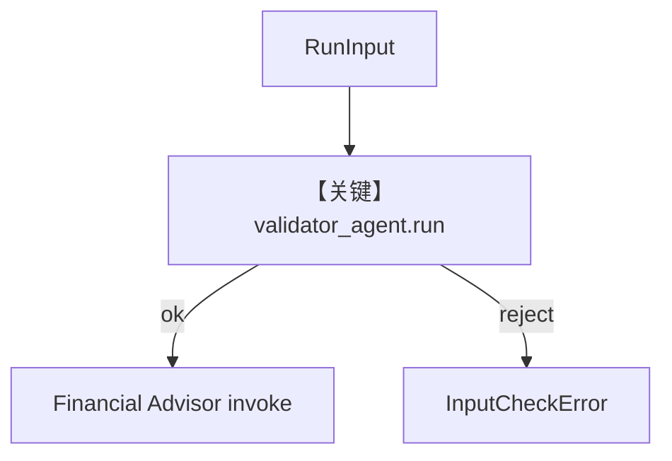

# pre_hook_input.py — 实现原理分析

> 源文件：`cookbook/02_agents/09_hooks/pre_hook_input.py`

## 概述

本示例展示 **AI 辅助的 pre_hook 输入校验**：`comprehensive_input_validation` 创建 `validator_agent`（`InputValidationResult`），在财务顾问主 Agent 运行前分析 `run_input.input_content`，不通过则 `InputCheckError`（含 `OFF_TOPIC` 等 trigger）。

**核心配置一览：**

| 配置项 | 值 |
|--------|-----|
| `name` | `"Financial Advisor"` |
| `model` | `OpenAIResponses(id="gpt-5-mini")` |
| `pre_hooks` | `[comprehensive_input_validation]` |
| `description` | 财务顾问长描述字面量 |
| `instructions` | 多行投资/退休等专长列表 |

## 核心组件解析

测试用例：充分信息通过；`Help me invest` 细节不足；披萨离题；操纵股价不安全。

### 运行机制与因果链

每个主 `run` 先执行 **验证 Agent**（额外 LLM），再进入主 Agent；成本与延迟翻倍量级。

## System Prompt 组装

主 Agent 的 `description` 与 `instructions` 均为长字面量，应原样还原至「还原后的完整 System 文本」——篇幅较长，读者可直接打开 `.py` 复制（此处不重复全文以避免冗余）。

## 完整 API 请求

通过校验后：主财务 Agent 使用 `responses.create`。

## Mermaid 流程图

```mermaid
flowchart TD
    I["RunInput"] --> V["【关键】validator_agent.run"]
    V -->|ok| F["Financial Advisor invoke"]
    V -->|reject| X["InputCheckError"]
```

## 关键源码文件索引

| 文件 | 作用 |
|------|------|
| `agno/exceptions` | `CheckTrigger.OFF_TOPIC` 等 |
