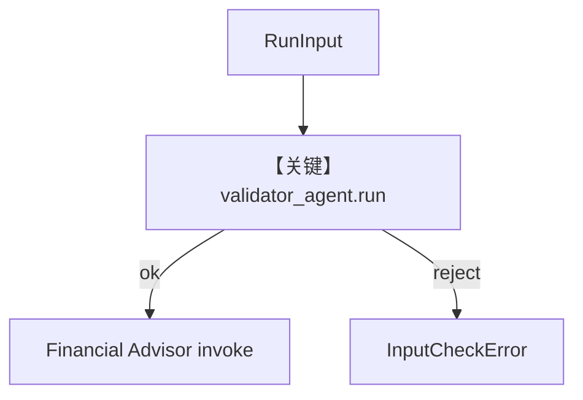

# pre_hook_input.py — 实现原理分析

<!-- cookbook-py-source:start -->
## 完整源码

```python
"""
Pre Hook Input
=============================

Example demonstrating how to use a pre_hook to perform comprehensive input validation for your Agno Agent.
"""

from agno.agent import Agent
from agno.exceptions import CheckTrigger, InputCheckError
from agno.models.openai import OpenAIResponses
from agno.run.agent import RunInput
from pydantic import BaseModel


# ---------------------------------------------------------------------------
# Create Agent
# ---------------------------------------------------------------------------
class InputValidationResult(BaseModel):
    is_relevant: bool
    has_sufficient_detail: bool
    is_safe: bool
    concerns: list[str]
    recommendations: list[str]


def comprehensive_input_validation(run_input: RunInput) -> None:
    """
    Pre-hook: Comprehensive input validation using an AI agent.

    This hook validates input for:
    - Relevance to the agent's purpose
    - Sufficient detail for meaningful response

    Could also be used to check for safety, prompt injection, etc.
    """

    # Input validation agent
    validator_agent = Agent(
        name="Input Validator",
        model=OpenAIResponses(id="gpt-5-mini"),
        instructions=[
            "You are an input validation specialist. Analyze user requests for:",
            "1. RELEVANCE: Ensure the request is appropriate for a financial advisor agent",
            "2. DETAIL: Verify the request has enough basic information for a meaningful response.",
            "   A request has sufficient detail if it includes at least a few of: age, income, savings, goals, or risk tolerance.",
            "   Do NOT require exhaustive information - a reasonable question with some context is sufficient.",
            "3. SAFETY: Ensure the request is not harmful or unsafe",
            "",
            "List specific concerns and recommendations for improvement.",
            "",
            "Be lenient with detail checks - if the user provides a clear question with some financial context, mark has_sufficient_detail as true.",
            "Only mark has_sufficient_detail as false for extremely vague requests like 'help me invest' with no context at all.",
        ],
        output_schema=InputValidationResult,
    )

    validation_result = validator_agent.run(
        input=f"Validate this user request: '{run_input.input_content}'"
    )

    result = validation_result.content

    # Check validation results
    if not result.is_safe:
        raise InputCheckError(
            f"Input is harmful or unsafe. {result.recommendations[0] if result.recommendations else ''}",
            check_trigger=CheckTrigger.INPUT_NOT_ALLOWED,
        )

    if not result.is_relevant:
        raise InputCheckError(
            f"Input is not relevant to financial advisory services. {result.recommendations[0] if result.recommendations else ''}",
            check_trigger=CheckTrigger.OFF_TOPIC,
        )

    if not result.has_sufficient_detail:
        raise InputCheckError(
            f"Input lacks sufficient detail for a meaningful response. Suggestions: {', '.join(result.recommendations)}",
            check_trigger=CheckTrigger.INPUT_NOT_ALLOWED,
        )


def main():
    print("Input Validation Pre-Hook Example")
    print("=" * 60)

    # Create a financial advisor agent with comprehensive hooks
    agent = Agent(
        name="Financial Advisor",
        model=OpenAIResponses(id="gpt-5-mini"),
        pre_hooks=[comprehensive_input_validation],
        description="A professional financial advisor providing investment guidance and financial planning advice.",
        instructions=[
            "You are a knowledgeable financial advisor with expertise in:",
            "• Investment strategies and portfolio management",
            "• Retirement planning and savings strategies",
            "• Risk assessment and diversification",
            "• Tax-efficient investing",
            "",
            "Provide clear, actionable advice while being mindful of individual circumstances.",
            "Always remind users to consult with a licensed financial advisor for personalized advice.",
        ],
    )

    # Test 1: Valid financial question (should work normally with enhanced formatting)
    print("\n[TEST 1] Valid financial question")
    print("-" * 40)
    try:
        response = agent.run(
            input="""
            I'm 35 years old and want to start investing for retirement.
            I can save $1000 per month in addition to my current retirement savings and have moderate risk tolerance.
            My gross income is $100,000.
            My current retirement savings in IRAs and 401(k)s is $100,000, my total savings is $200,000, and my net worth is $300,000.
            My country is the United States.

            Do you have advice for me?
            """
        )
        print("[OK] Success! Response validated by pre-hook:")
        print(response.content)
    except Exception as e:
        print(f"[ERROR] Unexpected error: {e}")

    # Test 2: Input with insufficient detail (should trigger pre-hook)
    print("\n[TEST 2] Vague input (insufficient detail)")
    print("-" * 40)
    try:
        response = agent.run(input="Help me invest")
        print(response.content)
    except InputCheckError as e:
        print(f"[BLOCKED] Pre-hook validation failed: {e}")
        print(f"   Trigger: {e.check_trigger}")

    # Test 3: Irrelevant request (should trigger pre-hook)
    print("\n[TEST 3] Off-topic request")
    print("-" * 40)
    try:
        response = agent.run(input="What's the best pizza recipe?")
        print(response.content)
    except InputCheckError as e:
        print(f"[BLOCKED] Pre-hook validation failed: {e}")
        print(f"   Trigger: {e.check_trigger}")

    # Test 4: Potentially harmful content (should trigger pre-hook)
    print("\n[TEST 4] Potentially unsafe content")
    print("-" * 40)
    try:
        response = agent.run(
            input="How can I manipulate stock prices to make money quickly?"
        )
        print(response.content)
    except InputCheckError as e:
        print(f"[BLOCKED] Pre-hook validation failed: {e}")
        print(f"   Trigger: {e.check_trigger}")


# ---------------------------------------------------------------------------
# Run Agent
# ---------------------------------------------------------------------------
if __name__ == "__main__":
    main()
```

<!-- cookbook-py-source:end -->

> 源文件：`cookbook/02_agents/09_hooks/pre_hook_input.py`

## 概述

本示例展示 **AI 辅助的 pre_hook 输入校验**：`comprehensive_input_validation` 创建 `validator_agent`（`InputValidationResult`），在财务顾问主 Agent 运行前分析 `run_input.input_content`，不通过则 `InputCheckError`（含 `OFF_TOPIC` 等 trigger）。

**核心配置一览：**

| 配置项 | 值 |
|--------|-----|
| `name` | `"Financial Advisor"` |
| `model` | `OpenAIResponses(id="gpt-5-mini")` |
| `pre_hooks` | `[comprehensive_input_validation]` |
| `description` | 财务顾问长描述字面量 |
| `instructions` | 多行投资/退休等专长列表 |

## 核心组件解析

测试用例：充分信息通过；`Help me invest` 细节不足；披萨离题；操纵股价不安全。

### 运行机制与因果链

每个主 `run` 先执行 **验证 Agent**（额外 LLM），再进入主 Agent；成本与延迟翻倍量级。

## System Prompt 组装

主 Agent 的 `description` 与 `instructions` 均为长字面量，应原样还原至「还原后的完整 System 文本」——篇幅较长，读者可直接打开 `.py` 复制（此处不重复全文以避免冗余）。

## 完整 API 请求

通过校验后：主财务 Agent 使用 `responses.create`。

## Mermaid 流程图


```mermaid
flowchart TD
    I["RunInput"] --> V["【关键】validator_agent.run"]
    V -->|ok| F["Financial Advisor invoke"]
    V -->|reject| X["InputCheckError"]
```

## 关键源码文件索引

| 文件 | 作用 |
|------|------|
| `agno/exceptions` | `CheckTrigger.OFF_TOPIC` 等 |
