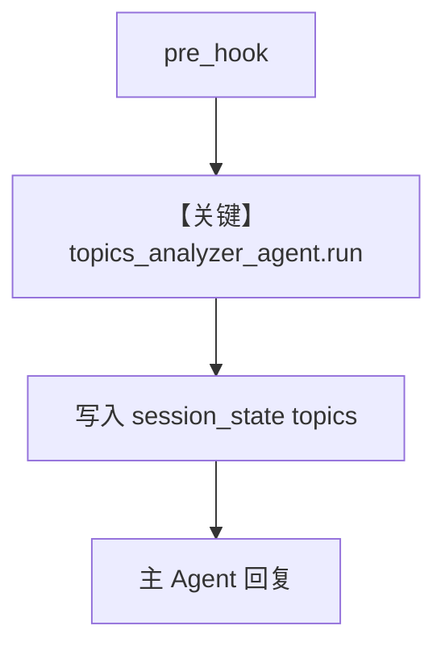

# session_state_hooks.py — 实现原理分析

<!-- cookbook-py-source:start -->
## 完整源码

```python
"""
Session State Hooks
=============================

Example demonstrating how to use a pre_hook to update the session_state.
"""

from typing import List

from agno.agent import Agent
from agno.db.sqlite import SqliteDb
from agno.models.openai import OpenAIResponses
from agno.run import RunContext
from agno.run.agent import RunInput
from pydantic import BaseModel, Field


class ConversationTopics(BaseModel):
    topics: List[str] = Field(description="Topics present in the user messages")


# This will be our pre-hook function
def track_conversation_topics(run_context: RunContext, run_input: RunInput) -> None:
    """Simple pre-hook function to track conversation topics in the session state"""

    # Initialize the session state if it doesn't exist yet
    if run_context.session_state is None:
        run_context.session_state = {"topics": []}
    elif run_context.session_state.get("topics") is None:
        run_context.session_state["topics"] = []

    # Setup an Agent to get the topics discussed in the conversation
    # ---------------------------------------------------------------------------
    # Create Agent
    # ---------------------------------------------------------------------------

    topics_analyzer_agent = Agent(
        name="Topics Analyzer",
        model=OpenAIResponses(id="gpt-5-mini"),
        instructions=[
            "Your task is to analyze a user query and extract the topics."
            "You will be presented with a user message sent to an agent."
            "You need to extract the topics present in the user message."
            "Be concise and brief. Topics should be one or two words, and only want the one or two main topics."
            "Respond just with the list of topics, no other text or explanation."
        ],
        output_schema=ConversationTopics,
    )

    # Run the Agent to get the topics discussed in the conversation
    response = topics_analyzer_agent.run(
        input=f"Extract the topics present in the following user message: {run_input.input_content}"
    )

    # Update the session state to track the topics discussed in the conversation
    run_context.session_state["topics"].extend(response.content.topics)  # type: ignore


# ---------------------------------------------------------------------------
# Create Agent
# ---------------------------------------------------------------------------
# Create a simple agent and equip it with our pre-hook
agent = Agent(
    name="Simple Agent",
    model=OpenAIResponses(id="gpt-5-mini"),
    pre_hooks=[track_conversation_topics],
    db=SqliteDb(db_file="test.db"),
)

# ---------------------------------------------------------------------------
# Run Agent
# ---------------------------------------------------------------------------
if __name__ == "__main__":
    agent.print_response(
        input="I want to know more about AI Agents.",
        session_id="topics_analyzer_session",
    )
    print(
        f"Current session state, after the first run: {agent.get_session_state(session_id='topics_analyzer_session')}"
    )

    agent.print_response(
        input="I also want to know more about Agno, the framework to build AI Agents.",
        session_id="topics_analyzer_session",
    )
    print(
        f"Current session state, after the second run: {agent.get_session_state(session_id='topics_analyzer_session')}"
    )
```

<!-- cookbook-py-source:end -->

> 源文件：`cookbook/02_agents/09_hooks/session_state_hooks.py`

## 概述

本示例展示 **pre_hook 写入 `run_context.session_state`**：`track_conversation_topics` 初始化 `topics` 列表，并用小型 **`topics_analyzer_agent`**（结构化 `ConversationTopics`）从用户句提取主题，追加到 session state；配合 `db` 与固定 `session_id` 跨轮读取。

**核心配置一览：**

| 配置项 | 值 |
|--------|-----|
| `name` | `"Simple Agent"` |
| `model` | `OpenAIResponses(id="gpt-5-mini")` |
| `pre_hooks` | `[track_conversation_topics]` |
| `db` | `SqliteDb(db_file="test.db")` |

## 核心组件解析

### Session state 变异

Hook 内直接修改 `run_context.session_state`，后续 `get_session_state(session_id=...)` 打印累积 topics。

### 子 Agent

`topics_analyzer_agent` 在 hook 内每次 **新建**（演示用；高频场景应复用）。

### 运行机制与因果链

同一 `session_id` 两次 `print_response`，state 中 topics 累加。

## System Prompt 组装

主 Agent 未设 `instructions`；子 Agent 含长 `instructions` 列表与 `output_schema`（见 `.py` L40–47）。

## 完整 API 请求

每轮用户消息：先 analyzer Agent，再主 Agent；均为 Responses API。

## Mermaid 流程图



## 关键源码文件索引

| 文件 | 作用 |
|------|------|
| `agno/run/base.py` | `RunContext` |
| `agno/db/sqlite` | 会话持久化 |
