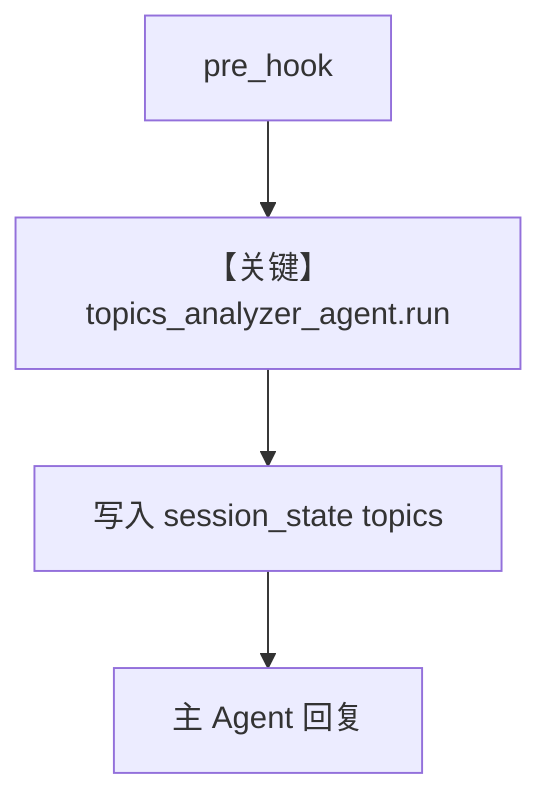

# session_state_hooks.py — 实现原理分析

> 源文件：`cookbook/02_agents/09_hooks/session_state_hooks.py`

## 概述

本示例展示 **pre_hook 写入 `run_context.session_state`**：`track_conversation_topics` 初始化 `topics` 列表，并用小型 **`topics_analyzer_agent`**（结构化 `ConversationTopics`）从用户句提取主题，追加到 session state；配合 `db` 与固定 `session_id` 跨轮读取。

**核心配置一览：**

| 配置项 | 值 |
|--------|-----|
| `name` | `"Simple Agent"` |
| `model` | `OpenAIResponses(id="gpt-5-mini")` |
| `pre_hooks` | `[track_conversation_topics]` |
| `db` | `SqliteDb(db_file="test.db")` |

## 核心组件解析

### Session state 变异

Hook 内直接修改 `run_context.session_state`，后续 `get_session_state(session_id=...)` 打印累积 topics。

### 子 Agent

`topics_analyzer_agent` 在 hook 内每次 **新建**（演示用；高频场景应复用）。

### 运行机制与因果链

同一 `session_id` 两次 `print_response`，state 中 topics 累加。

## System Prompt 组装

主 Agent 未设 `instructions`；子 Agent 含长 `instructions` 列表与 `output_schema`（见 `.py` L40–47）。

## 完整 API 请求

每轮用户消息：先 analyzer Agent，再主 Agent；均为 Responses API。

## Mermaid 流程图

## 关键源码文件索引

| 文件 | 作用 |
|------|------|
| `agno/run/base.py` | `RunContext` |
| `agno/db/sqlite` | 会话持久化 |
