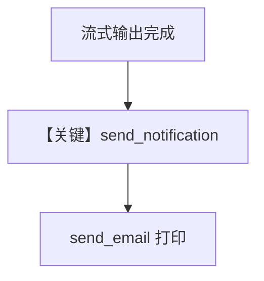

# stream_hook.py — 实现原理分析

<!-- cookbook-py-source:start -->
## 完整源码

```python
"""
Stream Hook
=============================

Example demonstrating sending a notification to the user after an agent generates a response.
"""

import asyncio

from agno.agent import Agent
from agno.models.openai import OpenAIResponses
from agno.run import RunContext
from agno.run.agent import RunOutput
from agno.tools.yfinance import YFinanceTools


def send_notification(run_output: RunOutput, run_context: RunContext) -> None:
    """
    Post-hook: Send a notification to the user.
    """
    if run_context.metadata is None:
        return
    email = run_context.metadata.get("email")
    if email:
        send_email(email, run_output.content)


def send_email(email: str, content: str) -> None:
    """
    Send an email to the user. Mock, just for the example.
    """
    print(f"Sending email to {email}: {content}")


# ---------------------------------------------------------------------------
# Create Agent
# ---------------------------------------------------------------------------
async def main():
    # Agent with comprehensive output validation

    # ---------------------------------------------------------------------------
    # Create Agent
    # ---------------------------------------------------------------------------

    agent = Agent(
        name="Financial Report Agent",
        model=OpenAIResponses(id="gpt-5-mini"),
        post_hooks=[send_notification],
        tools=[YFinanceTools()],
        instructions=[
            "You are a helpful financial report agent.",
            "Generate a financial report for the given company.",
            "Keep it short and concise.",
        ],
    )

    # Run the agent
    await agent.aprint_response(
        "Generate a financial report for Apple (AAPL).",
        user_id="user_123",
        metadata={"email": "test@example.com"},
        stream=True,
    )


# ---------------------------------------------------------------------------
# Run Agent
# ---------------------------------------------------------------------------
if __name__ == "__main__":
    asyncio.run(main())
```

<!-- cookbook-py-source:end -->

> 源文件：`cookbook/02_agents/09_hooks/stream_hook.py`

## 概述

本示例展示 **post_hook 结合 `run_context.metadata`**：`send_notification` 在响应完成后若 `metadata` 含 `email` 则调用占位 `send_email`（print 模拟），用于「流式生成结束后的用户通知」类集成。

**核心配置一览：**

| 配置项 | 值 |
|--------|-----|
| `name` | `"Financial Report Agent"` |
| `model` | `OpenAIResponses(id="gpt-5-mini")` |
| `post_hooks` | `[send_notification]` |
| `tools` | `[YFinanceTools()]` |
| `instructions` | 三条财务报告字面量 |

## 核心组件解析

### Metadata 守卫

`if run_context.metadata is None: return` 避免空引用。

### 运行机制与因果链

`aprint_response(..., metadata={"email": "test@example.com"}, stream=True)`：流结束后仍触发 **同一** post_hook，拿到完整 `run_output.content` 发邮件。

## System Prompt 组装

```text
You are a helpful financial report agent.
Generate a financial report for the given company.
Keep it short and concise.
```

## 完整 API 请求

YFinance 工具可能触发额外网络；主模型 `responses.create`（流式）。

## Mermaid 流程图



## 关键源码文件索引

| 文件 | 作用 |
|------|------|
| `agno/tools/yfinance` | `YFinanceTools` |
