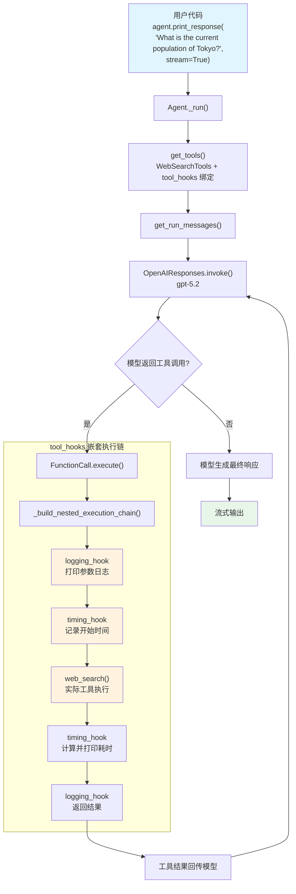

# tool_hooks.py — 实现原理分析

> 源文件：`cookbook/02_agents/09_hooks/tool_hooks.py`

## 概述

本示例展示 Agno 的 **`tool_hooks`** 机制：在每次工具调用时插入中间件（middleware），用嵌套执行链包裹工具函数。与 `pre_hooks`/`post_hooks`（在整个运行前后执行）不同，`tool_hooks` 在**每次工具调用**时执行，可用于日志记录、性能监控、参数修改等横切关注点。

**核心配置一览：**

| 配置项 | 值 | 说明 |
|--------|------|------|
| `name` | `None` | 未设置 |
| `model` | `OpenAIResponses(id="gpt-5.2")` | Responses API |
| `tools` | `[WebSearchTools()]` | Web 搜索工具 |
| `tool_hooks` | `[logging_hook, timing_hook]` | 工具调用中间件 |
| `pre_hooks` | `None` | 未设置 |
| `post_hooks` | `None` | 未设置 |
| `markdown` | `True` | 启用 markdown 格式 |
| `instructions` | `None` | 未设置 |

## 架构分层

```
用户代码层                          agno.agent 层
┌──────────────────────────┐    ┌──────────────────────────────────────┐
│ tool_hooks.py            │    │ Agent._run()                         │
│                          │    │  ├ get_tools()                       │
│ tool_hooks=[             │    │  │  → tool_hooks 绑定到每个 Function │
│   logging_hook,          │───>│  │                                    │
│   timing_hook            │    │  ├ Model.response()                   │
│ ]                        │    │  │  → 模型请求工具调用                │
│                          │    │  │                                    │
│ tools=[WebSearchTools()] │    │  ├ FunctionCall.execute()             │
│                          │    │  │  ├ _build_nested_execution_chain() │
│                          │    │  │  │  logging_hook                   │
│                          │    │  │  │   └─ timing_hook                │
│                          │    │  │  │       └─ entrypoint(**args)     │
│                          │    │  │  └ 执行链式调用                    │
└──────────────────────────┘    └──────────────────────────────────────┘
                                        │
                                        ▼
                                ┌──────────────────┐
                                │ OpenAIResponses   │
                                │ gpt-5.2           │
                                └──────────────────┘
```

## 核心组件解析

### tool_hooks 与 pre_hooks/post_hooks 的区别

| 维度 | `pre_hooks` / `post_hooks` | `tool_hooks` |
|------|---------------------------|-------------|
| 执行时机 | 整个运行的前/后（各执行一次） | 每次工具调用时执行 |
| 作用对象 | 运行级别（`RunInput` / `RunOutput`） | 工具函数级别（函数名、参数、返回值） |
| 注册位置 | `Agent(pre_hooks=..., post_hooks=...)` | `Agent(tool_hooks=...)` |
| 属性定义 | `agent.py` L176-178 | `agent.py` L172 |
| 执行方式 | 顺序执行 | 嵌套中间件链（洋葱模型） |
| 可中断 | 抛出 `InputCheckError` / `OutputCheckError` | 不抛出特殊异常，但可拦截返回值 |

### tool_hooks 绑定流程

`tool_hooks` 在 `get_tools()`（`_tools.py:105`）中被绑定到每个 `Function` 对象：

```python
# Agent 的 tool_hooks 属性传递给每个 Function
# Function.tool_hooks 存储 hook 列表
```

### 嵌套执行链（洋葱模型）

`_build_nested_execution_chain()`（`tools/function.py:928`）使用 `functools.reduce` 构建嵌套调用链：

```python
# tools/function.py L928-974
def _build_nested_execution_chain(self, entrypoint_args):
    def execute_entrypoint(name, func, args):
        """最内层：执行实际工具函数"""
        arguments = entrypoint_args.copy()
        if self.arguments is not None:
            arguments.update(self.arguments)
        return self.function.entrypoint(**arguments)

    def create_hook_wrapper(inner_func, hook):
        """创建中间件包装器"""
        def wrapper(name, func, args):
            def next_func(**kwargs):
                return inner_func(name, func, kwargs)
            hook_args = self._build_hook_args(hook, name, next_func, args)
            return hook(**hook_args)
        return wrapper

    # 从内向外构建链：反转 hooks 顺序
    hooks = list(reversed(final_hooks))
    chain = reduce(create_hook_wrapper, hooks, execute_entrypoint)
    return chain
```

对于 `tool_hooks=[logging_hook, timing_hook]`，执行顺序为：

```
logging_hook（最外层）
  └─ timing_hook（中间层）
      └─ web_search()（最内层，实际工具函数）
```

`reduce` 的构建过程：
1. 初始值：`execute_entrypoint`（实际工具函数）
2. 第一次 reduce：`create_hook_wrapper(execute_entrypoint, timing_hook)` → `timing_wrapper`
3. 第二次 reduce：`create_hook_wrapper(timing_wrapper, logging_hook)` → `logging_wrapper`

### _build_hook_args 参数注入

`_build_hook_args()`（`tools/function.py:898`）根据 hook 函数签名注入参数：

```python
# tools/function.py L898-926
def _build_hook_args(self, hook, name, func, args):
    hook_args = {}
    if "agent" in signature(hook).parameters:
        hook_args["agent"] = self.function._agent
    if "team" in signature(hook).parameters:
        hook_args["team"] = self.function._team
    if "run_context" in signature(hook).parameters:
        hook_args["run_context"] = self.function._run_context
    if "name" in signature(hook).parameters:
        hook_args["name"] = name
    if "function_name" in signature(hook).parameters:
        hook_args["function_name"] = name
    if "function" in signature(hook).parameters:
        hook_args["function"] = func      # next_func 回调
    if "func" in signature(hook).parameters:
        hook_args["func"] = func          # next_func 回调（别名）
    if "function_call" in signature(hook).parameters:
        hook_args["function_call"] = func # next_func 回调（别名）
    if "args" in signature(hook).parameters:
        hook_args["args"] = args          # 工具调用参数
    if "arguments" in signature(hook).parameters:
        hook_args["arguments"] = args     # 工具调用参数（别名）
    return hook_args
```

**tool_hooks 参数注入映射：**

| hook 函数参数名 | 注入内容 | 本例使用 |
|----------------|---------|---------|
| `agent` | Agent 实例 | 否 |
| `team` | Team 实例 | 否 |
| `run_context` | RunContext（含 session_state） | 否 |
| `name` / `function_name` | 工具函数名 | 是（`function_name`） |
| `function` / `func` / `function_call` | next_func 回调 | 是（`func`） |
| `args` / `arguments` | 工具调用参数 | 是（`args`） |

### 本例两个 hook 的执行过程

```python
# logging_hook 签名：(function_name, func, args)
def logging_hook(function_name, func, args):
    print(f"[logging_hook] Calling {function_name} with args: {list(args.keys())}")
    return func(**args)  # 调用 next_func → 进入 timing_hook

# timing_hook 签名：(function_name, func, args)
def timing_hook(function_name, func, args):
    start = time.time()
    result = func(**args)  # 调用 next_func → 执行实际工具函数
    elapsed = time.time() - start
    print(f"[timing_hook] {function_name} took {elapsed:.3f}s")
    return result
```

实际执行流：
1. `logging_hook` 打印参数日志
2. `logging_hook` 调用 `func(**args)` → 进入 `timing_hook`
3. `timing_hook` 记录开始时间
4. `timing_hook` 调用 `func(**args)` → 执行 `web_search()`
5. `web_search()` 返回结果
6. `timing_hook` 计算耗时并打印
7. `logging_hook` 返回最终结果

### FunctionCall.execute() 调用链

```python
# tools/function.py L1006-1011
if self.function.tool_hooks is not None:
    # 有 hooks：构建嵌套执行链
    execution_chain = self._build_nested_execution_chain(entrypoint_args=entrypoint_args)
    result = execution_chain(self.function.name, self.function.entrypoint, self.arguments or {})
else:
    # 无 hooks：直接调用
    result = self.function.entrypoint(**entrypoint_args, **self.arguments)
```

## System Prompt 组装

| 序号 | 组成部分 | 本文件中的值/来源 | 是否生效 |
|------|---------|-----------------|---------|
| 1 | `system_message`（自定义） | `None` | 否 |
| 3.1 | `instructions` | `None` | 否 |
| 3.1.1 | 模型指令（`get_instructions_for_model`） | 模型默认 | 是 |
| 3.2.1 | `markdown` | `True` | 是 |
| 3.2.2 | `add_datetime_to_context` | `False` | 否 |
| 3.2.3 | `add_location_to_context` | `False` | 否 |
| 3.2.4 | `add_name_to_context` | `False` | 否 |
| 3.3.1 | `description` | `None` | 否 |
| 3.3.2 | `role` | `None` | 否 |
| 3.3.3 | instructions 拼接 | 无 | 否 |
| 3.3.4 | additional_information | `"Use markdown to format your answers."` | 是 |
| 3.3.5 | `_tool_instructions` | WebSearchTools 工具使用说明 | 是 |
| fmt | `resolve_in_context` 变量替换 | 无模板变量 | 否 |
| 3.3.7 | `expected_output` | `None` | 否 |
| 3.3.8 | `additional_context` | `None` | 否 |
| 3.3.9 | `add_memories_to_context` | `None` | 否 |
| 3.3.10 | `add_culture_to_context` | `None` | 否 |
| 3.3.11 | `add_session_summary_to_context` | `None` | 否 |
| 3.3.12 | `add_learnings_to_context` | `True`（默认），但无 learning | 否 |
| 3.3.13 | `search_knowledge` instructions | 无 knowledge | 否 |
| 3.3.14 | 模型 system message | 模型默认 | 否 |
| 3.3.15 | JSON output prompt | 无 output_schema | 否 |
| 3.3.16 | response model format prompt | 无 parser_model | 否 |
| 3.3.17 | `add_session_state_to_context` | `False` | 否 |

### 最终 System Prompt

```text
<additional_information>
- Use markdown to format your answers.
</additional_information>

<WebSearchTools 工具使用说明>
```

## 完整 API 请求

### 第一轮：模型请求工具调用

```python
client.responses.create(
    model="gpt-5.2",
    input=[
        # System Message
        {"role": "developer", "content": "<additional_information>\n- Use markdown to format your answers.\n</additional_information>\n\n<tool_instructions>..."},
        # 用户输入
        {"role": "user", "content": "What is the current population of Tokyo?"}
    ],
    tools=[
        {"type": "function", "function": {"name": "web_search", "parameters": {"type": "object", "properties": {"query": {"type": "string"}}, "required": ["query"]}}}
    ],
    stream=True,
    stream_options={"include_usage": True}
)
```

模型返回工具调用 → 触发 tool_hooks 执行链：

```
[logging_hook] Calling web_search with args: ['query']
（web_search 执行实际搜索）
[timing_hook] web_search took 1.234s
```

### 第二轮：工具结果回传后

```python
client.responses.create(
    model="gpt-5.2",
    input=[
        {"role": "developer", "content": "..."},
        {"role": "user", "content": "What is the current population of Tokyo?"},
        {"type": "function_call", "name": "web_search", "arguments": "{\"query\": \"current population of Tokyo\"}"},
        {"type": "function_call_output", "call_id": "...", "output": "<搜索结果>"}
    ],
    tools=[...],
    stream=True,
    stream_options={"include_usage": True}
)
```

> tool_hooks 只在工具函数执行时生效，不影响 API 请求格式。

## Mermaid 流程图



## 关键源码文件索引

| 文件 | 关键函数/类 | 作用 |
|------|------------|------|
| `agno/agent/agent.py` | `tool_hooks` L172 | tool_hooks 属性定义 |
| `agno/tools/function.py` | `Function.tool_hooks` L168 | Function 上的 hook 列表 |
| `agno/tools/function.py` | `_build_hook_args()` L898 | hook 参数注入（按签名匹配） |
| `agno/tools/function.py` | `_build_nested_execution_chain()` L928 | 构建嵌套调用链（reduce 包裹） |
| `agno/tools/function.py` | `execute()` L1006-1009 | 有 hook 时执行链式调用 |
| `agno/tools/function.py` | `execute()` L1011 | 无 hook 时直接调用 |
| `agno/agent/_tools.py` | `get_tools()` L105 | 工具解析 + tool_hooks 绑定 |
