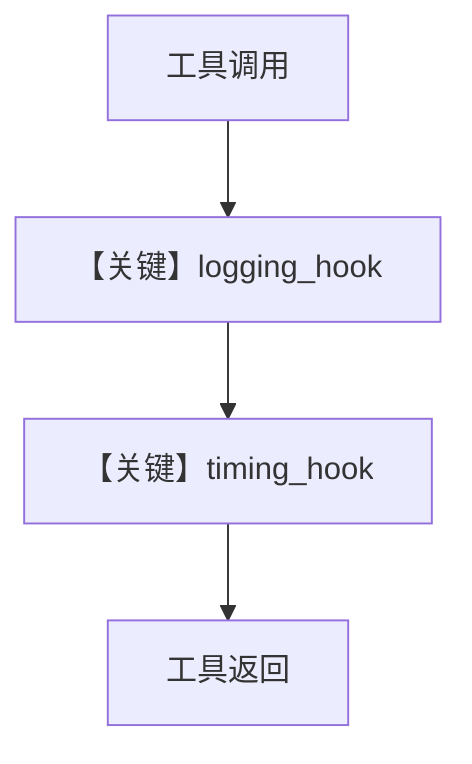

# tool_hooks.py — 实现原理分析

<!-- cookbook-py-source:start -->
## 完整源码

```python
"""
Tool Hooks
=============================

Use tool_hooks to add middleware that wraps every tool call.

Tool hooks act as middleware: each hook receives the tool name, arguments,
and a next_func callback. The hook must call next_func(**args) to continue
the chain, and can inspect or modify args before and the result after.
"""

import time

from agno.agent import Agent
from agno.models.openai import OpenAIResponses
from agno.tools.websearch import WebSearchTools


def timing_hook(function_name: str, func: callable, args: dict):
    """Measure and print the execution time of each tool call."""
    start = time.time()
    result = func(**args)
    elapsed = time.time() - start
    print(f"[timing_hook] {function_name} took {elapsed:.3f}s")
    return result


def logging_hook(function_name: str, func: callable, args: dict):
    """Log the tool name and arguments before execution."""
    print(f"[logging_hook] Calling {function_name} with args: {list(args.keys())}")
    return func(**args)


# ---------------------------------------------------------------------------
# Create Agent
# ---------------------------------------------------------------------------
agent = Agent(
    model=OpenAIResponses(id="gpt-5.2"),
    tools=[WebSearchTools()],
    # Hooks are applied to every tool call in middleware order
    tool_hooks=[logging_hook, timing_hook],
    markdown=True,
)

# ---------------------------------------------------------------------------
# Run Agent
# ---------------------------------------------------------------------------
if __name__ == "__main__":
    agent.print_response(
        "What is the current population of Tokyo?",
        stream=True,
    )
```

<!-- cookbook-py-source:end -->

> 源文件：`cookbook/02_agents/09_hooks/tool_hooks.py`

## 概述

本示例展示 **`tool_hooks` 中间件链**：对每个工具调用按顺序执行 `logging_hook`、`timing_hook`，在调用前后记录参数键名与耗时。需通过 **`next_func` 模式** 的变体在此简化为直接 `func(**args)`（与最新 API 以源码为准）。

**核心配置一览：**

| 配置项 | 值 |
|--------|-----|
| `model` | `OpenAIResponses(id="gpt-5.2")` |
| `tools` | `[WebSearchTools()]` |
| `tool_hooks` | `[logging_hook, timing_hook]` |
| `markdown` | `True` |

## 核心组件解析

`tool_hooks` 在 Agent 工具执行管线中包裹实际工具函数，便于观测与鉴权（本示例仅日志+计时）。

### 运行机制与因果链

用户问东京人口 → 模型调用 web 搜索工具 → hooks 依次执行 → 返回结果给模型。

## System Prompt 组装

无显式 `instructions`；`markdown=True` 产生附加段；`WebSearchTools` 可能自带工具说明进入 `# 3.3.5`。

## 完整 API 请求

主对话：`responses.create`；工具内部可能访问搜索提供商 HTTP。

## Mermaid 流程图


```mermaid
flowchart TD
    T["工具调用"] --> L["【关键】logging_hook"]
    L --> TI["【关键】timing_hook"]
    TI --> R["工具返回"]
```

## 关键源码文件索引

| 文件 | 作用 |
|------|------|
| `agno/agent/_tools.py` | `tool_hooks` 应用 |
| `agno/tools/websearch` | `WebSearchTools` |
