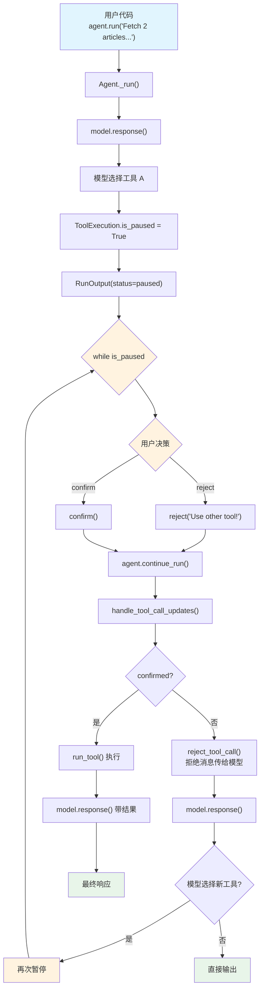

# confirmation_advanced.py — 实现原理分析

> 源文件：`cookbook/02_agents/10_human_in_the_loop/confirmation_advanced.py`

## 概述

本示例展示 Agno 的 **多工具确认 + 拒绝引导**机制：Agent 同时注册多个需要确认的工具（`@tool(requires_confirmation=True)` 和 `Toolkit(requires_confirmation_tools=[...])`），运行时通过 `while run_response.is_paused` 循环处理可能多轮的暂停-确认交互，拒绝时可通过 `requirement.reject("消息")` 传递引导信息让模型选择其他工具。

**核心配置一览：**

| 配置项 | 值 | 说明 |
|--------|------|------|
| `model` | `OpenAIResponses(id="gpt-5-mini")` | Responses API |
| `tools` | `[get_top_hackernews_stories, WikipediaTools(requires_confirmation_tools=["search_wikipedia"])]` | 两个确认工具 |
| `markdown` | `True` | 启用 markdown 格式化 |
| `db` | `SqliteDb(db_file="tmp/confirmation_required_multiple_tools.db")` | SQLite 持久化 |
| `instructions` | `None` | 未设置 |
| `session_state` | `None` | 未设置 |

## 架构分层

```
用户代码层                       agno.agent 层
┌──────────────────────┐      ┌──────────────────────────────────────────┐
│ confirmation_         │      │ Agent._run()                             │
│   advanced.py         │      │  ├ model.response() → tool_call          │
│                       │      │  ├ ToolExecution.is_paused → True        │
│ 两个确认工具：        │      │  └ handle_agent_run_paused()             │
│ ① HackerNews(@tool)  │─────>│                                          │
│ ② Wikipedia(Toolkit)  │      ├──────────────────────────────────────────┤
│                       │      │ continue_run_dispatch()                  │
│ while is_paused:      │      │  ├ handle_tool_call_updates()            │
│   reject("use other") │      │  │  ├ rejected → reject_tool_call()      │
│   或 confirm()        │      │  │  │  → 拒绝消息传给模型               │
│   continue_run()      │─────>│  │  └ 模型可能选择另一个工具            │
│                       │      │  ├ model.response() → 新 tool_call?     │
│ 循环直到完成          │      │  └ 可能再次暂停                         │
└──────────────────────┘      └──────────────────────────────────────────┘
                                      │
                                      ▼
                              ┌──────────────┐
                              │ OpenAI       │
                              │ Responses API│
                              │ gpt-5-mini   │
                              └──────────────┘
```

## 核心组件解析

### 混合确认来源

本文件同时使用两种确认标记方式：

```python
# 方式一：@tool 装饰器
@tool(requires_confirmation=True)
def get_top_hackernews_stories(num_stories: int) -> str: ...

# 方式二：Toolkit 级
WikipediaTools(requires_confirmation_tools=["search_wikipedia"])
```

两种方式在 `_tools.py` 处理时效果相同 — 最终都将 `ToolExecution.requires_confirmation` 设为 `True`。

### while 循环处理多轮暂停

```python
# 用户代码
run_response = agent.run("Fetch 2 articles about 'python'...")

while run_response.is_paused:  # 可能多轮暂停
    for requirement in run_response.active_requirements:
        if requirement.needs_confirmation:
            message = Prompt.ask("Do you want to continue?", ...)
            if message == "n":
                requirement.reject("This is not the right tool to use. Use the other tool!")
            else:
                requirement.confirm()
    run_response = agent.continue_run(
        run_id=run_response.run_id,
        requirements=run_response.requirements,
    )
```

**关键点：** 当用户拒绝一个工具时，`reject("消息")` 将拒绝原因写入 `ToolExecution.confirmation_note`。在 `handle_tool_call_updates()`（`_tools.py:744`）中：

```python
# _tools.py L744-747
reject_tool_call(agent, run_messages, _t, functions=_functions)
_t.confirmed = False
_t.confirmation_note = _t.confirmation_note or "Tool call was rejected"
_t.tool_call_error = True
```

拒绝消息作为 tool 角色的错误响应传给模型，模型可能据此选择另一个工具（如从 HackerNews 切换到 Wikipedia），触发新一轮暂停。

### continue_run 传参方式

本文件使用 `run_id` + `requirements` 方式恢复：

```python
run_response = agent.continue_run(
    run_id=run_response.run_id,          # 按 run_id 查找暂停的运行
    requirements=run_response.requirements,  # 传递更新后的需求
)
```

在 `continue_run_dispatch()`（`_run.py:2762-2770`）中，requirements 中的 ToolExecution 按 `tool_call_id` 合并回 `run_response.tools`。

## System Prompt 组装

| 序号 | 组成部分 | 本文件中的值/来源 | 是否生效 |
|------|---------|-----------------|---------|
| 1 | `system_message`（自定义） | `None` | 否 |
| 3.2.1 | `markdown` | `True` | 是 |
| 3.3.4 | additional_information | markdown 指令 | 是 |
| 其余 | — | 均未启用 | 否 |

### 最终 System Prompt

```text
<additional_information>
- Use markdown to format your answers.
</additional_information>
```

## 完整 API 请求

### 第一轮：初始请求

```python
client.responses.create(
    model="gpt-5-mini",
    input=[
        {"role": "developer", "content": "<additional_information>\n- Use markdown to format your answers.\n</additional_information>\n\n"},
        {"role": "user", "content": "Fetch 2 articles about the topic 'python'. You can choose which source to use, but only use one source."}
    ],
    tools=[
        {"type": "function", "function": {"name": "get_top_hackernews_stories", "description": "Fetch top stories from Hacker News.", "parameters": {"type": "object", "properties": {"num_stories": {"type": "integer", "description": "(int) Number of stories to retrieve"}}, "required": ["num_stories"]}}},
        {"type": "function", "function": {"name": "search_wikipedia", "description": "Search Wikipedia...", "parameters": {...}}}
    ],
    stream=True,
    stream_options={"include_usage": True}
)
```

> 模型选择 `get_top_hackernews_stories` → 暂停

### 第二轮：拒绝后模型选择新工具

用户 `reject("Use the other tool!")` 后：

```python
client.responses.create(
    model="gpt-5-mini",
    input=[
        {"role": "developer", "content": "..."},
        {"role": "user", "content": "Fetch 2 articles..."},
        # 被拒绝的工具调用
        {"role": "assistant", "tool_calls": [{"id": "call_1", "function": {"name": "get_top_hackernews_stories", ...}}]},
        # 拒绝消息（tool_call_error=True）
        {"role": "tool", "tool_call_id": "call_1", "content": "This is not the right tool to use. Use the other tool!"}
    ],
    tools=[...],
    stream=True
)
```

> 模型改选 `search_wikipedia` → 再次暂停

### 第三轮：确认后执行

用户 `confirm()` 后，工具执行，结果传给模型生成最终响应。

## Mermaid 流程图



## 关键源码文件索引

| 文件 | 关键函数/类 | 作用 |
|------|------------|------|
| `agno/tools/decorator.py` | `tool()` L60 | `@tool(requires_confirmation=True)` |
| `agno/tools/toolkit.py` | `Toolkit.__init__()` L15 | `requires_confirmation_tools` 参数 |
| `agno/tools/toolkit.py` | `_register_tools()` L191 | 传播确认标记到 Function |
| `agno/run/requirement.py` | `RunRequirement.reject()` L105 | 拒绝并附带消息 |
| `agno/run/requirement.py` | `RunRequirement.is_resolved()` L169 | 判断需求是否已解决 |
| `agno/run/agent.py` | `RunOutput.active_requirements` L638 | 过滤未解决的需求 |
| `agno/agent/_tools.py` | `handle_tool_call_updates()` L730 | 处理确认/拒绝后执行 |
| `agno/agent/_tools.py` | `reject_tool_call()` L744 | 构造拒绝消息传给模型 |
| `agno/agent/_run.py` | `continue_run_dispatch()` L2630 | 恢复运行，合并 requirements |
| `agno/agent/_run.py` | `_continue_run()` L2842 | 恢复后执行（含 agentic loop） |
