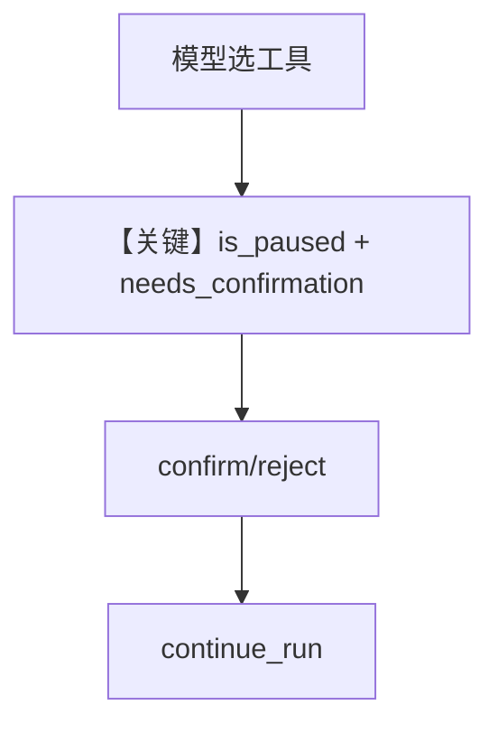

# confirmation_advanced.py — 实现原理分析

<!-- cookbook-py-source:start -->
## 完整源码

```python
"""
Confirmation Advanced
=============================

Human-in-the-Loop: Adding User Confirmation to Tool Calls.
"""

import json

import httpx
from agno.agent import Agent
from agno.db.sqlite import SqliteDb
from agno.models.openai import OpenAIResponses
from agno.tools import tool
from agno.tools.wikipedia import WikipediaTools
from agno.utils import pprint
from rich.console import Console
from rich.prompt import Prompt

console = Console()


@tool(requires_confirmation=True)
def get_top_hackernews_stories(num_stories: int) -> str:
    """Fetch top stories from Hacker News.

    Args:
        num_stories (int): Number of stories to retrieve

    Returns:
        str: JSON string containing story details
    """
    # Fetch top story IDs
    response = httpx.get("https://hacker-news.firebaseio.com/v0/topstories.json")
    story_ids = response.json()

    # Yield story details
    all_stories = []
    for story_id in story_ids[:num_stories]:
        story_response = httpx.get(
            f"https://hacker-news.firebaseio.com/v0/item/{story_id}.json"
        )
        story = story_response.json()
        if "text" in story:
            story.pop("text", None)
        all_stories.append(story)
    return json.dumps(all_stories)


# ---------------------------------------------------------------------------
# Create Agent
# ---------------------------------------------------------------------------
agent = Agent(
    model=OpenAIResponses(id="gpt-5-mini"),
    tools=[
        get_top_hackernews_stories,
        WikipediaTools(requires_confirmation_tools=["search_wikipedia"]),
    ],
    markdown=True,
    db=SqliteDb(db_file="tmp/confirmation_required_multiple_tools.db"),
)

# ---------------------------------------------------------------------------
# Run Agent
# ---------------------------------------------------------------------------
if __name__ == "__main__":
    run_response = agent.run(
        "Fetch 2 articles about the topic 'python'. You can choose which source to use, but only use one source."
    )
    while run_response.is_paused:
        for requirement in run_response.active_requirements:
            if requirement.needs_confirmation:
                # Ask for confirmation
                console.print(
                    f"Tool name [bold blue]{requirement.tool_execution.tool_name}({requirement.tool_execution.tool_args})[/] requires confirmation."
                )
                message = (
                    Prompt.ask(
                        "Do you want to continue?", choices=["y", "n"], default="y"
                    )
                    .strip()
                    .lower()
                )

                if message == "n":
                    requirement.reject(
                        "This is not the right tool to use. Use the other tool!"
                    )
                else:
                    requirement.confirm()

        run_response = agent.continue_run(
            run_id=run_response.run_id,
            requirements=run_response.requirements,
        )
        pprint.pprint_run_response(run_response)
```

<!-- cookbook-py-source:end -->

> 源文件：`cookbook/02_agents/10_human_in_the_loop/confirmation_advanced.py`

## 概述

本示例展示 **多工具场景下的 HITL 确认**：`@tool(requires_confirmation=True)` 与 `WikipediaTools(requires_confirmation_tools=["search_wikipedia"])` 并存；`while run_response.is_paused` 循环处理 `active_requirements`，`reject` 时可带拒绝理由字符串，再 `continue_run`。

**核心配置一览：**

| 配置项 | 值 |
|--------|-----|
| `model` | `OpenAIResponses(id="gpt-5-mini")` |
| `tools` | `get_top_hackernews_stories`，`WikipediaTools(...)` |
| `markdown` | `True` |
| `db` | `SqliteDb(db_file="tmp/confirmation_required_multiple_tools.db")` |

## 核心组件解析

### `is_paused` 与 `continue_run`

Run 在待确认工具处暂停；用户 y/n 后 `requirement.confirm()` / `reject(...)`，最后 `agent.continue_run(run_id, requirements)`。

### 运行机制与因果链

多轮暂停可能由 `while` 处理；数据库保存 run 状态以支持续跑。

## System Prompt 组装

无显式 `instructions`；`markdown=True`；工具说明来自各工具。

## 完整 API 请求

暂停前已完成至少一次模型调用；`continue_run` 再走 Responses 完成工具结果回合。

## Mermaid 流程图


```mermaid
flowchart TD
    R["模型选工具"] --> P["【关键】is_paused + needs_confirmation"]
    P --> C["confirm/reject"]
    C --> N["continue_run"]
```

## 关键源码文件索引

| 文件 | 作用 |
|------|------|
| `agno/tools` | `@tool(requires_confirmation=True)` |
| `agno/agent` | `continue_run`；`RunOutput.is_paused` |
