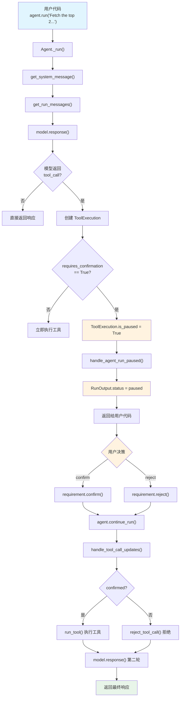

# confirmation_required.py — 实现原理分析

> 源文件：`cookbook/02_agents/10_human_in_the_loop/confirmation_required.py`

## 概述

本示例展示 Agno 的 **Human-in-the-Loop (HITL) 确认机制**：通过 `@tool(requires_confirmation=True)` 装饰器标记工具需要用户确认后才能执行，Agent 运行到该工具调用时自动暂停（`RunStatus.paused`），等待用户通过 `requirement.confirm()` 或 `requirement.reject()` 决定是否继续，再调用 `agent.continue_run()` 恢复执行。

**核心配置一览：**

| 配置项 | 值 | 说明 |
|--------|------|------|
| `model` | `OpenAIResponses(id="gpt-5-mini")` | Responses API |
| `tools` | `[get_top_hackernews_stories]` | 带 `requires_confirmation=True` 的工具 |
| `markdown` | `True` | 启用 markdown 格式化 |
| `db` | `SqliteDb(session_table="test_session", db_file="tmp/example.db")` | SQLite 持久化 |
| `instructions` | `None` | 未设置 |
| `session_state` | `None` | 未设置 |

## 架构分层

```
用户代码层                     agno.agent 层
┌─────────────────────┐     ┌──────────────────────────────────────────┐
│ confirmation_        │     │ Agent._run()                             │
│   required.py        │     │  ├ model.response()                     │
│                      │     │  │  → 模型返回 tool_call                │
│ @tool(requires_      │────>│  │                                      │
│   confirmation=True) │     │  ├ ToolExecution.is_paused == True       │
│                      │     │  │  → handle_agent_run_paused()         │
│ agent.run(...)       │     │  │  → RunStatus.paused                  │
│  ↓                   │     │  │                                      │
│ run_response         │<────│  └ 返回 RunOutput(status=paused)        │
│  .is_paused → True   │     │                                        │
│  .active_requirements│     ├─────────────────────────────────────────┤
│  → confirm()/reject()│     │ Agent.continue_run()                    │
│  ↓                   │     │  ├ handle_tool_call_updates()           │
│ agent.continue_run() │────>│  │  ├ confirmed → run_tool() 执行工具  │
│                      │     │  │  └ rejected → reject_tool_call()     │
│ 最终响应             │<────│  └ model.response() → 最终输出          │
└─────────────────────┘     └──────────────────────────────────────────┘
                                    │
                                    ▼
                            ┌──────────────┐
                            │ OpenAI       │
                            │ Responses API│
                            │ gpt-5-mini   │
                            └──────────────┘
```

## 核心组件解析

### @tool(requires_confirmation=True) 装饰器

`@tool` 装饰器在 `decorator.py:60` 中定义，`requires_confirmation` 参数传递给 `Function` 对象：

```python
# tools/decorator.py L60-72
def tool(
    *,
    requires_confirmation: Optional[bool] = None,  # HITL 确认标记
    requires_user_input: Optional[bool] = None,
    external_execution: Optional[bool] = None,
    ...
) -> Callable[[F], Function]: ...
```

当 `requires_confirmation=True` 时，`Function.requires_confirmation` 被设置为 `True`（`function.py:171`）。

### ToolExecution.is_paused 暂停检测

模型返回工具调用后，agno 创建 `ToolExecution` 对象。其 `is_paused` 属性（`models/response.py:64`）检测是否需要暂停：

```python
# models/response.py L64-65
@property
def is_paused(self) -> bool:
    # 三种 HITL 场景之一为 True 即暂停
    return bool(self.requires_confirmation or self.requires_user_input or self.external_execution_required)
```

### handle_agent_run_paused() 暂停处理

在 `_run.py:533` 检测到 `is_paused` 后，调用 `handle_agent_run_paused()`（`_run.py:192`）：

```python
# _run.py L533-550
if any(tool_call.is_paused for tool_call in run_response.tools or []):
    return handle_agent_run_paused(agent, run_response=run_response, ...)

# _run.py L192-211
def handle_agent_run_paused(agent, run_response, session, ...):
    run_response.status = RunStatus.paused        # 设置暂停状态
    run_response.content = get_paused_content(...)  # 生成暂停提示
    cleanup_and_store(agent, ...)                   # 持久化到数据库
    return run_response
```

### RunRequirement 用户交互

`RunRequirement`（`run/requirement.py:10`）封装了 HITL 交互逻辑：

```python
# run/requirement.py L55-112
@property
def needs_confirmation(self) -> bool:
    # 如果 confirmation 已设置 或 tool_execution.confirmed 已设置，返回 False
    return self.tool_execution.requires_confirmation or False

def confirm(self):
    self.confirmation = True
    self.tool_execution.confirmed = True    # 标记工具已确认

def reject(self, note=None):
    self.confirmation = False
    self.tool_execution.confirmed = False   # 标记工具已拒绝
    self.tool_execution.confirmation_note = note
```

### RunOutput.is_paused / active_requirements

`RunOutput`（`run/agent.py:628-646`）提供便捷属性：

```python
# run/agent.py L644-646
@property
def is_paused(self):
    return self.status == RunStatus.paused

# run/agent.py L638-642
@property
def active_requirements(self) -> list[RunRequirement]:
    return [req for req in self.requirements if not req.is_resolved()]
```

### continue_run() 恢复执行

`agent.continue_run()`（`agent.py:1480`）委派到 `continue_run_dispatch()`（`_run.py:2630`）：

```python
# _run.py L2762-2770
# 从 requirements 提取更新后的 ToolExecution
if requirements is not None:
    run_response.requirements = requirements
    updated_tools = [req.tool_execution for req in requirements if req.tool_execution is not None]
    # 按 tool_call_id 合并更新
    updated_tools_map = {tool.tool_call_id: tool for tool in updated_tools}
    run_response.tools = [updated_tools_map.get(tool.tool_call_id, tool) for tool in run_response.tools]
```

### handle_tool_call_updates() 工具状态处理

`_tools.py:730` 处理确认/拒绝后的工具执行：

```python
# _tools.py L738-749
if _t.requires_confirmation and _t.confirmed and _t.result is None:
    # 确认 → 执行工具
    deque(run_tool(agent, run_response, run_messages, _t, functions=_functions), maxlen=0)
else:
    # 拒绝 → 构造拒绝消息
    reject_tool_call(agent, run_messages, _t, functions=_functions)
    _t.confirmed = False
    _t.confirmation_note = _t.confirmation_note or "Tool call was rejected"
    _t.tool_call_error = True
_t.requires_confirmation = False  # 清除标记，防止再次暂停
```

## System Prompt 组装

| 序号 | 组成部分 | 本文件中的值/来源 | 是否生效 |
|------|---------|-----------------|---------|
| 1 | `system_message`（自定义） | `None` | 否 |
| 3.1 | `instructions` | `None` | 否 |
| 3.1.1 | 模型指令（`get_instructions_for_model`） | Responses API 默认 | 可能 |
| 3.2.1 | `markdown` | `True` | 是 |
| 3.2.2 | `add_datetime_to_context` | `False` | 否 |
| 3.2.3 | `add_location_to_context` | `False` | 否 |
| 3.2.4 | `add_name_to_context` | `False` | 否 |
| 3.3.1 | `description` | `None` | 否 |
| 3.3.2 | `role` | `None` | 否 |
| 3.3.3 | instructions 拼接 | 无 | 否 |
| 3.3.4 | additional_information | markdown 指令 | 是 |
| 3.3.5 | `_tool_instructions` | 无 | 否 |
| fmt | `resolve_in_context` 变量替换 | 默认 `True`，无模板变量 | 否 |
| 3.3.7 | `expected_output` | `None` | 否 |
| 3.3.8 | `additional_context` | `None` | 否 |
| 3.3.9 | `add_memories_to_context` | `None` | 否 |
| 3.3.10 | `add_culture_to_context` | `None` | 否 |
| 3.3.11 | `add_session_summary_to_context` | `None` | 否 |
| 3.3.12 | `add_learnings_to_context` | 无 learning | 否 |
| 3.3.13 | `search_knowledge` instructions | 无 knowledge | 否 |
| 3.3.14 | 模型 system message | 无 | 否 |
| 3.3.15 | JSON output prompt | 无 output_schema | 否 |
| 3.3.16 | parser_model format prompt | 无 parser_model | 否 |
| 3.3.17 | `add_session_state_to_context` | `False` | 否 |

### 最终 System Prompt

```text
<additional_information>
- Use markdown to format your answers.
</additional_information>
```

## 完整 API 请求

### 第一轮：初始请求

```python
client.responses.create(
    model="gpt-5-mini",
    input=[
        # 1. System Message（role_map: system → developer）
        {"role": "developer", "content": "<additional_information>\n- Use markdown to format your answers.\n</additional_information>\n\n"},
        # 2. 用户消息
        {"role": "user", "content": "Fetch the top 2 hackernews stories."}
    ],
    tools=[{
        "type": "function",
        "function": {
            "name": "get_top_hackernews_stories",
            "description": "Fetch top stories from Hacker News.",
            "parameters": {
                "type": "object",
                "properties": {
                    "num_stories": {
                        "type": "integer",
                        "description": "(int) Number of stories to retrieve"
                    }
                },
                "required": ["num_stories"]
            }
        }
    }],
    stream=True,
    stream_options={"include_usage": True}
)
```

> 模型返回 `tool_call: get_top_hackernews_stories(num_stories=2)`
> `ToolExecution.requires_confirmation=True` → `is_paused=True` → **Agent 暂停，不执行工具**

### 第二轮：确认后继续

用户调用 `requirement.confirm()` 后，`agent.continue_run()` 先执行工具，然后带工具结果发第二轮请求：

```python
client.responses.create(
    model="gpt-5-mini",
    input=[
        # 1. System Message
        {"role": "developer", "content": "..."},
        # 2. 用户消息
        {"role": "user", "content": "Fetch the top 2 hackernews stories."},
        # 3. 模型工具调用
        {"role": "assistant", "tool_calls": [{"id": "call_xxx", "function": {"name": "get_top_hackernews_stories", "arguments": "{\"num_stories\": 2}"}}]},
        # 4. 工具执行结果（确认后才执行）
        {"role": "tool", "tool_call_id": "call_xxx", "content": "[{\"title\": \"...\", ...}]"}
    ],
    tools=[...],
    stream=True,
    stream_options={"include_usage": True}
)
```

> 如果用户 `reject()`，工具结果内容为拒绝消息："Tool call was rejected"

## Mermaid 流程图



## 关键源码文件索引

| 文件 | 关键函数/类 | 作用 |
|------|------------|------|
| `agno/tools/decorator.py` | `tool()` L60 | `@tool` 装饰器，传递 `requires_confirmation` |
| `agno/tools/function.py` | `Function.requires_confirmation` L171 | 工具确认标记属性 |
| `agno/models/response.py` | `ToolExecution` L27 | 工具执行数据类，含 HITL 字段 |
| `agno/models/response.py` | `ToolExecution.is_paused` L64 | 检测是否需要暂停 |
| `agno/run/requirement.py` | `RunRequirement` L10 | HITL 需求封装，含 confirm/reject |
| `agno/run/agent.py` | `RunOutput.is_paused` L644 | 暂停状态便捷属性 |
| `agno/run/agent.py` | `RunOutput.active_requirements` L638 | 未解决的需求列表 |
| `agno/run/base.py` | `RunStatus.paused` L284 | 暂停状态枚举值 |
| `agno/agent/_run.py` | `_run()` L533 | is_paused 检测点 |
| `agno/agent/_run.py` | `handle_agent_run_paused()` L192 | 暂停处理（设状态+持久化） |
| `agno/agent/_run.py` | `continue_run_dispatch()` L2630 | 恢复运行入口 |
| `agno/agent/_tools.py` | `handle_tool_call_updates()` L730 | 确认/拒绝后工具执行 |
| `agno/utils/response.py` | `get_paused_content()` L128 | 生成暂停提示文本 |
