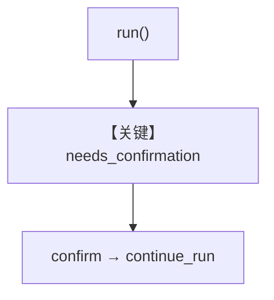

# confirmation_required.py — 实现原理分析

> 源文件：`cookbook/02_agents/10_human_in_the_loop/confirmation_required.py`

## 概述

本示例展示 **单工具确认的最小流程**：`@tool(requires_confirmation=True)` 的 Hacker News 抓取；`agent.run` 后遍历 `active_requirements`，控制台 y/n，`continue_run` 恢复。

**核心配置一览：**

| 配置项 | 值 |
|--------|-----|
| `model` | `OpenAIResponses(id="gpt-5-mini")` |
| `tools` | `[get_top_hackernews_stories]` |
| `markdown` | `True` |
| `db` | `SqliteDb(session_table="test_session", db_file="tmp/example.db")` |

## 运行机制与因果链

用户确认前 **工具不执行**（或处于待执行暂停态，依实现）；确认后注入工具结果继续对话。

## System Prompt 组装

无自定义 `instructions`；默认 system 由 markdown 与工具 schema 说明构成。

参照用户句：`Fetch the top 2 hackernews stories.`

## 完整 API 请求

`responses.create`；确认后续跑可能含 tool 结果消息。

## Mermaid 流程图

```mermaid
flowchart TD
    A["run()"] --> B["【关键】needs_confirmation"]
    B --> C["confirm → continue_run"]
```

## 关键源码文件索引

| 文件 | 作用 |
|------|------|
| `agno/run/agent` | `RunOutput`；`active_requirements` |
