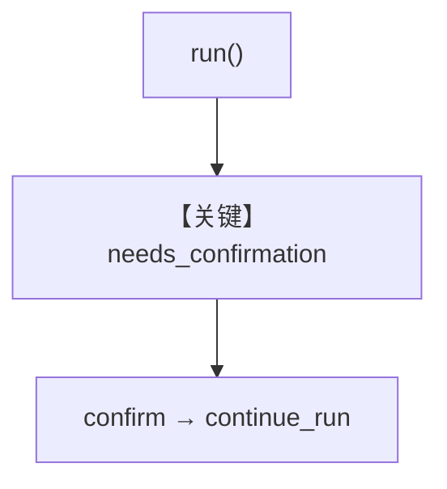

# confirmation_required.py — 实现原理分析

<!-- cookbook-py-source:start -->
## 完整源码

```python
"""
Confirmation Required
=============================

Human-in-the-Loop (HITL): Adding User Confirmation to Tool Calls.
"""

import json

import httpx
from agno.agent import Agent
from agno.db.sqlite import SqliteDb
from agno.models.openai import OpenAIResponses
from agno.tools import tool
from agno.utils import pprint
from rich.console import Console
from rich.prompt import Prompt

console = Console()


# This tool will require user confirmation before execution
@tool(requires_confirmation=True)
def get_top_hackernews_stories(num_stories: int) -> str:
    """Fetch top stories from Hacker News.

    Args:
        num_stories (int): Number of stories to retrieve

    Returns:
        str: JSON string containing story details
    """
    # Fetch top story IDs
    response = httpx.get("https://hacker-news.firebaseio.com/v0/topstories.json")
    story_ids = response.json()

    # Yield story details
    all_stories = []
    for story_id in story_ids[:num_stories]:
        story_response = httpx.get(
            f"https://hacker-news.firebaseio.com/v0/item/{story_id}.json"
        )
        story = story_response.json()
        if "text" in story:
            story.pop("text", None)
        all_stories.append(story)
    return json.dumps(all_stories)


# ---------------------------------------------------------------------------
# Create Agent
# ---------------------------------------------------------------------------
agent = Agent(
    model=OpenAIResponses(id="gpt-5-mini"),
    tools=[get_top_hackernews_stories],
    markdown=True,
    db=SqliteDb(session_table="test_session", db_file="tmp/example.db"),
)

# ---------------------------------------------------------------------------
# Run Agent
# ---------------------------------------------------------------------------
if __name__ == "__main__":
    run_response = agent.run("Fetch the top 2 hackernews stories.")

    for requirement in run_response.active_requirements:
        if requirement.needs_confirmation:
            # Ask for confirmation
            console.print(
                f"Tool name [bold blue]{requirement.tool_execution.tool_name}({requirement.tool_execution.tool_args})[/] requires confirmation."
            )
            message = (
                Prompt.ask("Do you want to continue?", choices=["y", "n"], default="y")
                .strip()
                .lower()
            )

            # Confirm or reject the requirement
            if message == "n":
                requirement.reject()
            else:
                requirement.confirm()

    run_response = agent.continue_run(
        run_id=run_response.run_id,
        requirements=run_response.requirements,
    )

    # You can also pass the updated tools when continuing the run:
    # run_response = agent.continue_run(
    #     run_id=run_response.run_id,
    #     updated_tools=run_response.tools,
    # )

    pprint.pprint_run_response(run_response)
```

<!-- cookbook-py-source:end -->

> 源文件：`cookbook/02_agents/10_human_in_the_loop/confirmation_required.py`

## 概述

本示例展示 **单工具确认的最小流程**：`@tool(requires_confirmation=True)` 的 Hacker News 抓取；`agent.run` 后遍历 `active_requirements`，控制台 y/n，`continue_run` 恢复。

**核心配置一览：**

| 配置项 | 值 |
|--------|-----|
| `model` | `OpenAIResponses(id="gpt-5-mini")` |
| `tools` | `[get_top_hackernews_stories]` |
| `markdown` | `True` |
| `db` | `SqliteDb(session_table="test_session", db_file="tmp/example.db")` |

## 运行机制与因果链

用户确认前 **工具不执行**（或处于待执行暂停态，依实现）；确认后注入工具结果继续对话。

## System Prompt 组装

无自定义 `instructions`；默认 system 由 markdown 与工具 schema 说明构成。

参照用户句：`Fetch the top 2 hackernews stories.`

## 完整 API 请求

`responses.create`；确认后续跑可能含 tool 结果消息。

## Mermaid 流程图


```mermaid
flowchart TD
    A["run()"] --> B["【关键】needs_confirmation"]
    B --> C["confirm → continue_run"]
```

## 关键源码文件索引

| 文件 | 作用 |
|------|------|
| `agno/run/agent` | `RunOutput`；`active_requirements` |
