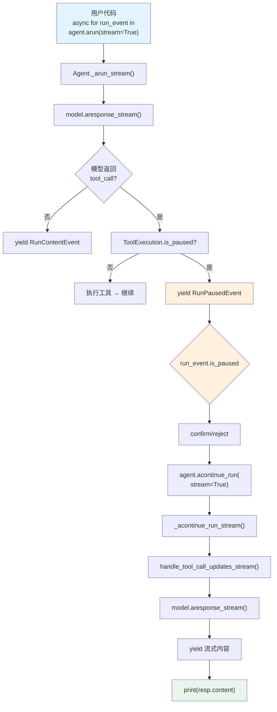

# confirmation_required_mcp_toolkit.py — 实现原理分析

> 源文件：`cookbook/02_agents/10_human_in_the_loop/confirmation_required_mcp_toolkit.py`

## 概述

本示例展示 Agno 的 **MCP 工具确认 + 异步流式 HITL** 机制：通过 `MCPTools(requires_confirmation_tools=["SearchAgno"])` 对 MCP Server 提供的工具启用确认，并使用 `async for run_event in agent.arun(stream=True)` 异步流式处理暂停事件，暂停后通过 `agent.acontinue_run(stream=True)` 异步恢复。

**核心配置一览：**

| 配置项 | 值 | 说明 |
|--------|------|------|
| `model` | `OpenAIResponses(id="gpt-5.2")` | Responses API |
| `tools` | `[MCPTools(transport="streamable-http", url="...", requires_confirmation_tools=["SearchAgno"])]` | MCP 工具 + 确认 |
| `markdown` | `True` | 启用 markdown 格式化 |
| `db` | `SqliteDb(db_file="tmp/confirmation_required_toolkit.db")` | SQLite 持久化 |
| `instructions` | `None` | 未设置 |

## 架构分层

```
用户代码层                      agno.agent 层
┌──────────────────────┐     ┌──────────────────────────────────────────┐
│ confirmation_         │     │ MCPTools(Toolkit)                        │
│  required_mcp_        │     │  ├ requires_confirmation_tools=          │
│  toolkit.py           │     │  │   ["SearchAgno"]                     │
│                       │     │  └ _register_tools() 传播标记           │
│ async for run_event   │     │                                         │
│   in agent.arun(      │     ├─────────────────────────────────────────┤
│     stream=True):     │     │ Agent._arun_stream()                    │
│                       │<────│  ├ model.aresponse_stream()             │
│ if run_event.is_paused│     │  ├ yield RunPausedEvent                 │
│   confirm/reject      │     │  └ 暂停                                │
│                       │     │                                         │
│ async for resp in     │     ├─────────────────────────────────────────┤
│   agent.acontinue_run │────>│ acontinue_run_dispatch()                │
│     (stream=True):    │     │  └ _acontinue_run_stream()              │
│   print(resp.content) │<────│     └ yield 流式内容                    │
└──────────────────────┘     └──────────────────────────────────────────┘
                                    │
                                    ▼
                        ┌───────────────────┐
                        │ OpenAI Responses   │
                        │ API (gpt-5.2)      │
                        └─────────┬─────────┘
                                  │
                        ┌─────────▼─────────┐
                        │ MCP Server         │
                        │ docs.agno.com/mcp  │
                        │ (streamable-http)  │
                        └───────────────────┘
```

## 核心组件解析

### MCPTools 确认配置

`MCPTools` 继承自 `Toolkit`，因此直接支持 `requires_confirmation_tools` 参数。工具名大小写敏感：

```python
mcp_tools = MCPTools(
    transport="streamable-http",
    url="https://docs.agno.com/mcp",
    requires_confirmation_tools=["SearchAgno"],  # 注意：大小写敏感
)
```

### 异步流式 HITL 处理

与同步模式不同，异步流式模式下暂停通过 `RunPausedEvent` 事件传递（`run/agent.py:282`）：

```python
# run/agent.py L282-295
@dataclass
class RunPausedEvent(BaseAgentRunEvent):
    event: str = RunEvent.run_paused.value
    tools: Optional[List[ToolExecution]] = None
    requirements: Optional[List[RunRequirement]] = None

    @property
    def is_paused(self):
        return True

    @property
    def active_requirements(self) -> List[RunRequirement]:
        return [req for req in self.requirements if not req.is_resolved()]
```

在流式模式下，`handle_agent_run_paused_stream()`（`_run.py:214`）yield `RunPausedEvent`，用户代码通过 `run_event.is_paused` 检测暂停。

### acontinue_run 异步恢复

```python
async for resp in agent.acontinue_run(
    run_id=run_event.run_id,
    requirements=run_event.requirements,
    stream=True,  # 恢复后也用流式
):
    if resp.content:
        print(resp.content, end="")
```

内部委派到 `_acontinue_run_stream()`（`_run.py:3829`），异步版的 `handle_tool_call_updates_stream()` 处理确认/拒绝。

### 流式 vs 非流式 HITL 对比

| 特性 | 非流式（`agent.run()`） | 流式（`agent.arun(stream=True)`） |
|------|------|------|
| 暂停返回类型 | `RunOutput(status=paused)` | `RunPausedEvent` |
| 暂停检测 | `run_response.is_paused` | `run_event.is_paused` |
| 恢复方法 | `agent.continue_run()` | `agent.acontinue_run(stream=True)` |
| 恢复返回 | `RunOutput` | `AsyncIterator[RunOutputEvent]` |
| 内容获取 | `run_response.content` | 逐 chunk `resp.content` |

## System Prompt 组装

| 序号 | 组成部分 | 本文件中的值/来源 | 是否生效 |
|------|---------|-----------------|---------|
| 3.2.1 | `markdown` | `True` | 是 |
| 3.3.4 | additional_information | markdown 指令 | 是 |
| 其余 | — | 均未启用 | 否 |

### 最终 System Prompt

```text
<additional_information>
- Use markdown to format your answers.
</additional_information>
```

## 完整 API 请求

### 第一轮：初始请求

```python
client.responses.create(
    model="gpt-5.2",
    input=[
        {"role": "developer", "content": "<additional_information>\n- Use markdown to format your answers.\n</additional_information>\n\n"},
        {"role": "user", "content": "What is Agno?"}
    ],
    tools=[{
        "type": "function",
        "function": {
            "name": "SearchAgno",
            "description": "Search the Agno documentation...",
            "parameters": {...}
        }
    }],
    stream=True,
    stream_options={"include_usage": True}
)
```

> 模型返回 `tool_call: SearchAgno(...)` → 暂停（yield RunPausedEvent）

### 第二轮：确认后流式恢复

```python
client.responses.create(
    model="gpt-5.2",
    input=[
        {"role": "developer", "content": "..."},
        {"role": "user", "content": "What is Agno?"},
        {"role": "assistant", "tool_calls": [{"id": "call_xxx", "function": {"name": "SearchAgno", ...}}]},
        {"role": "tool", "tool_call_id": "call_xxx", "content": "<MCP 工具执行结果>"}
    ],
    tools=[...],
    stream=True,
    stream_options={"include_usage": True}
)
```

## Mermaid 流程图



## 关键源码文件索引

| 文件 | 关键函数/类 | 作用 |
|------|------------|------|
| `agno/tools/toolkit.py` | `Toolkit.__init__()` L15 | `requires_confirmation_tools` 参数 |
| `agno/run/agent.py` | `RunPausedEvent` L282 | 流式暂停事件 |
| `agno/run/agent.py` | `RunPausedEvent.is_paused` L288 | 暂停检测属性 |
| `agno/run/agent.py` | `RunPausedEvent.active_requirements` L292 | 未解决需求 |
| `agno/agent/_run.py` | `handle_agent_run_paused_stream()` L214 | 流式暂停处理 |
| `agno/agent/_run.py` | `acontinue_run_dispatch()` L3326 | 异步恢复入口 |
| `agno/agent/_run.py` | `_acontinue_run_stream()` L3829 | 异步流式恢复 |
| `agno/agent/_tools.py` | `handle_tool_call_updates_stream()` L778 | 流式确认后执行 |
