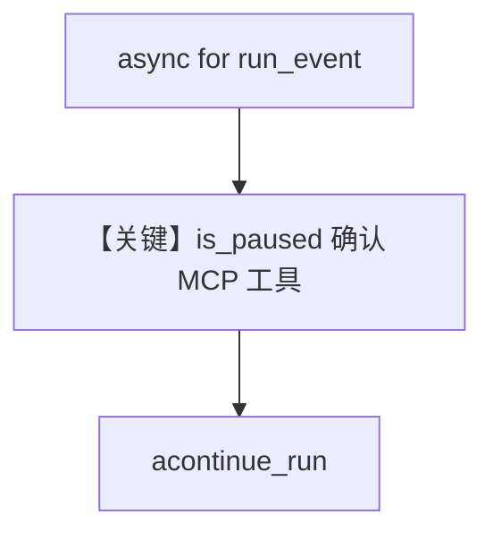

# confirmation_required_mcp_toolkit.py — 实现原理分析

> 源文件：`cookbook/02_agents/10_human_in_the_loop/confirmation_required_mcp_toolkit.py`

## 概述

本示例展示 **MCP 工具集的确认**：`MCPTools(transport="streamable-http", url=..., requires_confirmation_tools=["SearchAgno"])`；异步 **`async for run_event in agent.arun(..., stream=True)`**，在 `run_event.is_paused` 处分支，确认后 **`agent.acontinue_run`**。

**核心配置一览：**

| 配置项 | 值 |
|--------|-----|
| `model` | `OpenAIResponses(id="gpt-5.2")` |
| `tools` | `[mcp_tools]` |
| `markdown` | `True` |
| `db` | `SqliteDb(db_file="tmp/confirmation_required_toolkit.db")` |

## 核心组件解析

工具名 **大小写敏感**（注释强调 `SearchAgno`）。

### 运行机制与因果链

流式事件中处理暂停，与同步 `run` + `continue_run` 对照，适合 UI 长连接。

## System Prompt 组装

无显式业务 `instructions`。

## 完整 API 请求

流式 `arun`；MCP 通过 HTTP 连接 `docs.agno.com/mcp`。

## Mermaid 流程图

```mermaid
flowchart TD
    E["async for run_event"] --> P["【关键】is_paused 确认 MCP 工具"]
    P --> A["acontinue_run"]
```

## 关键源码文件索引

| 文件 | 作用 |
|------|------|
| `agno/tools/mcp` | `MCPTools` |
