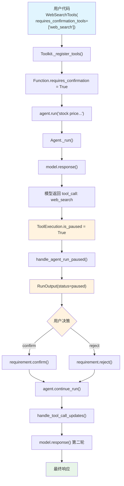

# confirmation_toolkit.py — 实现原理分析

> 源文件：`cookbook/02_agents/10_human_in_the_loop/confirmation_toolkit.py`

## 概述

本示例展示 Agno 的 **Toolkit 级确认机制**：通过 `Toolkit(requires_confirmation_tools=["tool_name"])` 在 Toolkit 层面指定哪些工具需要用户确认，而非在 `@tool` 装饰器上逐个标记。本例使用 `WebSearchTools(requires_confirmation_tools=["web_search"])` 对内置搜索工具启用确认。

**核心配置一览：**

| 配置项 | 值 | 说明 |
|--------|------|------|
| `model` | `OpenAIResponses(id="gpt-5-mini")` | Responses API |
| `tools` | `[WebSearchTools(requires_confirmation_tools=["web_search"])]` | Toolkit 级确认 |
| `markdown` | `True` | 启用 markdown 格式化 |
| `db` | `SqliteDb(db_file="tmp/confirmation_required_toolkit.db")` | SQLite 持久化 |
| `instructions` | `None` | 未设置 |
| `session_state` | `None` | 未设置 |

## 架构分层

```
用户代码层                     agno.agent 层
┌─────────────────────┐     ┌──────────────────────────────────────────┐
│ confirmation_        │     │ Toolkit.__init__()                       │
│   toolkit.py         │     │  ├ requires_confirmation_tools=          │
│                      │     │  │   ["web_search"]                     │
│ WebSearchTools(      │     │  └ _register_tools() 时将               │
│  requires_           │────>│    Function.requires_confirmation       │
│  confirmation_tools  │     │    = True                               │
│  =["web_search"])    │     │                                         │
│                      │     ├─────────────────────────────────────────┤
│ agent.run(...)       │     │ Agent._run()                            │
│  ↓                   │     │  ├ model.response() → tool_call         │
│ is_paused → True     │     │  ├ ToolExecution.is_paused → True       │
│ confirm/reject       │     │  └ handle_agent_run_paused()            │
│  ↓                   │     │                                         │
│ agent.continue_run() │────>│ continue_run_dispatch()                 │
│                      │     │  └ handle_tool_call_updates()           │
└─────────────────────┘     └──────────────────────────────────────────┘
                                    │
                                    ▼
                            ┌──────────────┐
                            │ OpenAI       │
                            │ Responses API│
                            │ gpt-5-mini   │
                            └──────────────┘
```

## 核心组件解析

### Toolkit.requires_confirmation_tools

`Toolkit.__init__()`（`tools/toolkit.py:15`）接受 `requires_confirmation_tools` 参数：

```python
# tools/toolkit.py L24, L64
requires_confirmation_tools: Optional[list[str]] = None,
...
self.requires_confirmation_tools: list[str] = requires_confirmation_tools or []
```

### 工具注册时传播确认标记

在 `Toolkit._register_tools()` 中（`toolkit.py:191`），注册每个工具时检查是否在确认列表中：

```python
# tools/toolkit.py L191-192
requires_confirmation=tool_name in self.requires_confirmation_tools,
external_execution=tool_name in self.external_execution_required_tools,
```

对于已有 `@tool` 装饰器标记的 `Function` 对象，在 `toolkit.py:268` 合并两种来源：

```python
# tools/toolkit.py L268-286
requires_confirmation = function.requires_confirmation or tool_name in self.requires_confirmation_tools
```

这意味着 `@tool(requires_confirmation=True)` 和 `Toolkit(requires_confirmation_tools=["name"])` 两种方式可以叠加使用。

### 与 @tool 装饰器方式的对比

| 特性 | `@tool(requires_confirmation=True)` | `Toolkit(requires_confirmation_tools=[...])` |
|------|------|------|
| 标记位置 | 函数定义处 | Toolkit 实例化时 |
| 适用场景 | 自定义工具 | 内置 Toolkit（如 WebSearchTools） |
| 灵活性 | 固定在代码中 | 可按需在不同实例中选择不同工具 |
| 合并行为 | — | 与装饰器标记取 OR |

### 后续 HITL 流程

暂停、确认、恢复的流程与 `confirmation_required.py` 完全相同，参见该文件的分析。

## System Prompt 组装

| 序号 | 组成部分 | 本文件中的值/来源 | 是否生效 |
|------|---------|-----------------|---------|
| 1 | `system_message`（自定义） | `None` | 否 |
| 3.1 | `instructions` | `None` | 否 |
| 3.1.1 | 模型指令 | Responses API 默认 | 可能 |
| 3.2.1 | `markdown` | `True` | 是 |
| 3.2.2 | `add_datetime_to_context` | `False` | 否 |
| 3.2.3 | `add_location_to_context` | `False` | 否 |
| 3.2.4 | `add_name_to_context` | `False` | 否 |
| 3.3.1 | `description` | `None` | 否 |
| 3.3.2 | `role` | `None` | 否 |
| 3.3.3 | instructions 拼接 | 无 | 否 |
| 3.3.4 | additional_information | markdown 指令 | 是 |
| 3.3.5 | `_tool_instructions` | WebSearchTools 无指令 | 否 |
| fmt | `resolve_in_context` | 默认 `True`，无模板变量 | 否 |
| 3.3.7~3.3.17 | 其余步骤 | 均未启用 | 否 |

### 最终 System Prompt

```text
<additional_information>
- Use markdown to format your answers.
</additional_information>
```

## 完整 API 请求

### 第一轮：初始请求

```python
client.responses.create(
    model="gpt-5-mini",
    input=[
        {"role": "developer", "content": "<additional_information>\n- Use markdown to format your answers.\n</additional_information>\n\n"},
        {"role": "user", "content": "What is the current stock price of Apple?"}
    ],
    tools=[{
        "type": "function",
        "function": {
            "name": "web_search",
            "description": "Search the web for information...",
            "parameters": {
                "type": "object",
                "properties": {
                    "query": {"type": "string", "description": "..."}
                },
                "required": ["query"]
            }
        }
    }],
    stream=True,
    stream_options={"include_usage": True}
)
```

> 模型返回 `tool_call: web_search(query="Apple stock price")`
> `Function.requires_confirmation=True`（Toolkit 传播） → `ToolExecution.is_paused=True` → **暂停**

### 第二轮：确认后继续

```python
client.responses.create(
    model="gpt-5-mini",
    input=[
        {"role": "developer", "content": "..."},
        {"role": "user", "content": "What is the current stock price of Apple?"},
        {"role": "assistant", "tool_calls": [{"id": "call_xxx", "function": {"name": "web_search", "arguments": "{\"query\": \"Apple stock price\"}"}}]},
        {"role": "tool", "tool_call_id": "call_xxx", "content": "<搜索结果>"}
    ],
    tools=[...],
    stream=True,
    stream_options={"include_usage": True}
)
```

## Mermaid 流程图



## 关键源码文件索引

| 文件 | 关键函数/类 | 作用 |
|------|------------|------|
| `agno/tools/toolkit.py` | `Toolkit.__init__()` L15 | 接受 `requires_confirmation_tools` 参数 |
| `agno/tools/toolkit.py` | `_register_tools()` L191 | 注册时将确认标记传播到 Function |
| `agno/tools/toolkit.py` | 合并逻辑 L268 | `@tool` 装饰器标记与 Toolkit 级标记取 OR |
| `agno/tools/function.py` | `Function.requires_confirmation` L171 | 工具确认标记属性 |
| `agno/models/response.py` | `ToolExecution.is_paused` L64 | 检测是否需要暂停 |
| `agno/run/requirement.py` | `RunRequirement.confirm()` L98 | 确认操作 |
| `agno/run/requirement.py` | `RunRequirement.reject()` L105 | 拒绝操作 |
| `agno/agent/_run.py` | `handle_agent_run_paused()` L192 | 暂停处理 |
| `agno/agent/_run.py` | `continue_run_dispatch()` L2630 | 恢复运行 |
| `agno/agent/_tools.py` | `handle_tool_call_updates()` L730 | 确认后执行/拒绝工具 |
