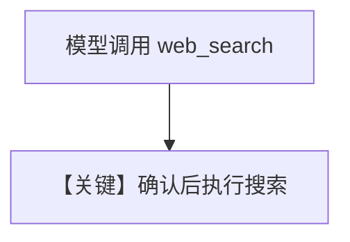

# confirmation_toolkit.py — 实现原理分析

<!-- cookbook-py-source:start -->
## 完整源码

```python
"""
Confirmation Toolkit
=============================

Human-in-the-Loop: Adding User Confirmation to Tool Calls.
"""

from agno.agent import Agent
from agno.db.sqlite import SqliteDb
from agno.models.openai import OpenAIResponses
from agno.tools.websearch import WebSearchTools
from agno.utils import pprint
from rich.console import Console
from rich.prompt import Prompt

console = Console()

# ---------------------------------------------------------------------------
# Create Agent
# ---------------------------------------------------------------------------
agent = Agent(
    model=OpenAIResponses(id="gpt-5-mini"),
    tools=[WebSearchTools(requires_confirmation_tools=["web_search"])],
    markdown=True,
    db=SqliteDb(db_file="tmp/confirmation_required_toolkit.db"),
)

# ---------------------------------------------------------------------------
# Run Agent
# ---------------------------------------------------------------------------
if __name__ == "__main__":
    run_response = agent.run("What is the current stock price of Apple?")
    if run_response.is_paused:  # Or agent.run_response.is_paused
        for requirement in run_response.active_requirements:
            if requirement.needs_confirmation:
                # Ask for confirmation
                console.print(
                    f"Tool name [bold blue]{requirement.tool_execution.tool_name}({requirement.tool_execution.tool_args})[/] requires confirmation."
                )
                message = (
                    Prompt.ask(
                        "Do you want to continue?", choices=["y", "n"], default="y"
                    )
                    .strip()
                    .lower()
                )

                if message == "n":
                    requirement.reject()
                else:
                    requirement.confirm()

        run_response = agent.continue_run(
            run_id=run_response.run_id,
            requirements=run_response.requirements,
        )
        pprint.pprint_run_response(run_response)
```

<!-- cookbook-py-source:end -->

> 源文件：`cookbook/02_agents/10_human_in_the_loop/confirmation_toolkit.py`

## 概述

本示例展示 **Toolkit 级按名要求确认**：`WebSearchTools(requires_confirmation_tools=["web_search"])`，股价查询触发搜索前暂停，用户确认后 `continue_run`。

**核心配置一览：**

| 配置项 | 值 |
|--------|-----|
| `model` | `OpenAIResponses(id="gpt-5-mini")` |
| `tools` | `[WebSearchTools(requires_confirmation_tools=["web_search"])]` |
| `markdown` | `True` |
| `db` | `SqliteDb(db_file="tmp/confirmation_required_toolkit.db")` |

## 运行机制与因果链

与单函数 `requires_confirmation` 等价，但粒度为 **内置工具名**。

参照用户句：`What is the current stock price of Apple?`

## System Prompt 组装

无额外 `instructions`。

## 完整 API 请求

搜索工具可能调用外部搜索 API；主模型 `responses.create`。

## Mermaid 流程图


```mermaid
flowchart TD
    M["模型调用 web_search"] --> H["【关键】确认后执行搜索"]
```

## 关键源码文件索引

| 文件 | 作用 |
|------|------|
| `agno/tools/websearch` | `requires_confirmation_tools` |
