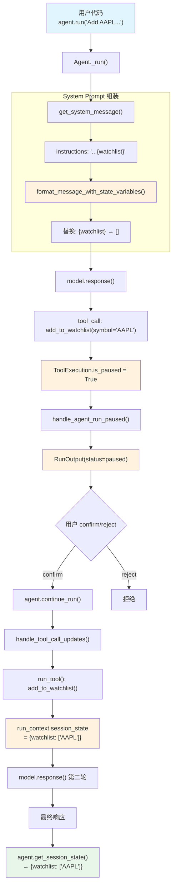

# confirmation_with_session_state.py — 实现原理分析

> 源文件：`cookbook/02_agents/10_human_in_the_loop/confirmation_with_session_state.py`

## 概述

本示例展示 Agno 的 **HITL 确认 + session_state 状态保持**机制：工具函数通过 `RunContext.session_state` 修改会话状态，即使 Agent 因确认需求暂停，状态变更也能跨 pause/continue 轮次保持。同时使用 `{watchlist}` 模板变量在 instructions 中动态注入状态。

**核心配置一览：**

| 配置项 | 值 | 说明 |
|--------|------|------|
| `model` | `OpenAIChat(id="gpt-4o-mini")` | Chat Completions API |
| `tools` | `[add_to_watchlist]` | `@tool(requires_confirmation=True)` + RunContext |
| `session_state` | `{"watchlist": []}` | 初始空 watchlist |
| `instructions` | `"...{watchlist}"` | 模板变量引用 session_state |
| `db` | `SqliteDb(db_file="tmp/hitl_state.db")` | SQLite 持久化 |
| `markdown` | `True` | 启用 markdown 格式化 |
| `add_session_state_to_context` | `False` | 未启用 XML 注入 |
| `enable_agentic_state` | `False` | 未启用内置状态工具 |

## 架构分层

```
用户代码层                      agno.agent 层
┌──────────────────────┐     ┌──────────────────────────────────────────┐
│ confirmation_with_    │     │ Agent._run()                             │
│   session_state.py    │     │  ├ get_system_message()                  │
│                       │     │  │  ├ instructions: "...{watchlist}"     │
│ session_state=        │     │  │  └ format_message_with_state_variables│
│  {"watchlist": []}    │────>│  │    → "{watchlist}" 替换为 "[]"        │
│                       │     │  │                                       │
│ instructions=         │     │  ├ model.response() → tool_call          │
│  "...{watchlist}"     │     │  │  add_to_watchlist(symbol="AAPL")     │
│                       │     │  │                                       │
│ @tool(requires_       │     │  ├ ToolExecution:                        │
│  confirmation=True)   │     │  │  requires_confirmation=True           │
│ def add_to_watchlist  │     │  │  → is_paused → handle_run_paused     │
│   (run_context, ...)  │     │  │                                       │
│                       │     │  └ RunOutput(status=paused,              │
│ confirm() →           │     │     session_state={"watchlist":[]})      │
│ continue_run()        │────>│                                          │
│                       │     │ continue_run_dispatch()                  │
│ get_session_state()   │     │  ├ handle_tool_call_updates()            │
│ → {"watchlist":       │     │  │  confirmed → run_tool()               │
│     ["AAPL"]}         │<────│  │  → run_context.session_state 更新     │
│                       │     │  └ model.response() → 最终输出           │
└──────────────────────┘     └──────────────────────────────────────────┘
                                    │
                                    ▼
                            ┌──────────────┐
                            │ OpenAI       │
                            │ Chat API     │
                            │ gpt-4o-mini  │
                            └──────────────┘
```

## 核心组件解析

### RunContext 参数注入

工具函数的 `run_context: RunContext` 参数被 agno 自动注入（`function.py:429-430` 排除自动参数）：

```python
@tool(requires_confirmation=True)
def add_to_watchlist(run_context: RunContext, symbol: str) -> str:
    # run_context 由 agno 自动注入，不暴露给模型
    watchlist = run_context.session_state.get("watchlist", [])
    watchlist.append(symbol.upper())
    run_context.session_state["watchlist"] = watchlist  # 直接修改引用
    return f"Added {symbol} to watchlist. Current watchlist: {watchlist}"
```

`run_context` 参数从函数签名中被排除（`function.py:429`），不会出现在模型的工具 schema 中。`session_state` 是引用传递，工具函数直接修改即可。

### {watchlist} 模板变量替换

`instructions` 中的 `{watchlist}` 通过 `format_message_with_state_variables()`（`_messages.py:56`）替换：

```python
# _messages.py L56-98
def format_message_with_state_variables(agent, message, run_context=None):
    # 收集替换变量：session_state + dependencies + metadata + user_id
    substitution_values = {}
    if run_context and run_context.session_state:
        substitution_values.update(run_context.session_state)
    # 使用 string.Template.safe_substitute()，未匹配变量保持原样
    template = Template(message)
    return template.safe_substitute(substitution_values)
```

替换后 instructions 变为：`"You MUST use the add_to_watchlist tool... The user's watchlist is: []"`

### 状态跨 pause/continue 保持

状态保持的关键在于 `RunContext.session_state` 是引用传递：

1. `Agent._run()` 创建 `RunContext(session_state=session_state)`
2. 工具函数修改 `run_context.session_state`（但因 HITL 暂停，工具未执行）
3. 暂停时 `cleanup_and_store()` 将当前状态持久化到数据库
4. `continue_run_dispatch()` 从数据库加载状态（`_run.py:2702`）
5. 确认后 `run_tool()` 执行工具函数，修改 `session_state`
6. 最终 `cleanup_and_store()` 再次持久化更新后的状态

### RunStatus 检测

```python
if run_response.status != RunStatus.paused:
    # 模型可能没调用工具
    console.print("[yellow]Agent did not pause...[/]")
```

`RunStatus`（`run/base.py:278`）是枚举类：`pending → running → completed/paused/cancelled/error`

## System Prompt 组装

| 序号 | 组成部分 | 本文件中的值/来源 | 是否生效 |
|------|---------|-----------------|---------|
| 1 | `system_message`（自定义） | `None` | 否 |
| 3.1 | `instructions` | `"You MUST use...{watchlist}"` | 是 |
| 3.2.1 | `markdown` | `True` | 是 |
| 3.2.2 | `add_datetime_to_context` | `False` | 否 |
| 3.3.3 | instructions 拼接 | 替换后写入 system message | 是 |
| 3.3.4 | additional_information | markdown 指令 | 是 |
| fmt | `resolve_in_context` | `True` → `{watchlist}` 替换为 `[]` | 是 |
| 3.3.5~3.3.17 | 其余步骤 | 均未启用 | 否 |

### 最终 System Prompt

```text
You MUST use the add_to_watchlist tool when the user asks to add a stock. The user's watchlist is: []

<additional_information>
- Use markdown to format your answers.
</additional_information>
```

## 完整 API 请求

### 第一轮：初始请求

```python
client.chat.completions.create(
    model="gpt-4o-mini",
    messages=[
        # 1. System Message（Chat Completions API 保持 system 角色）
        {"role": "system", "content": "You MUST use the add_to_watchlist tool when the user asks to add a stock. The user's watchlist is: []\n\n<additional_information>\n- Use markdown to format your answers.\n</additional_information>\n\n"},
        # 2. 用户消息
        {"role": "user", "content": "Add AAPL to my watchlist using the add_to_watchlist tool"}
    ],
    tools=[{
        "type": "function",
        "function": {
            "name": "add_to_watchlist",
            "description": "Add a stock symbol to the user's watchlist. Requires confirmation.",
            "parameters": {
                "type": "object",
                "properties": {
                    "symbol": {"type": "string", "description": "Stock ticker symbol (e.g. AAPL, TSLA)"}
                },
                "required": ["symbol"]
            }
        }
    }],
    stream=True,
    stream_options={"include_usage": True}
)
```

> 注意：`run_context` 参数不出现在 tool schema 中（被排除）
> 模型返回 `tool_call: add_to_watchlist(symbol="AAPL")` → **暂停**

### 第二轮：确认后执行

```python
client.chat.completions.create(
    model="gpt-4o-mini",
    messages=[
        {"role": "system", "content": "...The user's watchlist is: []\n\n..."},
        {"role": "user", "content": "Add AAPL to my watchlist..."},
        {"role": "assistant", "tool_calls": [{"id": "call_xxx", "function": {"name": "add_to_watchlist", "arguments": "{\"symbol\": \"AAPL\"}"}}]},
        # 确认后工具执行，run_context.session_state 更新为 {"watchlist": ["AAPL"]}
        {"role": "tool", "tool_call_id": "call_xxx", "content": "Added AAPL to watchlist. Current watchlist: ['AAPL']"}
    ],
    tools=[...],
    stream=True,
    stream_options={"include_usage": True}
)
```

> 执行后 `agent.get_session_state()` 返回 `{"watchlist": ["AAPL"]}`

## Mermaid 流程图



## 关键源码文件索引

| 文件 | 关键函数/类 | 作用 |
|------|------------|------|
| `agno/tools/decorator.py` | `tool()` L60 | `@tool(requires_confirmation=True)` |
| `agno/tools/function.py` | 参数排除 L429-430 | `run_context` 不暴露给模型 |
| `agno/run/base.py` | `RunContext.session_state` L27 | 会话状态（引用传递） |
| `agno/run/base.py` | `RunStatus` L278 | 运行状态枚举 |
| `agno/agent/_messages.py` | `format_message_with_state_variables()` L56 | 模板变量替换 |
| `agno/agent/_run.py` | `handle_agent_run_paused()` L192 | 暂停 + 持久化 |
| `agno/agent/_run.py` | `continue_run_dispatch()` L2630 | 恢复 + 加载状态 |
| `agno/agent/_run.py` | `continue_run_dispatch()` L2702 | 从 DB 加载 session_state |
| `agno/agent/_tools.py` | `handle_tool_call_updates()` L730 | 确认后执行工具 |
| `agno/agent/agent.py` | `get_session_state()` L939 | 获取当前状态 |
