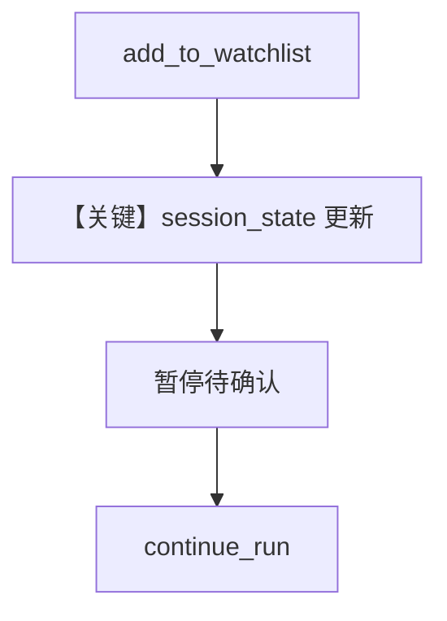

# confirmation_with_session_state.py — 实现原理分析

<!-- cookbook-py-source:start -->
## 完整源码

```python
"""
Confirmation with Session State
=============================

HITL confirmation where the tool modifies session_state before pausing.
Verifies that state changes survive the pause/continue round-trip.
"""

from agno.agent import Agent
from agno.db.sqlite import SqliteDb
from agno.models.openai import OpenAIChat
from agno.run import RunContext, RunStatus
from agno.tools import tool
from agno.utils import pprint
from rich.console import Console
from rich.prompt import Prompt

console = Console()


@tool(requires_confirmation=True)
def add_to_watchlist(run_context: RunContext, symbol: str) -> str:
    """Add a stock symbol to the user's watchlist. Requires confirmation.

    Args:
        symbol: Stock ticker symbol (e.g. AAPL, TSLA)

    Returns:
        Confirmation message with updated watchlist
    """
    if run_context.session_state is None:
        run_context.session_state = {}

    watchlist = run_context.session_state.get("watchlist", [])
    symbol = symbol.upper()
    if symbol not in watchlist:
        watchlist.append(symbol)
    run_context.session_state["watchlist"] = watchlist
    return f"Added {symbol} to watchlist. Current watchlist: {watchlist}"


# ---------------------------------------------------------------------------
# Create Agent
# ---------------------------------------------------------------------------
agent = Agent(
    model=OpenAIChat(id="gpt-4o-mini"),
    tools=[add_to_watchlist],
    session_state={"watchlist": []},
    instructions="You MUST use the add_to_watchlist tool when the user asks to add a stock. The user's watchlist is: {watchlist}",
    db=SqliteDb(db_file="tmp/hitl_state.db"),
    markdown=True,
)

# ---------------------------------------------------------------------------
# Run Agent
# ---------------------------------------------------------------------------
if __name__ == "__main__":
    console.print(
        "[bold]Step 1:[/] Asking agent to add AAPL to watchlist (will pause for confirmation)"
    )
    run_response = agent.run("Add AAPL to my watchlist using the add_to_watchlist tool")

    console.print(f"[dim]Status: {run_response.status}[/]")
    console.print(f"[dim]Session state after pause: {agent.get_session_state()}[/]")

    if run_response.status != RunStatus.paused:
        console.print(
            "[yellow]Agent did not pause (model may not have called the tool). Try re-running.[/]"
        )
    else:
        for requirement in run_response.active_requirements:
            if requirement.needs_confirmation:
                console.print(
                    f"Tool [bold blue]{requirement.tool_execution.tool_name}({requirement.tool_execution.tool_args})[/] requires confirmation."
                )
                message = (
                    Prompt.ask(
                        "Do you want to continue?", choices=["y", "n"], default="y"
                    )
                    .strip()
                    .lower()
                )
                if message == "n":
                    requirement.reject()
                else:
                    requirement.confirm()

        console.print("\n[bold]Step 2:[/] Continuing run after confirmation")
        run_response = agent.continue_run(
            run_id=run_response.run_id,
            requirements=run_response.requirements,
        )

        pprint.pprint_run_response(run_response)

        final_state = agent.get_session_state()
        console.print(f"\n[bold green]Final session state:[/] {final_state}")
```

<!-- cookbook-py-source:end -->

> 源文件：`cookbook/02_agents/10_human_in_the_loop/confirmation_with_session_state.py`

## 概述

本示例展示 **确认暂停前后 session_state 一致性**：`add_to_watchlist` 在确认前即修改 `run_context.session_state`（watchlist），验证 **`RunStatus.paused`** 后 state 仍保留，确认后 `continue_run` 完成回合。

**核心配置一览：**

| 配置项 | 值 |
|--------|-----|
| `model` | `OpenAIChat(id="gpt-4o-mini")` | Chat Completions |
| `tools` | `[add_to_watchlist]`，`requires_confirmation=True` |
| `session_state` | `{"watchlist": []}` |
| `instructions` | 含 `{watchlist}` 占位 |
| `markdown` | `True` |
| `db` | `SqliteDb(db_file="tmp/hitl_state.db")` |

## 核心组件解析

`instructions` 字面量：

```text
You MUST use the add_to_watchlist tool when the user asks to add a stock. The user's watchlist is: {watchlist}
```

（`resolve_in_context` / 模板解析依 Agent 默认。）

## 运行机制与因果链

打印 `get_session_state()` 观察暂停点状态；**关键验证点**为 state 与 HITL 暂停的交互。

## 完整 API 请求

`OpenAIChat` → `chat.completions.create`。

## Mermaid 流程图


```mermaid
flowchart TD
    T["add_to_watchlist"] --> S["【关键】session_state 更新"]
    S --> P["暂停待确认"]
    P --> C["continue_run"]
```

## 关键源码文件索引

| 文件 | 作用 |
|------|------|
| `agno/run` | `RunStatus.paused` |
