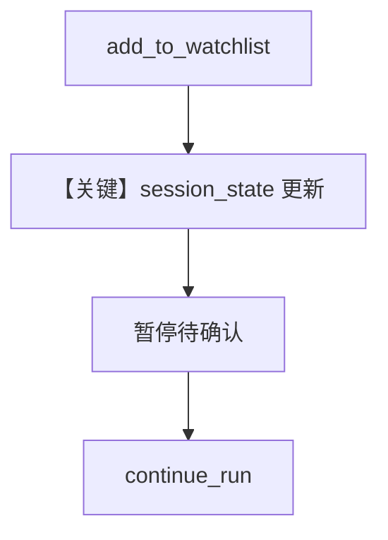

# confirmation_with_session_state.py — 实现原理分析

> 源文件：`cookbook/02_agents/10_human_in_the_loop/confirmation_with_session_state.py`

## 概述

本示例展示 **确认暂停前后 session_state 一致性**：`add_to_watchlist` 在确认前即修改 `run_context.session_state`（watchlist），验证 **`RunStatus.paused`** 后 state 仍保留，确认后 `continue_run` 完成回合。

**核心配置一览：**

| 配置项 | 值 |
|--------|-----|
| `model` | `OpenAIChat(id="gpt-4o-mini")` | Chat Completions |
| `tools` | `[add_to_watchlist]`，`requires_confirmation=True` |
| `session_state` | `{"watchlist": []}` |
| `instructions` | 含 `{watchlist}` 占位 |
| `markdown` | `True` |
| `db` | `SqliteDb(db_file="tmp/hitl_state.db")` |

## 核心组件解析

`instructions` 字面量：

```text
You MUST use the add_to_watchlist tool when the user asks to add a stock. The user's watchlist is: {watchlist}
```

（`resolve_in_context` / 模板解析依 Agent 默认。）

## 运行机制与因果链

打印 `get_session_state()` 观察暂停点状态；**关键验证点**为 state 与 HITL 暂停的交互。

## 完整 API 请求

`OpenAIChat` → `chat.completions.create`。

## Mermaid 流程图


```mermaid
flowchart TD
    T["add_to_watchlist"] --> S["【关键】session_state 更新"]
    S --> P["暂停待确认"]
    P --> C["continue_run"]
```

## 关键源码文件索引

| 文件 | 作用 |
|------|------|
| `agno/run` | `RunStatus.paused` |
