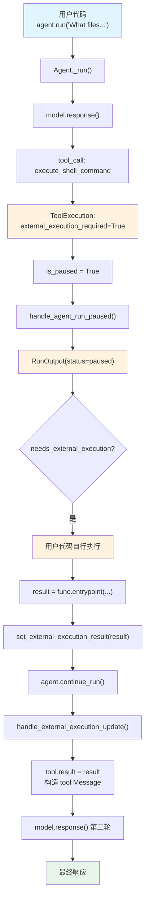

# external_tool_execution.py — 实现原理分析

> 源文件：`cookbook/02_agents/10_human_in_the_loop/external_tool_execution.py`

## 概述

本示例展示 Agno 的 **外部工具执行 (External Tool Execution)** 机制：通过 `@tool(external_execution=True)` 标记工具在 Agent 控制流之外执行。Agent 暂停后，用户代码获取工具参数、自行执行工具逻辑、将结果通过 `requirement.set_external_execution_result()` 传回，再调用 `continue_run()` 恢复。

**核心配置一览：**

| 配置项 | 值 | 说明 |
|--------|------|------|
| `model` | `OpenAIResponses(id="gpt-5-mini")` | Responses API |
| `tools` | `[execute_shell_command]` | `@tool(external_execution=True)` |
| `markdown` | `True` | 启用 markdown 格式化 |
| `db` | `SqliteDb(session_table="test_session", db_file="tmp/example.db")` | SQLite 持久化 |
| `instructions` | `None` | 未设置 |

## 架构分层

```
用户代码层                      agno.agent 层
┌──────────────────────┐     ┌──────────────────────────────────────────┐
│ external_tool_        │     │ Agent._run()                             │
│   execution.py        │     │  ├ model.response() → tool_call          │
│                       │     │  │  execute_shell_command(command="ls")  │
│ @tool(external_       │     │  │                                       │
│   execution=True)     │────>│  ├ ToolExecution:                        │
│                       │     │  │  external_execution_required=True     │
│ agent.run(...)        │     │  │  → is_paused → handle_run_paused     │
│  ↓                    │     │  │  → Agent 不执行工具函数              │
│ is_paused → True      │     │  └ RunOutput(status=paused)              │
│                       │<────│                                          │
│ 用户代码自行执行：    │     ├─────────────────────────────────────────┤
│ result = func(...)    │     │ continue_run_dispatch()                  │
│ set_external_         │     │  ├ handle_external_execution_update()    │
│  execution_result()   │     │  │  → tool.result 设置结果              │
│  ↓                    │     │  │  → 构造 tool 消息加入 messages       │
│ agent.continue_run()  │────>│  └ model.response() → 最终输出          │
└──────────────────────┘     └──────────────────────────────────────────┘
                                    │
                                    ▼
                            ┌──────────────┐
                            │ OpenAI       │
                            │ Responses API│
                            │ gpt-5-mini   │
                            └──────────────┘
```

## 核心组件解析

### @tool(external_execution=True)

`external_execution` 标记在 `Function`（`function.py:181`）中：

```python
# function.py L180-184
# 如果 True，函数将在 Agent 控制流之外执行
external_execution: Optional[bool] = None
# 如果 True 且 external_execution=True，抑制冗长的暂停消息
external_execution_silent: Optional[bool] = None
```

### ToolExecution.is_paused 检测

`external_execution_required` 是 `is_paused` 的三个触发条件之一（`models/response.py:64`）：

```python
@property
def is_paused(self) -> bool:
    return bool(self.requires_confirmation or self.requires_user_input or self.external_execution_required)
```

### RunRequirement.needs_external_execution

```python
# run/requirement.py L89-96
@property
def needs_external_execution(self) -> bool:
    if self.external_execution_result is not None:  # 已设置结果则不需要
        return False
    return self.tool_execution.external_execution_required or False
```

### set_external_execution_result()

```python
# run/requirement.py L162-167
def set_external_execution_result(self, result: str):
    self.external_execution_result = result
    if self.tool_execution:
        self.tool_execution.result = result  # 同步到 ToolExecution
```

### handle_external_execution_update()

`continue_run` 恢复后，`_tools.py:485` 处理外部执行结果：

```python
# _tools.py L485-507
def handle_external_execution_update(agent, run_messages, tool):
    if tool.result is not None:
        # 将外部执行结果作为 tool 消息加入 messages
        run_messages.messages.append(
            Message(
                role=agent.model.tool_message_role,
                content=tool.result,
                tool_call_id=tool.tool_call_id,
                tool_name=tool.tool_name,
                tool_args=tool.tool_args,
            )
        )
        tool.external_execution_required = False  # 清除标记
    else:
        raise ValueError(f"Tool {tool.tool_name} requires external execution, cannot continue run")
```

### 用户代码执行工具

```python
# 用户代码直接调用工具的 entrypoint
result = execute_shell_command.entrypoint(**requirement.tool_execution.tool_args)
requirement.set_external_execution_result(result)
```

`Function.entrypoint` 是原始 Python 函数，直接调用即可。这种方式让用户完全控制工具执行环境（如安全检查、sandbox 等）。

### 与 requires_confirmation 的区别

| 特性 | `requires_confirmation` | `external_execution` |
|------|------|------|
| Agent 是否执行工具 | 确认后由 Agent 执行 | Agent 从不执行 |
| 用户角色 | 仅审批 | 自行执行并返回结果 |
| 结果来源 | `run_tool()` 自动执行 | `set_external_execution_result()` 手动设置 |
| 适用场景 | 需要人工审批的操作 | 需要特殊环境/权限的操作 |

## System Prompt 组装

| 序号 | 组成部分 | 本文件中的值/来源 | 是否生效 |
|------|---------|-----------------|---------|
| 3.2.1 | `markdown` | `True` | 是 |
| 3.3.4 | additional_information | markdown 指令 | 是 |
| 其余 | — | 均未启用 | 否 |

### 最终 System Prompt

```text
<additional_information>
- Use markdown to format your answers.
</additional_information>
```

## 完整 API 请求

### 第一轮：初始请求

```python
client.responses.create(
    model="gpt-5-mini",
    input=[
        {"role": "developer", "content": "<additional_information>\n- Use markdown to format your answers.\n</additional_information>\n\n"},
        {"role": "user", "content": "What files do I have in my current directory?"}
    ],
    tools=[{
        "type": "function",
        "function": {
            "name": "execute_shell_command",
            "description": "Execute a shell command.",
            "parameters": {
                "type": "object",
                "properties": {
                    "command": {"type": "string", "description": "(str) The shell command to execute"}
                },
                "required": ["command"]
            }
        }
    }],
    stream=True,
    stream_options={"include_usage": True}
)
```

> 模型返回 `tool_call: execute_shell_command(command="ls")`
> `ToolExecution.external_execution_required=True` → **暂停，Agent 不执行工具**

### 第二轮：用户执行后继续

用户代码执行 `subprocess.check_output("ls")` 并设置结果后：

```python
client.responses.create(
    model="gpt-5-mini",
    input=[
        {"role": "developer", "content": "..."},
        {"role": "user", "content": "What files do I have in my current directory?"},
        {"role": "assistant", "tool_calls": [{"id": "call_xxx", "function": {"name": "execute_shell_command", "arguments": "{\"command\": \"ls\"}"}}]},
        # 由用户代码执行并手动设置的结果
        {"role": "tool", "tool_call_id": "call_xxx", "content": "file1.py\nfile2.txt\nREADME.md"}
    ],
    tools=[...],
    stream=True,
    stream_options={"include_usage": True}
)
```

## Mermaid 流程图



## 关键源码文件索引

| 文件 | 关键函数/类 | 作用 |
|------|------------|------|
| `agno/tools/decorator.py` | `tool()` L60 | `@tool(external_execution=True)` |
| `agno/tools/function.py` | `Function.external_execution` L181 | 外部执行标记 |
| `agno/tools/function.py` | `Function.external_execution_silent` L184 | 静默模式（抑制暂停消息） |
| `agno/models/response.py` | `ToolExecution.external_execution_required` L55 | 运行时标记 |
| `agno/models/response.py` | `ToolExecution.is_paused` L64 | 暂停检测（三条件之一） |
| `agno/run/requirement.py` | `RunRequirement.needs_external_execution` L89 | 检测是否需要外部执行 |
| `agno/run/requirement.py` | `set_external_execution_result()` L162 | 设置外部执行结果 |
| `agno/agent/_tools.py` | `handle_external_execution_update()` L485 | 处理结果 + 构造消息 |
| `agno/agent/_tools.py` | `handle_tool_call_updates()` L730 | Case 2: 外部执行处理 |
| `agno/utils/response.py` | `get_paused_content()` L128 | 生成暂停提示 |
