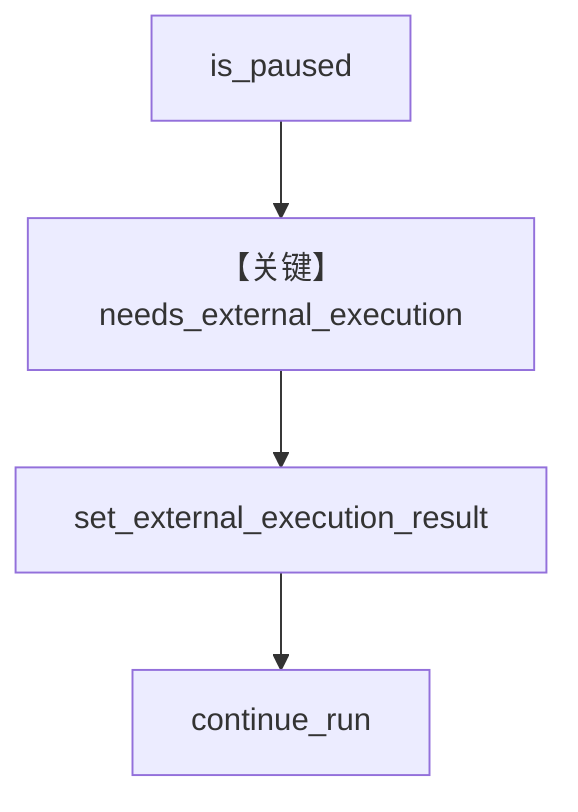

# external_tool_execution.py — 实现原理分析

> 源文件：`cookbook/02_agents/10_human_in_the_loop/external_tool_execution.py`

## 概述

本示例展示 **`external_execution=True`**：工具不在沙箱内自动执行，run **暂停**后由宿主调用 `requirement.set_external_execution_result(result)` 注入结果，再 `continue_run`。

**核心配置一览：**

| 配置项 | 值 |
|--------|-----|
| `model` | `OpenAIResponses(id="gpt-5-mini")` |
| `tools` | `[execute_shell_command]`，`@tool(external_execution=True)` |
| `markdown` | `True` |
| `db` | `SqliteDb(session_table="test_session", db_file="tmp/example.db")` |

## 核心组件解析

示例仅允许 `command.startswith("ls")`；外部执行通过 `execute_shell_command.entrypoint(**tool_args)`。

### 运行机制与因果链

`needs_external_execution` 与确认/用户输入不同分支；适合 **不可信命令必须由人执行** 的场景。

## System Prompt 组装

无显式 `instructions`。

## 完整 API 请求

外部 `subprocess` 在 Python 侧执行，结果作为 tool message 回到模型。

## Mermaid 流程图

```mermaid
flowchart TD
    P["is_paused"] --> E["【关键】needs_external_execution"]
    E --> S["set_external_execution_result"]
    S --> C["continue_run"]
```

## 关键源码文件索引

| 文件 | 作用 |
|------|------|
| `agno/tools` | `external_execution` |
