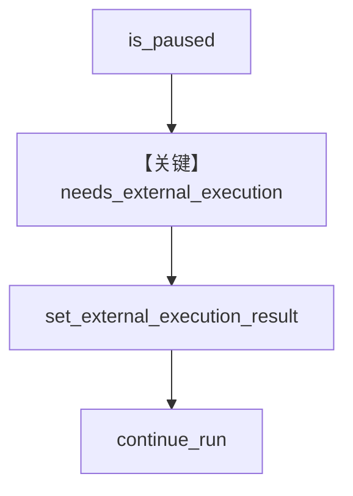

# external_tool_execution.py — 实现原理分析

<!-- cookbook-py-source:start -->
## 完整源码

```python
"""
External Tool Execution
=============================

Human-in-the-Loop: Execute a tool call outside of the agent.
"""

import subprocess

from agno.agent import Agent
from agno.db.sqlite import SqliteDb
from agno.models.openai import OpenAIResponses
from agno.tools import tool
from agno.utils import pprint


# We have to create a tool with the correct name, arguments and docstring for the agent to know what to call.
@tool(external_execution=True)
def execute_shell_command(command: str) -> str:
    """Execute a shell command.

    Args:
        command (str): The shell command to execute

    Returns:
        str: The output of the shell command
    """
    if command.startswith("ls"):
        return subprocess.check_output(command, shell=True).decode("utf-8")
    else:
        raise Exception(f"Unsupported command: {command}")


# ---------------------------------------------------------------------------
# Create Agent
# ---------------------------------------------------------------------------
agent = Agent(
    model=OpenAIResponses(id="gpt-5-mini"),
    tools=[execute_shell_command],
    markdown=True,
    db=SqliteDb(session_table="test_session", db_file="tmp/example.db"),
)

# ---------------------------------------------------------------------------
# Run Agent
# ---------------------------------------------------------------------------
if __name__ == "__main__":
    run_response = agent.run("What files do I have in my current directory?")

    if run_response.is_paused:
        for requirement in run_response.active_requirements:
            if requirement.needs_external_execution:
                if requirement.tool_execution.tool_name == execute_shell_command.name:
                    print(
                        f"Executing {requirement.tool_execution.tool_name} with args {requirement.tool_execution.tool_args} externally"
                    )
                    # We execute the tool ourselves. You can also execute something completely external here.
                    result = execute_shell_command.entrypoint(
                        **requirement.tool_execution.tool_args
                    )  # type: ignore
                    # We have to set the result on the tool execution object so that the agent can continue
                    requirement.set_external_execution_result(result)

    run_response = agent.continue_run(
        run_id=run_response.run_id,
        requirements=run_response.requirements,
    )
    pprint.pprint_run_response(run_response)

    # Or for simple debug flow
    # agent.print_response("What files do I have in my current directory?")
```

<!-- cookbook-py-source:end -->

> 源文件：`cookbook/02_agents/10_human_in_the_loop/external_tool_execution.py`

## 概述

本示例展示 **`external_execution=True`**：工具不在沙箱内自动执行，run **暂停**后由宿主调用 `requirement.set_external_execution_result(result)` 注入结果，再 `continue_run`。

**核心配置一览：**

| 配置项 | 值 |
|--------|-----|
| `model` | `OpenAIResponses(id="gpt-5-mini")` |
| `tools` | `[execute_shell_command]`，`@tool(external_execution=True)` |
| `markdown` | `True` |
| `db` | `SqliteDb(session_table="test_session", db_file="tmp/example.db")` |

## 核心组件解析

示例仅允许 `command.startswith("ls")`；外部执行通过 `execute_shell_command.entrypoint(**tool_args)`。

### 运行机制与因果链

`needs_external_execution` 与确认/用户输入不同分支；适合 **不可信命令必须由人执行** 的场景。

## System Prompt 组装

无显式 `instructions`。

## 完整 API 请求

外部 `subprocess` 在 Python 侧执行，结果作为 tool message 回到模型。

## Mermaid 流程图


```mermaid
flowchart TD
    P["is_paused"] --> E["【关键】needs_external_execution"]
    E --> S["set_external_execution_result"]
    S --> C["continue_run"]
```

## 关键源码文件索引

| 文件 | 作用 |
|------|------|
| `agno/tools` | `external_execution` |
