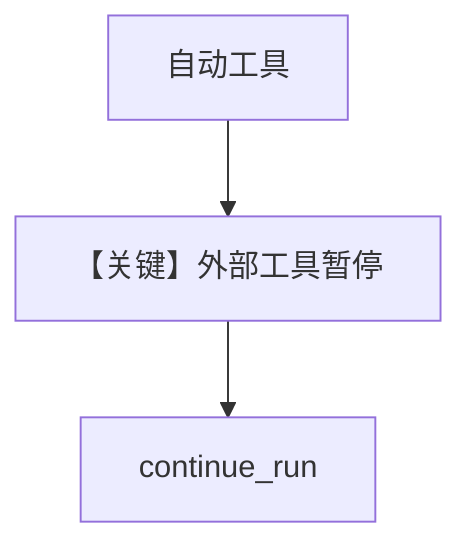

# mixed_external_and_regular_tools.py — 实现原理分析

<!-- cookbook-py-source:start -->
## 完整源码

```python
"""
Mixed External and Regular Tools
=============================

Human-in-the-Loop: Mix external_execution tools with regular tools in the same agent.

When an agent has both external_execution tools (paused for human execution) and
regular tools (executed automatically), the agent will:
1. Execute regular tools automatically
2. Pause when external_execution tools need to be called
3. Resume after external tool results are provided
"""

import json
from datetime import datetime

from agno.agent import Agent
from agno.db.sqlite import SqliteDb
from agno.models.openai import OpenAIResponses
from agno.tools import tool
from agno.utils import pprint


# A regular tool - the agent executes this automatically.
def get_current_date() -> str:
    """Get the current date and time.

    Returns:
        str: The current date and time in a human-readable format.
    """
    return datetime.now().strftime("%A, %B %d, %Y at %I:%M %p")


# An external tool - the agent pauses and we execute it ourselves.
@tool(external_execution=True)
def get_user_location() -> str:
    """Get the user's current location.

    Returns:
        str: The user's current city and country.
    """
    return json.dumps({"city": "San Francisco", "country": "US"})


agent = Agent(
    model=OpenAIResponses(id="gpt-5-mini"),
    tools=[get_user_location, get_current_date],
    markdown=True,
    db=SqliteDb(session_table="mixed_tools_session", db_file="tmp/mixed_tools.db"),
)

if __name__ == "__main__":
    run_response = agent.run("What is the current date and time in my location?")

    # Check if the agent paused for external tool execution
    if run_response.is_paused:
        print("Agent paused - handling external tool calls...")
        for requirement in run_response.active_requirements:
            if requirement.needs_external_execution:
                tool_name = requirement.tool_execution.tool_name
                tool_args = requirement.tool_execution.tool_args
                print(f"Executing {tool_name} with args {tool_args} externally")

                # Execute the external tool (here we call our own function)
                if tool_name == get_user_location.name:
                    result = get_user_location.entrypoint(**tool_args)  # type: ignore
                    requirement.set_external_execution_result(result)

        # Continue the run with the external tool results
        run_response = agent.continue_run(
            run_id=run_response.run_id,
            requirements=run_response.requirements,
        )

    pprint.pprint_run_response(run_response)
```

<!-- cookbook-py-source:end -->

> 源文件：`cookbook/02_agents/10_human_in_the_loop/mixed_external_and_regular_tools.py`

## 概述

本示例展示 **普通函数工具与 external_execution 工具混用**：`get_current_date` 自动执行；`get_user_location` 标记 `@tool(external_execution=True)` 需宿主注入结果。

**核心配置一览：**

| 配置项 | 值 |
|--------|-----|
| `model` | `OpenAIResponses(id="gpt-5-mini")` |
| `tools` | `[get_user_location, get_current_date]` |
| `markdown` | `True` |
| `db` | `SqliteDb(session_table="mixed_tools_session", db_file="tmp/mixed_tools.db")` |

## 运行机制与因果链

同一 user 请求可能先自动跑日期，再暂停等位置；顺序由模型工具调用顺序决定。

参照用户句：`What is the current date and time in my location?`

## System Prompt 组装

无自定义 `instructions`。

## Mermaid 流程图



## 关键源码文件索引

| 文件 | 作用 |
|------|------|
| `agno/agent` | 混合工具调度 |
