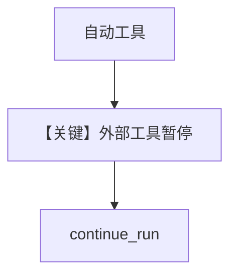

# mixed_external_and_regular_tools.py — 实现原理分析

> 源文件：`cookbook/02_agents/10_human_in_the_loop/mixed_external_and_regular_tools.py`

## 概述

本示例展示 **普通函数工具与 external_execution 工具混用**：`get_current_date` 自动执行；`get_user_location` 标记 `@tool(external_execution=True)` 需宿主注入结果。

**核心配置一览：**

| 配置项 | 值 |
|--------|-----|
| `model` | `OpenAIResponses(id="gpt-5-mini")` |
| `tools` | `[get_user_location, get_current_date]` |
| `markdown` | `True` |
| `db` | `SqliteDb(session_table="mixed_tools_session", db_file="tmp/mixed_tools.db")` |

## 运行机制与因果链

同一 user 请求可能先自动跑日期，再暂停等位置；顺序由模型工具调用顺序决定。

参照用户句：`What is the current date and time in my location?`

## System Prompt 组装

无自定义 `instructions`。

## Mermaid 流程图

## 关键源码文件索引

| 文件 | 作用 |
|------|------|
| `agno/agent` | 混合工具调度 |
