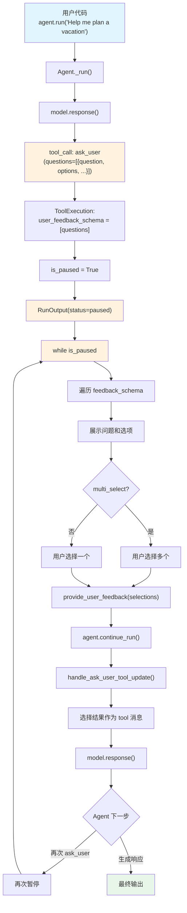

# user_feedback.py — 实现原理分析

> 源文件：`cookbook/02_agents/10_human_in_the_loop/user_feedback.py`

## 概述

本示例展示 Agno 的 **结构化用户反馈 (User Feedback)** 机制：使用 `UserFeedbackTools` 让 Agent 通过 `ask_user()` 工具向用户呈现结构化问题（含预定义选项的单选/多选），用户通过 `requirement.provide_user_feedback()` 返回选择结果后恢复执行。

**核心配置一览：**

| 配置项 | 值 | 说明 |
|--------|------|------|
| `model` | `OpenAIResponses(id="gpt-5.2")` | Responses API |
| `tools` | `[UserFeedbackTools()]` | 结构化反馈工具 |
| `instructions` | `["You are a helpful travel assistant.", "When the user asks...use the ask_user tool..."]` | 指令列表 |
| `markdown` | `True` | 启用 markdown 格式化 |
| `db` | `SqliteDb(db_file="tmp/user_feedback.db")` | SQLite 持久化 |

## 架构分层

```
用户代码层                       agno.agent 层
┌──────────────────────┐      ┌──────────────────────────────────────────┐
│ user_feedback.py      │      │ Agent._run()                             │
│                       │      │  ├ model.response()                      │
│ UserFeedbackTools:    │      │  │  → tool_call: ask_user(questions=[    │
│  ask_user(questions)  │      │  │     {question: "...",                 │
│                       │─────>│  │      header: "...",                   │
│ instructions:         │      │  │      options: [{label, desc}, ...],  │
│  "travel assistant"   │      │  │      multi_select: true}])           │
│  "use ask_user tool"  │      │  │                                       │
│                       │      │  ├ ToolExecution: ask_user               │
│ while is_paused:      │      │  │  user_feedback_schema = [questions]  │
│   遍历 questions      │      │  │  → is_paused → 暂停                  │
│   展示选项            │      │  └ RunOutput(status=paused)              │
│   收集选择            │      │                                          │
│   provide_user_       │      ├──────────────────────────────────────────┤
│    feedback()         │      │ continue_run()                           │
│   continue_run()      │─────>│  ├ handle_ask_user_tool_update()         │
│                       │      │  │  → 选择结果作为 tool 消息             │
│ 循环直到完成          │<─────│  └ model.response() → 最终输出           │
└──────────────────────┘      └──────────────────────────────────────────┘
                                      │
                                      ▼
                              ┌──────────────┐
                              │ OpenAI       │
                              │ Responses API│
                              │ gpt-5.2      │
                              └──────────────┘
```

## 核心组件解析

### UserFeedbackTools

`UserFeedbackTools`（`tools/user_feedback.py:25`）提供 `ask_user()` 工具：

```python
# tools/user_feedback.py L25-54
class UserFeedbackTools(Toolkit):
    def __init__(self, ...):
        super().__init__(
            name="user_feedback_tools",
            instructions=self.DEFAULT_INSTRUCTIONS,
            add_instructions=True,
            tools=[self.ask_user],
        )

    def ask_user(self, questions: List[AskUserQuestion]) -> str:
        """Present structured questions with predefined options to the user.
        Args:
            questions: 问题列表，每个含 header, question, options, multi_select
        """
        return "User feedback received"
```

### AskUserQuestion / AskUserOption 数据模型

```python
# tools/user_feedback.py L9-22
class AskUserOption(BaseModel):
    label: str          # 选项显示文本（1-5 词）
    description: Optional[str]  # 选项说明

class AskUserQuestion(BaseModel):
    question: str       # 问题文本
    header: str         # 短标签（最多 12 字符）
    options: List[AskUserOption]  # 2-4 个选项
    multi_select: bool = False   # 是否多选
```

### UserFeedbackQuestion / UserFeedbackOption（运行时数据类）

模型调用 `ask_user` 后，agno 将 `AskUserQuestion`（Pydantic）转为 `UserFeedbackQuestion`（dataclass，`function.py:98`）存入 `ToolExecution.user_feedback_schema`：

```python
# function.py L97-129
@dataclass
class UserFeedbackQuestion:
    question: str
    header: Optional[str] = None
    options: Optional[List[UserFeedbackOption]] = None
    multi_select: bool = False
    selected_options: Optional[List[str]] = None  # 用户选择结果

@dataclass
class UserFeedbackOption:
    label: str
    description: Optional[str] = None
    selected: bool = False
```

### RunRequirement.needs_user_feedback

```python
# run/requirement.py L79-87
@property
def needs_user_feedback(self) -> bool:
    if self.tool_execution.answered is True:
        return False
    # 检查所有问题是否都有选择
    if self.user_feedback_schema and not all(q.selected_options is not None for q in self.user_feedback_schema):
        return True
    return False
```

### provide_user_feedback()

```python
# run/requirement.py L135-160
def provide_user_feedback(self, selections: Dict[str, List[str]]):
    """提供用户选择结果
    Args:
        selections: {问题文本: [选中的选项 label 列表]}
    """
    for question in self.user_feedback_schema:
        if question.question in selections:
            question.selected_options = selections[question.question]
            # 同步更新每个 option 的 selected 状态
            for opt in question.options:
                opt.selected = opt.label in question.selected_options
    # 同步到 tool_execution
    # 所有问题都有选择后标记 answered=True
```

### handle_ask_user_tool_update()

`_tools.py:541` 处理 `ask_user` 工具的反馈返回：

```python
# _tools.py L541-556
def handle_ask_user_tool_update(agent, run_messages, tool):
    feedback_result = [
        {"question": q.question, "selected": q.selected_options or []}
        for q in tool.user_feedback_schema
    ]
    run_messages.messages.append(
        Message(
            role=agent.model.tool_message_role,
            content=f"User feedback received: {json.dumps(feedback_result)}",
            tool_call_id=tool.tool_call_id,
        )
    )
```

用户选择以 JSON 格式传回模型，模型根据选择生成定制化响应。

### 用户代码处理流程

```python
while run_response.is_paused:
    for requirement in run_response.active_requirements:
        if requirement.needs_user_feedback:
            feedback_schema = requirement.user_feedback_schema
            selections = {}
            for question in feedback_schema:
                # 展示问题和选项
                print(f"\n{question.header}: {question.question}")
                for i, opt in enumerate(question.options, 1):
                    print(f"  {i}. {opt.label}")

                if question.multi_select:
                    # 多选：逗号分隔
                    raw = input("Select options (comma-separated numbers): ")
                    selected = [question.options[i].label for i in indices]
                else:
                    # 单选
                    raw = input("Select an option (number): ")
                    selected = [question.options[idx].label]

                selections[question.question] = selected

            requirement.provide_user_feedback(selections)

    run_response = agent.continue_run(...)
```

### 三种 HITL 输入模式对比

| 特性 | `requires_user_input` | `UserControlFlowTools` | `UserFeedbackTools` |
|------|------|------|------|
| 输入类型 | 自由文本 | 自由文本 | 结构化选项 |
| 字段来源 | 工具签名 | Agent 构造 | Agent 构造 |
| 处理 Case | `_tools.py` Case 4 | `_tools.py` Case 3a | `_tools.py` Case 3b |
| 适用场景 | 补全缺失参数 | Agent 缺信息时 | 用户偏好选择 |

## System Prompt 组装

| 序号 | 组成部分 | 本文件中的值/来源 | 是否生效 |
|------|---------|-----------------|---------|
| 3.1 | `instructions` | `["You are a helpful travel assistant.", "When the user asks..."]` | 是 |
| 3.2.1 | `markdown` | `True` | 是 |
| 3.3.3 | instructions 拼接 | 两条指令拼接 | 是 |
| 3.3.4 | additional_information | markdown 指令 | 是 |
| 3.3.5 | `_tool_instructions` | UserFeedbackTools 的 DEFAULT_INSTRUCTIONS | 是 |
| 其余 | — | 均未启用 | 否 |

### 最终 System Prompt

```text
- You are a helpful travel assistant.
- When the user asks you to plan a trip, use the ask_user tool to clarify their preferences.

<additional_information>
- Use markdown to format your answers.
</additional_information>

You have access to the `ask_user` tool to present structured questions with predefined options.

## Usage
- Use `ask_user` when you need the user to choose between specific options.
- Each question should have a short `header`, a clear `question` text, and a list of `options`.
- Each option needs a `label` and an optional `description`.
- Set `multi_select` to true if the user can select more than one option.

## Guidelines
- Provide 2-4 options per question.
- Keep headers short (max 12 characters).
- Write clear, specific questions that end with a question mark.
- Use `multi_select: true` only when choices are not mutually exclusive.
```

## 完整 API 请求

### 第一轮：Agent 构造问题

```python
client.responses.create(
    model="gpt-5.2",
    input=[
        {"role": "developer", "content": "- You are a helpful travel assistant.\n- When the user asks you to plan a trip, use the ask_user tool to clarify their preferences.\n\n<additional_information>\n- Use markdown to format your answers.\n</additional_information>\n\nYou have access to the `ask_user` tool..."},
        {"role": "user", "content": "Help me plan a vacation"}
    ],
    tools=[{
        "type": "function",
        "function": {
            "name": "ask_user",
            "description": "Present structured questions with predefined options to the user.",
            "parameters": {
                "type": "object",
                "properties": {
                    "questions": {
                        "type": "array",
                        "items": {
                            "type": "object",
                            "properties": {
                                "question": {"type": "string"},
                                "header": {"type": "string"},
                                "options": {"type": "array", "items": {"type": "object", "properties": {"label": {"type": "string"}, "description": {"type": "string"}}}},
                                "multi_select": {"type": "boolean"}
                            }
                        }
                    }
                },
                "required": ["questions"]
            }
        }
    }],
    stream=True,
    stream_options={"include_usage": True}
)
```

> Agent 返回 `ask_user(questions=[{question: "What type of vacation?", header: "Type", options: [{label: "Beach"}, {label: "Mountain"}, ...], multi_select: false}])` → **暂停**

### 第二轮：用户选择后继续

```python
client.responses.create(
    model="gpt-5.2",
    input=[
        {"role": "developer", "content": "..."},
        {"role": "user", "content": "Help me plan a vacation"},
        {"role": "assistant", "tool_calls": [{"id": "call_1", "function": {"name": "ask_user", "arguments": "..."}}]},
        {"role": "tool", "tool_call_id": "call_1", "content": "User feedback received: [{\"question\": \"What type of vacation?\", \"selected\": [\"Beach\"]}]"}
    ],
    tools=[...],
    stream=True
)
```

> Agent 可能再次调用 `ask_user` 询问更多偏好（预算、日期等），或直接生成度假方案

## Mermaid 流程图



## 关键源码文件索引

| 文件 | 关键函数/类 | 作用 |
|------|------------|------|
| `agno/tools/user_feedback.py` | `UserFeedbackTools` L25 | 结构化反馈工具包 |
| `agno/tools/user_feedback.py` | `ask_user()` L47 | 暂停并呈现问题 |
| `agno/tools/user_feedback.py` | `AskUserQuestion` L16 | 问题 Pydantic 模型 |
| `agno/tools/user_feedback.py` | `AskUserOption` L9 | 选项 Pydantic 模型 |
| `agno/tools/user_feedback.py` | `DEFAULT_INSTRUCTIONS` L60 | Agent 使用指南 |
| `agno/tools/function.py` | `UserFeedbackQuestion` L98 | 运行时问题数据类 |
| `agno/tools/function.py` | `UserFeedbackOption` L74 | 运行时选项数据类 |
| `agno/models/response.py` | `ToolExecution.user_feedback_schema` L52 | 反馈 schema 存储 |
| `agno/run/requirement.py` | `RunRequirement.needs_user_feedback` L79 | 检测是否需要反馈 |
| `agno/run/requirement.py` | `provide_user_feedback()` L135 | 设置用户选择结果 |
| `agno/agent/_tools.py` | `handle_ask_user_tool_update()` L541 | Case 3b: 处理反馈结果 |
| `agno/agent/_tools.py` | `handle_tool_call_updates()` L762-766 | Case 3b 入口 |
