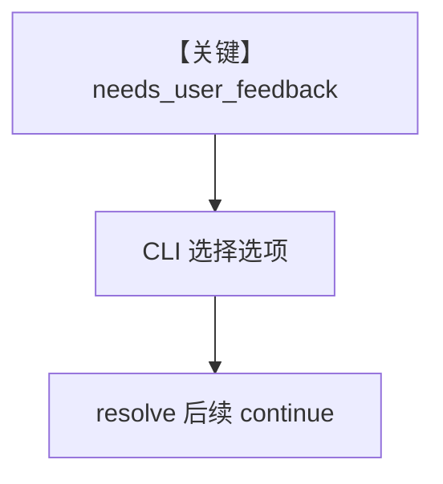

# user_feedback.py — 实现原理分析

<!-- cookbook-py-source:start -->
## 完整源码

```python
"""
User Feedback (Structured Questions)
=====================================

Human-in-the-Loop: Presenting structured questions with predefined options.
Uses UserFeedbackTools to pause the agent and collect user selections.
"""

from agno.agent import Agent
from agno.db.sqlite import SqliteDb
from agno.models.openai import OpenAIResponses
from agno.tools.user_feedback import UserFeedbackTools
from agno.utils import pprint

# ---------------------------------------------------------------------------
# Create Agent
# ---------------------------------------------------------------------------
agent = Agent(
    model=OpenAIResponses(id="gpt-5.2"),
    tools=[UserFeedbackTools()],
    instructions=[
        "You are a helpful travel assistant.",
        "When the user asks you to plan a trip, use the ask_user tool to clarify their preferences.",
    ],
    markdown=True,
    db=SqliteDb(db_file="tmp/user_feedback.db"),
)

# ---------------------------------------------------------------------------
# Run Agent
# ---------------------------------------------------------------------------
if __name__ == "__main__":
    run_response = agent.run("Help me plan a vacation")

    while run_response.is_paused:
        for requirement in run_response.active_requirements:
            if requirement.needs_user_feedback:
                feedback_schema = requirement.user_feedback_schema
                if not feedback_schema:
                    continue

                selections = {}
                for question in feedback_schema:
                    print(f"\n{question.header or 'Question'}: {question.question}")
                    if question.options:
                        for i, opt in enumerate(question.options, 1):
                            desc = f" - {opt.description}" if opt.description else ""
                            print(f"  {i}. {opt.label}{desc}")

                    if question.multi_select:
                        raw = input("Select options (comma-separated numbers): ")
                        indices = [
                            int(x.strip()) - 1
                            for x in raw.split(",")
                            if x.strip().isdigit()
                        ]
                        selected = [
                            question.options[i].label
                            for i in indices
                            if question.options and 0 <= i < len(question.options)
                        ]
                    else:
                        raw = input("Select an option (number): ")
                        idx = int(raw.strip()) - 1 if raw.strip().isdigit() else -1
                        selected = (
                            [question.options[idx].label]
                            if question.options and 0 <= idx < len(question.options)
                            else []
                        )

                    selections[question.question] = selected
                    print(f"  -> Selected: {selected}")

                requirement.provide_user_feedback(selections)

        run_response = agent.continue_run(
            run_id=run_response.run_id,
            requirements=run_response.requirements,
        )

        if not run_response.is_paused:
            pprint.pprint_run_response(run_response)
```

<!-- cookbook-py-source:end -->

> 源文件：`cookbook/02_agents/10_human_in_the_loop/user_feedback.py`

## 概述

本示例展示 **`UserFeedbackTools`**：Agent 通过结构化问卷暂停，`needs_user_feedback` 与 `user_feedback_schema` 驱动 CLI 选择，填答后续跑。

**核心配置一览：**

| 配置项 | 值 |
|--------|-----|
| `model` | `OpenAIResponses(id="gpt-5.2")` |
| `tools` | `[UserFeedbackTools()]` |
| `instructions` | 旅行助手两条 |
| `markdown` | `True` |
| `db` | `SqliteDb(db_file="tmp/user_feedback.db")` |

### 字面量 instructions

```text
You are a helpful travel assistant.
When the user asks you to plan a trip, use the ask_user tool to clarify their preferences.
```

## 核心组件解析

`while run_response.is_paused` 处理多题、单选/多选分支。

## 运行机制与因果链

适合 **表单式 HITL**，与自由文本 `input()` 不同。

## 完整 API 请求

`responses.create`；问卷逻辑在工具与续跑中闭环。

## Mermaid 流程图


```mermaid
flowchart TD
    F["【关键】needs_user_feedback"] --> I["CLI 选择选项"]
    I --> R["resolve 后续 continue"]
```

## 关键源码文件索引

| 文件 | 作用 |
|------|------|
| `agno/tools/user_feedback` | `UserFeedbackTools` |
