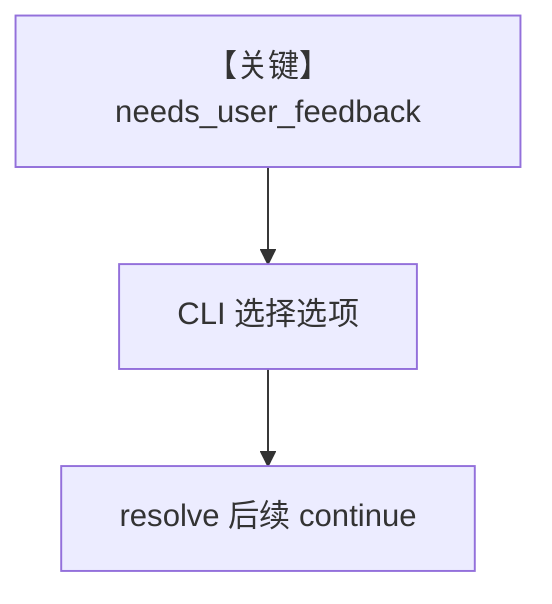

# user_feedback.py — 实现原理分析

> 源文件：`cookbook/02_agents/10_human_in_the_loop/user_feedback.py`

## 概述

本示例展示 **`UserFeedbackTools`**：Agent 通过结构化问卷暂停，`needs_user_feedback` 与 `user_feedback_schema` 驱动 CLI 选择，填答后续跑。

**核心配置一览：**

| 配置项 | 值 |
|--------|-----|
| `model` | `OpenAIResponses(id="gpt-5.2")` |
| `tools` | `[UserFeedbackTools()]` |
| `instructions` | 旅行助手两条 |
| `markdown` | `True` |
| `db` | `SqliteDb(db_file="tmp/user_feedback.db")` |

### 字面量 instructions

```text
You are a helpful travel assistant.
When the user asks you to plan a trip, use the ask_user tool to clarify their preferences.
```

## 核心组件解析

`while run_response.is_paused` 处理多题、单选/多选分支。

## 运行机制与因果链

适合 **表单式 HITL**，与自由文本 `input()` 不同。

## 完整 API 请求

`responses.create`；问卷逻辑在工具与续跑中闭环。

## Mermaid 流程图


```mermaid
flowchart TD
    F["【关键】needs_user_feedback"] --> I["CLI 选择选项"]
    I --> R["resolve 后续 continue"]
```

## 关键源码文件索引

| 文件 | 作用 |
|------|------|
| `agno/tools/user_feedback` | `UserFeedbackTools` |
