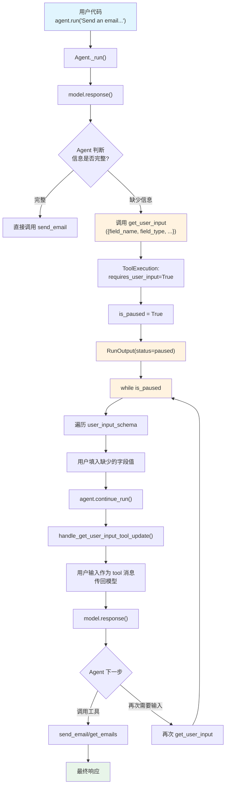

# user_input.py — 实现原理分析

> 源文件：`cookbook/02_agents/10_human_in_the_loop/user_input.py`

## 概述

本示例展示 Agno 的 **代理式用户输入 (Agentic User Input)** 机制：使用 `UserControlFlowTools` 让 Agent 主动决定何时需要用户输入。Agent 通过 `get_user_input()` 工具暂停运行，用户代码填入值后恢复。与 `@tool(requires_user_input=True)` 不同，这里 Agent 自行判断缺少哪些信息并构造表单字段。

**核心配置一览：**

| 配置项 | 值 | 说明 |
|--------|------|------|
| `model` | `OpenAIResponses(id="gpt-5-mini")` | Responses API |
| `tools` | `[EmailTools(), UserControlFlowTools()]` | 自定义 Toolkit + 用户控制流 |
| `markdown` | `True` | 启用 markdown 格式化 |
| `db` | `SqliteDb(db_file="tmp/agentic_user_input.db")` | SQLite 持久化 |
| `instructions` | `None` | 未设置 |

## 架构分层

```
用户代码层                       agno.agent 层
┌──────────────────────┐      ┌──────────────────────────────────────────┐
│ user_input.py         │      │ Agent._run()                             │
│                       │      │  ├ model.response()                      │
│ EmailTools:           │      │  │  → tool_call: get_user_input(         │
│  send_email           │      │  │     [{field_name:"to_address",...}])  │
│  get_emails           │      │  │                                       │
│                       │      │  ├ get_user_input 是 HITL 工具          │
│ UserControlFlowTools: │─────>│  │  → ToolExecution.requires_user_input  │
│  get_user_input       │      │  │  → is_paused → 暂停                  │
│                       │      │  │                                       │
│ while is_paused:      │      │  └ RunOutput(status=paused)              │
│   填入字段值          │      │                                          │
│   continue_run()      │─────>│ continue_run()                           │
│   ↓                   │      │  ├ handle_get_user_input_tool_update()   │
│   可能再次暂停        │      │  │  → 用户输入作为 tool 结果传给模型    │
│                       │      │  └ model.response() → 可能调用           │
│ 循环直到完成          │<─────│    send_email/get_emails                  │
└──────────────────────┘      └──────────────────────────────────────────┘
                                      │
                                      ▼
                              ┌──────────────┐
                              │ OpenAI       │
                              │ Responses API│
                              │ gpt-5-mini   │
                              └──────────────┘
```

## 核心组件解析

### UserControlFlowTools

`UserControlFlowTools`（`tools/user_control_flow.py:7`）提供 `get_user_input()` 工具：

```python
# tools/user_control_flow.py L7-46
class UserControlFlowTools(Toolkit):
    def __init__(self, ...):
        super().__init__(
            name="user_control_flow_tools",
            instructions=self.DEFAULT_INSTRUCTIONS,  # 详细使用指南
            add_instructions=True,
            tools=[self.get_user_input],
        )

    def get_user_input(self, user_input_fields: list[dict]) -> str:
        """Get user input for the given fields.
        Args:
            user_input_fields: 字段列表，每个含 field_name, field_type, field_description
        """
        # 实际不执行，Agent 逻辑会在此暂停
        return "User input received"
```

`DEFAULT_INSTRUCTIONS` 指导 Agent 在缺少信息时主动使用工具而非直接回复用户。

### 代理式 vs 声明式用户输入对比

| 特性 | `@tool(requires_user_input=True)` | `UserControlFlowTools` |
|------|------|------|
| 决策者 | 开发者预定义 | Agent 自行判断 |
| 字段来源 | 工具函数签名 | Agent 构造的 `user_input_fields` |
| 暂停时机 | 工具被调用时自动暂停 | Agent 主动调用 `get_user_input` 时 |
| 灵活性 | 固定字段 | Agent 可根据上下文动态选择字段 |
| 处理 Case | `_tools.py` Case 4 | `_tools.py` Case 3a |

### EmailTools 自定义 Toolkit

```python
class EmailTools(Toolkit):
    def __init__(self, *args, **kwargs):
        super().__init__(
            name="EmailTools",
            tools=[self.send_email, self.get_emails],
            *args, **kwargs
        )
```

提供 `send_email(subject, body, to_address)` 和 `get_emails(date_from, date_to)` 两个工具。

### handle_get_user_input_tool_update()

`_tools.py:517` 处理 `get_user_input` 工具的用户输入返回：

```python
# _tools.py L517-538
def handle_get_user_input_tool_update(agent, run_messages, tool):
    user_input_result = [
        {"name": field.name, "value": field.value}
        for field in tool.user_input_schema or []
    ]
    # 将用户输入作为 tool 角色消息传给模型
    run_messages.messages.append(
        Message(
            role=agent.model.tool_message_role,
            content=f"User inputs retrieved: {json.dumps(user_input_result)}",
            tool_call_id=tool.tool_call_id,
            tool_name=tool.tool_name,
        )
    )
```

与 `handle_user_input_update()`（Case 4）不同：
- Case 3a（`get_user_input`）：用户输入作为 tool 消息传回模型，模型决定下一步
- Case 4（`requires_user_input`）：用户输入合并到 `tool_args`，直接执行工具

### while 循环处理多轮交互

```python
while run_response.is_paused:
    for requirement in run_response.active_requirements:
        if requirement.needs_user_input:
            input_schema = requirement.user_input_schema
            for field in input_schema:
                if field.value is None:
                    user_value = input(f"Please enter a value for {field.name}: ")
                else:
                    user_value = field.value
                field.value = user_value

    run_response = agent.continue_run(
        run_id=run_response.run_id,
        requirements=run_response.requirements,
    )
```

Agent 可能多次调用 `get_user_input`（如先问 to_address，再问确认），用 while 循环处理所有轮次。

## System Prompt 组装

| 序号 | 组成部分 | 本文件中的值/来源 | 是否生效 |
|------|---------|-----------------|---------|
| 3.2.1 | `markdown` | `True` | 是 |
| 3.3.4 | additional_information | markdown 指令 | 是 |
| 3.3.5 | `_tool_instructions` | UserControlFlowTools 的 DEFAULT_INSTRUCTIONS | 是 |
| 其余 | — | 均未启用 | 否 |

### 最终 System Prompt

```text
<additional_information>
- Use markdown to format your answers.
</additional_information>

You have access to the `get_user_input` tool to get user input for the given fields.

1. **Get User Input**:
    - Purpose: When you have call a tool/function where you don't have enough information, don't say you can't do it, just use the `get_user_input` tool to get the information you need from the user.
    - Usage: Call `get_user_input` with the fields you require the user to fill in for you to continue your task.

## IMPORTANT GUIDELINES
- **Don't respond and ask the user for information.** Just use the `get_user_input` tool to get the information you need from the user.
- **Don't make up information you don't have.** ...
...
```

## 完整 API 请求

### 第一轮：Agent 判断缺少信息

```python
client.responses.create(
    model="gpt-5-mini",
    input=[
        {"role": "developer", "content": "<additional_information>\n- Use markdown to format your answers.\n</additional_information>\n\nYou have access to the `get_user_input` tool..."},
        {"role": "user", "content": "Send an email with the body 'What is the weather in Tokyo?'"}
    ],
    tools=[
        {"type": "function", "function": {"name": "send_email", "description": "Send an email to the given address with the given subject and body.", "parameters": {"type": "object", "properties": {"subject": {...}, "body": {...}, "to_address": {...}}, "required": ["subject", "body", "to_address"]}}},
        {"type": "function", "function": {"name": "get_emails", "description": "Get all emails between the given dates.", "parameters": {...}}},
        {"type": "function", "function": {"name": "get_user_input", "description": "Use this tool to get user input for the given fields...", "parameters": {"type": "object", "properties": {"user_input_fields": {"type": "array", "items": {"type": "object"}}}, "required": ["user_input_fields"]}}}
    ],
    stream=True,
    stream_options={"include_usage": True}
)
```

> Agent 判断缺少 `to_address` 和 `subject` → 调用 `get_user_input([{field_name: "to_address", ...}, {field_name: "subject", ...}])` → **暂停**

### 第二轮：用户输入后继续

```python
client.responses.create(
    model="gpt-5-mini",
    input=[
        {"role": "developer", "content": "..."},
        {"role": "user", "content": "Send an email..."},
        {"role": "assistant", "tool_calls": [{"id": "call_1", "function": {"name": "get_user_input", "arguments": "[{\"field_name\": \"to_address\", ...}]"}}]},
        # 用户输入结果
        {"role": "tool", "tool_call_id": "call_1", "content": "User inputs retrieved: [{\"name\": \"to_address\", \"value\": \"user@example.com\"}, ...]"}
    ],
    tools=[...],
    stream=True
)
```

> Agent 获得用户输入后调用 `send_email(...)` → 正常执行（无暂停）

## Mermaid 流程图



## 关键源码文件索引

| 文件 | 关键函数/类 | 作用 |
|------|------------|------|
| `agno/tools/user_control_flow.py` | `UserControlFlowTools` L7 | 用户控制流工具包 |
| `agno/tools/user_control_flow.py` | `get_user_input()` L35 | 暂停并获取用户输入 |
| `agno/tools/user_control_flow.py` | `DEFAULT_INSTRUCTIONS` L52 | Agent 使用指南 |
| `agno/tools/function.py` | `UserInputField` L41 | 用户输入字段数据类 |
| `agno/run/requirement.py` | `RunRequirement.needs_user_input` L66 | 检测是否需要用户输入 |
| `agno/agent/_tools.py` | `handle_get_user_input_tool_update()` L517 | Case 3a: 处理代理式输入 |
| `agno/agent/_tools.py` | `handle_tool_call_updates()` L757-761 | Case 3a 入口 |
| `agno/tools/toolkit.py` | `Toolkit.__init__()` L15 | Toolkit 基类 |
