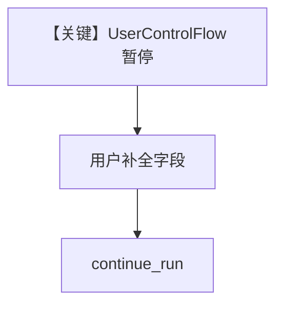

# user_input.py — 实现原理分析

<!-- cookbook-py-source:start -->
## 完整源码

```python
"""
Agentic User Input
=============================

Human-in-the-Loop: Allowing users to provide input externally.
"""

from typing import Any, Dict, List

from agno.agent import Agent
from agno.db.sqlite import SqliteDb
from agno.models.openai import OpenAIResponses
from agno.tools import Toolkit
from agno.tools.function import UserInputField
from agno.tools.user_control_flow import UserControlFlowTools
from agno.utils import pprint


class EmailTools(Toolkit):
    def __init__(self, *args, **kwargs):
        super().__init__(
            name="EmailTools", tools=[self.send_email, self.get_emails], *args, **kwargs
        )

    def send_email(self, subject: str, body: str, to_address: str) -> str:
        """Send an email to the given address with the given subject and body.

        Args:
            subject (str): The subject of the email.
            body (str): The body of the email.
            to_address (str): The address to send the email to.
        """
        return f"Sent email to {to_address} with subject {subject} and body {body}"

    def get_emails(self, date_from: str, date_to: str) -> list[dict[str, str]]:
        """Get all emails between the given dates.

        Args:
            date_from (str): The start date (in YYYY-MM-DD format).
            date_to (str): The end date (in YYYY-MM-DD format).
        """
        return [
            {
                "subject": "Hello",
                "body": "Hello, world!",
                "to_address": "test@test.com",
                "date": date_from,
            },
            {
                "subject": "Random other email",
                "body": "This is a random other email",
                "to_address": "john@doe.com",
                "date": date_to,
            },
        ]


# ---------------------------------------------------------------------------
# Create Agent
# ---------------------------------------------------------------------------
agent = Agent(
    model=OpenAIResponses(id="gpt-5-mini"),
    tools=[EmailTools(), UserControlFlowTools()],
    markdown=True,
    db=SqliteDb(db_file="tmp/agentic_user_input.db"),
)

# ---------------------------------------------------------------------------
# Run Agent
# ---------------------------------------------------------------------------
if __name__ == "__main__":
    run_response = agent.run(
        "Send an email with the body 'What is the weather in Tokyo?'"
    )

    # We use a while loop to continue the running until the agent is satisfied with the user input
    while run_response.is_paused:
        for requirement in run_response.active_requirements:
            if requirement.needs_user_input:
                input_schema: List[UserInputField] = requirement.user_input_schema  # type: ignore

                for field in input_schema:
                    # Get user input for each field in the schema
                    field_type = field.field_type  # type: ignore
                    field_description = field.description  # type: ignore

                    # Display field information to the user
                    print(f"\nField: {field.name}")  # type: ignore
                    print(f"Description: {field_description}")
                    print(f"Type: {field_type}")

                    # Get user input
                    if field.value is None:  # type: ignore
                        user_value = input(f"Please enter a value for {field.name}: ")  # type: ignore
                    else:
                        print(f"Value: {field.value}")  # type: ignore
                        user_value = field.value  # type: ignore

                    # Update the field value
                    field.value = user_value  # type: ignore

        run_response = agent.continue_run(
            run_id=run_response.run_id,
            requirements=run_response.requirements,
        )
        if not run_response.is_paused:
            pprint.pprint_run_response(run_response)
            break

    run_response = agent.run("Get me all my emails")

    while run_response.is_paused:
        for requirement in run_response.active_requirements:
            if requirement.needs_user_input:
                input_schema: Dict[str, Any] = requirement.user_input_schema  # type: ignore

                for field in input_schema:
                    # Get user input for each field in the schema
                    field_type = field.field_type  # type: ignore
                    field_description = field.description  # type: ignore

                    # Display field information to the user
                    print(f"\nField: {field.name}")  # type: ignore
                    print(f"Description: {field_description}")
                    print(f"Type: {field_type}")

                    # Get user input
                    if field.value is None:  # type: ignore
                        user_value = input(f"Please enter a value for {field.name}: ")  # type: ignore
                    else:
                        print(f"Value: {field.value}")  # type: ignore
                        user_value = field.value  # type: ignore

                    # Update the field value
                    field.value = user_value  # type: ignore

        run_response = agent.continue_run(
            run_id=run_response.run_id,
            requirements=run_response.requirements,
        )

        if not run_response.is_paused:
            pprint.pprint_run_response(run_response)
            break
```

<!-- cookbook-py-source:end -->

> 源文件：`cookbook/02_agents/10_human_in_the_loop/user_input.py`

## 概述

本示例展示 **`UserControlFlowTools` 与自定义 `EmailTools` Toolkit** 组合，实现 **对话中向用户索取字段** 的受控流（与 `requires_user_input` 单工具对照）。

**核心配置一览：**

| 配置项 | 值 |
|--------|-----|
| `model` | `OpenAIResponses(id="gpt-5-mini")` |
| `tools` | `[EmailTools(), UserControlFlowTools()]` |
| `markdown` | `True` |
| `db` | `SqliteDb(db_file="tmp/agentic_user_input.db")` |

## 核心组件解析

`EmailTools` 提供 `send_email`/`get_emails`；`UserControlFlowTools` 提供暂停—收集—继续语义（细节见源码）。

### 运行机制与因果链

Agent 可先规划邮件操作，再在需要时向用户索取参数。

## System Prompt 组装

无顶层 `instructions`；工具 docstring 供模型推理。

## 完整 API 请求

`responses.create`。

## Mermaid 流程图


```mermaid
flowchart TD
    U["【关键】UserControlFlow 暂停"] --> I["用户补全字段"]
    I --> C["continue_run"]
```

## 关键源码文件索引

| 文件 | 作用 |
|------|------|
| `agno/tools/user_control_flow` | 控制流工具 |
