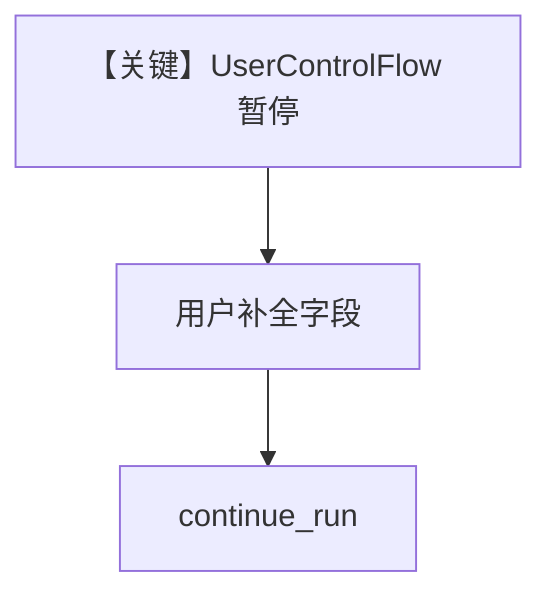

# user_input.py — 实现原理分析

> 源文件：`cookbook/02_agents/10_human_in_the_loop/user_input.py`

## 概述

本示例展示 **`UserControlFlowTools` 与自定义 `EmailTools` Toolkit** 组合，实现 **对话中向用户索取字段** 的受控流（与 `requires_user_input` 单工具对照）。

**核心配置一览：**

| 配置项 | 值 |
|--------|-----|
| `model` | `OpenAIResponses(id="gpt-5-mini")` |
| `tools` | `[EmailTools(), UserControlFlowTools()]` |
| `markdown` | `True` |
| `db` | `SqliteDb(db_file="tmp/agentic_user_input.db")` |

## 核心组件解析

`EmailTools` 提供 `send_email`/`get_emails`；`UserControlFlowTools` 提供暂停—收集—继续语义（细节见源码）。

### 运行机制与因果链

Agent 可先规划邮件操作，再在需要时向用户索取参数。

## System Prompt 组装

无顶层 `instructions`；工具 docstring 供模型推理。

## 完整 API 请求

`responses.create`。

## Mermaid 流程图

```mermaid
flowchart TD
    U["【关键】UserControlFlow 暂停"] --> I["用户补全字段"]
    I --> C["continue_run"]
```

## 关键源码文件索引

| 文件 | 作用 |
|------|------|
| `agno/tools/user_control_flow` | 控制流工具 |
