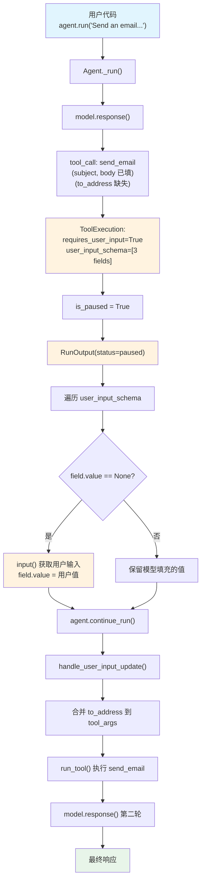

# user_input_required.py — 实现原理分析

> 源文件：`cookbook/02_agents/10_human_in_the_loop/user_input_required.py`

## 概述

本示例展示 Agno 的 **工具级用户输入 (User Input Required)** 机制：通过 `@tool(requires_user_input=True, user_input_fields=["to_address"])` 标记工具的某些参数需要用户手动提供，模型只负责填充其余参数。Agent 暂停后，用户代码遍历 `UserInputField` 列表填入值，然后 `continue_run()` 恢复执行。

**核心配置一览：**

| 配置项 | 值 | 说明 |
|--------|------|------|
| `model` | `OpenAIResponses(id="gpt-5-mini")` | Responses API |
| `tools` | `[send_email]` | `@tool(requires_user_input=True, user_input_fields=["to_address"])` |
| `markdown` | `True` | 启用 markdown 格式化 |
| `db` | `SqliteDb(db_file="tmp/user_input_required.db")` | SQLite 持久化 |
| `instructions` | `None` | 未设置 |

## 架构分层

```
用户代码层                       agno.agent 层
┌──────────────────────┐      ┌──────────────────────────────────────────┐
│ user_input_           │      │ Function 参数处理                        │
│   required.py         │      │  ├ user_input_fields=["to_address"]     │
│                       │      │  │ → "to_address" 从模型 schema 排除   │
│ @tool(requires_       │      │  │ → 仅 subject, body 暴露给模型       │
│  user_input=True,     │─────>│  └ user_input_schema = [               │
│  user_input_fields=   │      │      UserInputField("subject",...),     │
│  ["to_address"])      │      │      UserInputField("body",...),        │
│                       │      │      UserInputField("to_address",...)   │
│ agent.run(...)        │      │    ]                                    │
│  ↓                    │      ├─────────────────────────────────────────┤
│ is_paused → True      │      │ Agent._run()                            │
│ needs_user_input      │      │  ├ model.response() → tool_call         │
│  ↓                    │<─────│  │  send_email(subject=..., body=...)   │
│ 填入 to_address       │      │  ├ ToolExecution.requires_user_input    │
│  ↓                    │      │  │  → is_paused → 暂停                 │
│ agent.continue_run()  │─────>│  └ RunOutput(status=paused)             │
│                       │      │                                         │
│ 最终响应              │<─────│ continue_run()                          │
│                       │      │  ├ handle_user_input_update()           │
│                       │      │  │  → to_address 合并到 tool_args      │
│                       │      │  └ run_tool() 执行完整的 send_email    │
└──────────────────────┘      └──────────────────────────────────────────┘
                                      │
                                      ▼
                              ┌──────────────┐
                              │ OpenAI       │
                              │ Responses API│
                              │ gpt-5-mini   │
                              └──────────────┘
```

## 核心组件解析

### user_input_fields 参数排除

`Function.process_entrypoint()`（`function.py:466-470`）处理 `user_input_fields`：

```python
# function.py L466-470
if self.requires_user_input and self.user_input_fields:
    if len(self.user_input_fields) == 0:
        # 空列表 → 排除所有参数（用户提供全部）
        excluded_params.extend(list(type_hints.keys()))
    else:
        # 指定字段 → 仅排除这些字段
        excluded_params.extend(self.user_input_fields)
```

本例中 `user_input_fields=["to_address"]`，所以 `to_address` 从模型的工具 schema 中排除，模型只看到 `subject` 和 `body` 参数。

### UserInputField Schema 生成

`Function.process_entrypoint()`（`function.py:493-501`）为所有参数生成 `UserInputField`：

```python
# function.py L493-501
if self.requires_user_input:
    self.user_input_schema = [
        UserInputField(
            name=name,
            description=param_descriptions_clean.get(name),
            field_type=type_hints.get(name, str),
        )
        for name in sig.parameters  # 包括所有参数（不仅仅是 user_input_fields）
    ]
```

生成的 schema 包含三个字段：`subject`、`body`、`to_address`。模型填充 `subject` 和 `body` 的值，`to_address` 的值为 `None`，等待用户填入。

### UserInputField 数据类

```python
# function.py L41-70
@dataclass
class UserInputField:
    name: str           # 字段名
    field_type: Type    # Python 类型（str, int 等）
    description: Optional[str] = None  # 字段描述
    value: Optional[Any] = None        # 用户填入的值
```

### 用户填值流程

```python
for field in input_schema:
    if field.value is None:
        # 需要用户输入的字段
        user_value = input(f"Please enter a value for {field.name}: ")
    else:
        # 模型已填充的字段
        user_value = field.value
    field.value = user_value
```

当所有字段都有值后，`RunRequirement.needs_user_input` 返回 `False`（`requirement.py:67-77`）。

### handle_user_input_update() 合并参数

`_tools.py:510-514` 将用户输入合并到工具参数：

```python
# _tools.py L510-514
def handle_user_input_update(agent, tool):
    for field in tool.user_input_schema or []:
        if not tool.tool_args:
            tool.tool_args = {}
        tool.tool_args[field.name] = field.value  # 将 to_address 合并到 tool_args
```

合并后 `tool_args` 包含完整参数 `{subject, body, to_address}`，然后 `run_tool()` 执行工具函数。

## System Prompt 组装

| 序号 | 组成部分 | 本文件中的值/来源 | 是否生效 |
|------|---------|-----------------|---------|
| 3.2.1 | `markdown` | `True` | 是 |
| 3.3.4 | additional_information | markdown 指令 | 是 |
| 其余 | — | 均未启用 | 否 |

### 最终 System Prompt

```text
<additional_information>
- Use markdown to format your answers.
</additional_information>
```

## 完整 API 请求

### 第一轮：初始请求

```python
client.responses.create(
    model="gpt-5-mini",
    input=[
        {"role": "developer", "content": "<additional_information>\n- Use markdown to format your answers.\n</additional_information>\n\n"},
        {"role": "user", "content": "Send an email with the subject 'Hello' and the body 'Hello, world!'"}
    ],
    tools=[{
        "type": "function",
        "function": {
            "name": "send_email",
            "description": "Send an email.",
            "parameters": {
                "type": "object",
                "properties": {
                    # 注意：to_address 被排除，不在 schema 中
                    "subject": {"type": "string", "description": "(str) The subject of the email."},
                    "body": {"type": "string", "description": "(str) The body of the email."}
                },
                "required": ["subject", "body"]
            }
        }
    }],
    stream=True,
    stream_options={"include_usage": True}
)
```

> 模型返回 `tool_call: send_email(subject="Hello", body="Hello, world!")`
> `to_address` 不在模型参数中 → `ToolExecution.requires_user_input=True` → **暂停**

### 第二轮：用户输入后继续

用户填入 `to_address` 后，`handle_user_input_update()` 合并参数，`run_tool()` 执行：

```python
client.responses.create(
    model="gpt-5-mini",
    input=[
        {"role": "developer", "content": "..."},
        {"role": "user", "content": "Send an email with the subject 'Hello'..."},
        {"role": "assistant", "tool_calls": [{"id": "call_xxx", "function": {"name": "send_email", "arguments": "{\"subject\": \"Hello\", \"body\": \"Hello, world!\"}"}}]},
        # 工具执行结果（合并了用户输入的 to_address）
        {"role": "tool", "tool_call_id": "call_xxx", "content": "Sent email to user@example.com with subject Hello and body Hello, world!"}
    ],
    tools=[...],
    stream=True,
    stream_options={"include_usage": True}
)
```

## Mermaid 流程图



## 关键源码文件索引

| 文件 | 关键函数/类 | 作用 |
|------|------------|------|
| `agno/tools/decorator.py` | `tool()` L60 | `@tool(requires_user_input, user_input_fields)` |
| `agno/tools/function.py` | `Function.requires_user_input` L174 | 用户输入标记 |
| `agno/tools/function.py` | `Function.user_input_fields` L176 | 用户提供字段列表 |
| `agno/tools/function.py` | 参数排除 L466-470 | 将 user_input_fields 从模型 schema 排除 |
| `agno/tools/function.py` | schema 生成 L493-501 | 为所有参数生成 UserInputField |
| `agno/tools/function.py` | `UserInputField` L41 | 用户输入字段数据类 |
| `agno/models/response.py` | `ToolExecution.requires_user_input` L50 | 运行时标记 |
| `agno/run/requirement.py` | `RunRequirement.needs_user_input` L66 | 检测是否需要用户输入 |
| `agno/agent/_tools.py` | `handle_user_input_update()` L510 | 合并用户输入到 tool_args |
| `agno/agent/_tools.py` | `handle_tool_call_updates()` L768-774 | Case 4: 用户输入处理 + run_tool |
