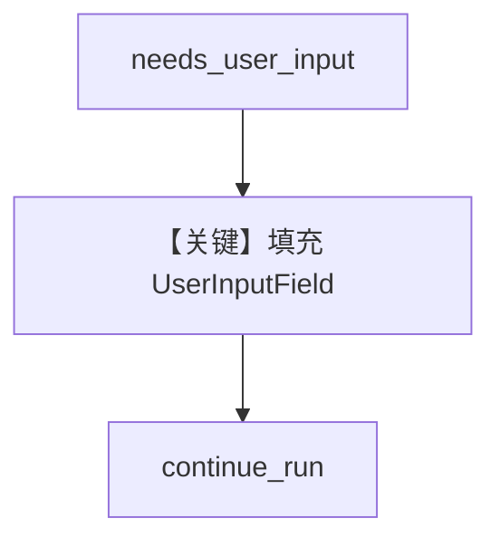

# user_input_required.py — 实现原理分析

<!-- cookbook-py-source:start -->
## 完整源码

```python
"""
User Input Required
=============================

Human-in-the-Loop: Allowing users to provide input externally.
"""

from typing import List

from agno.agent import Agent
from agno.db.sqlite import SqliteDb
from agno.models.openai import OpenAIResponses
from agno.tools import tool
from agno.tools.function import UserInputField
from agno.utils import pprint


# You can either specify the user_input_fields leave empty for all fields to be provided by the user
@tool(requires_user_input=True, user_input_fields=["to_address"])
def send_email(subject: str, body: str, to_address: str) -> str:
    """
    Send an email.

    Args:
        subject (str): The subject of the email.
        body (str): The body of the email.
        to_address (str): The address to send the email to.
    """
    return f"Sent email to {to_address} with subject {subject} and body {body}"


# ---------------------------------------------------------------------------
# Create Agent
# ---------------------------------------------------------------------------
agent = Agent(
    model=OpenAIResponses(id="gpt-5-mini"),
    tools=[send_email],
    markdown=True,
    db=SqliteDb(db_file="tmp/user_input_required.db"),
)

# ---------------------------------------------------------------------------
# Run Agent
# ---------------------------------------------------------------------------
if __name__ == "__main__":
    run_response = agent.run(
        "Send an email with the subject 'Hello' and the body 'Hello, world!'"
    )

    for requirement in run_response.active_requirements:
        if requirement.needs_user_input:
            input_schema: List[UserInputField] = requirement.user_input_schema  # type: ignore

            for field in input_schema:
                # Get user input for each field in the schema
                field_type = field.field_type
                field_description = field.description

                # Display field information to the user
                print(f"\nField: {field.name}")
                print(f"Description: {field_description}")
                print(f"Type: {field_type}")

                # Get user input
                if field.value is None:
                    user_value = input(f"Please enter a value for {field.name}: ")
                else:
                    print(f"Value: {field.value}")
                    user_value = field.value

                # Update the field value
                field.value = user_value

    run_response = agent.continue_run(
        run_id=run_response.run_id,
        requirements=run_response.requirements,
    )  # or agent.continue_run(run_response=run_response)
    pprint.pprint_run_response(run_response)

    # Or for simple debug flow
    # agent.print_response("Send an email with the subject 'Hello' and the body 'Hello, world!'")
```

<!-- cookbook-py-source:end -->

> 源文件：`cookbook/02_agents/10_human_in_the_loop/user_input_required.py`

## 概述

本示例展示 **`requires_user_input=True` + `user_input_fields`**：仅 `to_address` 必须由人提供，`send_email` 暂停后遍历 `user_input_schema` 填充 `UserInputField`，再 `continue_run`。

**核心配置一览：**

| 配置项 | 值 |
|--------|-----|
| `model` | `OpenAIResponses(id="gpt-5-mini")` |
| `tools` | `[send_email]` |
| `markdown` | `True` |
| `db` | `SqliteDb(db_file="tmp/user_input_required.db")` |

## 核心组件解析

`@tool(requires_user_input=True, user_input_fields=["to_address"])` 指定哪些参数从终端读取。

## 运行机制与因果链

`needs_user_input` 分支；适用于 **敏感收件人地址不交给模型自填**。

## System Prompt 组装

无自定义 `instructions`。

参照用户句：`Send an email with the subject 'Hello' and the body 'Hello, world!'`

## Mermaid 流程图


```mermaid
flowchart TD
    P["needs_user_input"] --> F["【关键】填充 UserInputField"]
    F --> C["continue_run"]
```

## 关键源码文件索引

| 文件 | 作用 |
|------|------|
| `agno/tools/function` | `UserInputField` |
