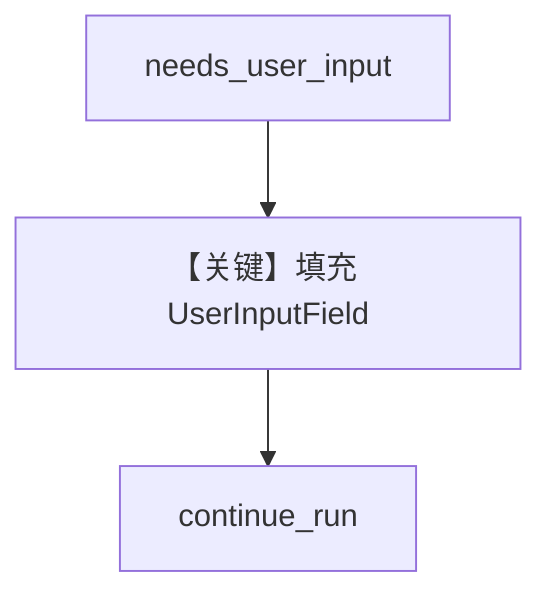

# user_input_required.py — 实现原理分析

> 源文件：`cookbook/02_agents/10_human_in_the_loop/user_input_required.py`

## 概述

本示例展示 **`requires_user_input=True` + `user_input_fields`**：仅 `to_address` 必须由人提供，`send_email` 暂停后遍历 `user_input_schema` 填充 `UserInputField`，再 `continue_run`。

**核心配置一览：**

| 配置项 | 值 |
|--------|-----|
| `model` | `OpenAIResponses(id="gpt-5-mini")` |
| `tools` | `[send_email]` |
| `markdown` | `True` |
| `db` | `SqliteDb(db_file="tmp/user_input_required.db")` |

## 核心组件解析

`@tool(requires_user_input=True, user_input_fields=["to_address"])` 指定哪些参数从终端读取。

## 运行机制与因果链

`needs_user_input` 分支；适用于 **敏感收件人地址不交给模型自填**。

## System Prompt 组装

无自定义 `instructions`。

参照用户句：`Send an email with the subject 'Hello' and the body 'Hello, world!'`

## Mermaid 流程图

```mermaid
flowchart TD
    P["needs_user_input"] --> F["【关键】填充 UserInputField"]
    F --> C["continue_run"]
```

## 关键源码文件索引

| 文件 | 作用 |
|------|------|
| `agno/tools/function` | `UserInputField` |
