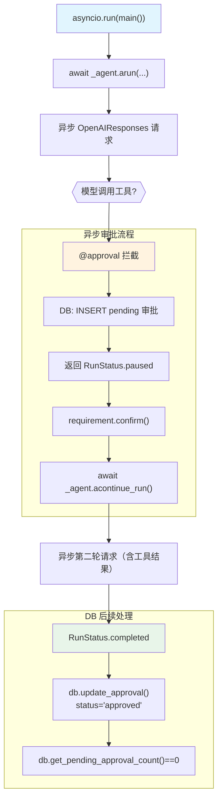

# approval_async.py — 实现原理分析

> 源文件：`cookbook/02_agents/11_approvals/approval_async.py`

## 概述

本示例展示 Agno 的 **`@approval` 异步审批**机制：结合 `asyncio` 使用 `arun()` 和 `acontinue_run()` 实现非阻塞的 HITL 审批流，与 `approval_basic.py` 的同步版本一一对应。

**核心配置一览：**

| 配置项 | 值 | 说明 |
|--------|------|------|
| `model` | `OpenAIResponses(id="gpt-5-mini")` | Responses API |
| `tools` | `[get_top_hackernews_stories]` | @approval + requires_confirmation |
| `markdown` | `True` | Markdown 格式 |
| `db` | `SqliteDb(approvals_table="approvals")` | 审批记录持久化 |

## 架构分层

```
用户代码层                          异步执行层
┌──────────────────────────┐      ┌─────────────────────────────────────┐
│ approval_async.py        │      │ asyncio.run(main())                  │
│                          │      │  └─ await _agent.arun(...)           │
│ async def main():        │      │      ├─ 异步模型请求                  │
│   await _agent.arun()    │─────>│      ├─ @approval 检测 → DB 写入     │
│   await _agent.          │      │      └─ 返回 RunStatus.paused        │
│     acontinue_run()      │      │                                      │
│   db.get_approvals()     │      │  └─ await _agent.acontinue_run()    │
│   db.update_approval()   │      │      ├─ 恢复执行（携带工具结果）      │
│                          │      │      └─ 返回 RunStatus.completed     │
└──────────────────────────┘      └─────────────────────────────────────┘
                                             │
                                             ▼
                                  ┌──────────────────────┐
                                  │ OpenAIResponses      │
                                  │ gpt-5-mini           │
                                  └──────────────────────┘
```

## 核心组件解析

### 异步 HITL 流程

同步版（`approval_basic.py`）和异步版的核心差异：

| 操作 | 同步版 | 异步版 |
|------|--------|--------|
| 运行 | `agent.run()` | `await agent.arun()` |
| 继续 | `agent.continue_run()` | `await agent.acontinue_run()` |
| DB 操作 | `db.get_approvals()` | `db.get_approvals()`（同步，SqliteDb 未异步化） |
| 暂停检测 | `run_response.is_paused` | `run_response.is_paused`（相同） |

```python
# 异步运行 - 立即返回（暂停）
run_response = await _agent.arun("Fetch the top 2 hackernews stories.")
assert run_response.is_paused

# 确认（同步操作）
for requirement in run_response.active_requirements:
    if requirement.needs_confirmation:
        requirement.confirm()

# 异步继续
run_response = await _agent.acontinue_run(
    run_id=run_response.run_id,
    requirements=run_response.requirements,
)
```

### 审批 DB 操作（与同步版相同）

```python
# 查询 pending 审批
approvals_list, total = _db.get_approvals(status="pending")

# 更新为已批准（注意：在 continue_run 之后调用）
resolved = _db.update_approval(
    approval_record["id"],
    expected_status="pending",
    status="approved",
    resolved_by="async_user",
    resolved_at=int(time.time()),
)
```

## System Prompt 组装

| 序号 | 组成部分 | 值 | 是否生效 |
|------|---------|-----|---------|
| 3.2.1 | `markdown` | `True` | 是 |
| 其他 | 均未设置 | - | 否 |

### 最终 System Prompt

```text
Respond using markdown.
```

## 完整 API 请求

```python
# 第一轮（异步）
await client.responses.create(
    model="gpt-5-mini",
    input=[
        {"role": "developer", "content": "Respond using markdown."},
        {"role": "user", "content": "Fetch the top 2 hackernews stories."}
    ],
    tools=[{"type": "function", "name": "get_top_hackernews_stories", ...}],
    stream=True,
    stream_options={"include_usage": True}
)
# → @approval 暂停，DB 写入 pending 记录

# 第二轮（acontinue_run 后）
await client.responses.create(
    model="gpt-5-mini",
    input=[
        {"role": "developer", "content": "Respond using markdown."},
        {"role": "user", "content": "Fetch the top 2 hackernews stories."},
        {"role": "assistant", "tool_calls": [...]},
        {"role": "tool", "content": "[...stories...]"}
    ],
    ...
)
```

## Mermaid 流程图



## 关键源码文件索引

| 文件 | 关键函数/类 | 作用 |
|------|------------|------|
| `agno/agent/agent.py` | `arun()` | 异步运行入口 |
| `agno/agent/agent.py` | `acontinue_run()` | 异步恢复运行 |
| `agno/approval/__init__.py` | `approval` | 审批装饰器 |
| `agno/db/sqlite/` | `SqliteDb` | 审批 CRUD |
