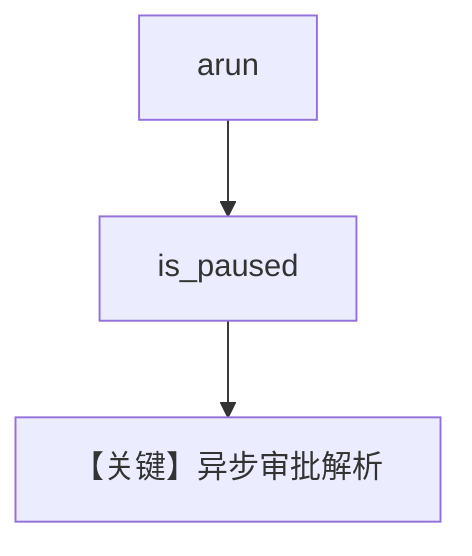

# approval_async.py — 实现原理分析

> 源文件：`cookbook/02_agents/11_approvals/approval_async.py`

## 概述

本示例为 **approval_basic 的异步版**：`await _agent.arun(...)`，暂停后同样查 `get_approvals`，再用异步续跑 API（脚本内 `acontinue_run` 或等价，以 `.py` 后半为准）。

**核心配置一览：** 与 basic 相同模式，`DB_FILE` 为 `tmp/approvals_async_test.db`。

## 运行机制与因果链

异步事件循环中完成 **非阻塞** 审批集成（如 WebSocket 通知）。

## System Prompt 组装

无自定义 `instructions`。

## Mermaid 流程图

```mermaid
flowchart TD
    A["arun"] --> P["is_paused"]
    P --> B["【关键】异步审批解析"]
```

## 关键源码文件索引

| 文件 | 作用 |
|------|------|
| `agno/agent/agent.py` | `arun`；`acontinue_run` |
